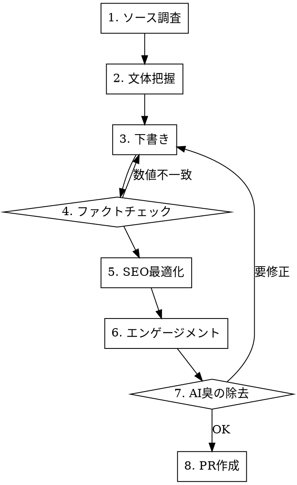

# Blog Article Writing

funailog.com のブログ記事を執筆するためのワークフロー。外部ソースからの調査 → 下書き → ファクトチェック → SEO → エンゲージメント → AI臭の除去を一貫して行う。

## ワークフロー



## 1. ソース調査

外部リポジトリ、ADR、ドキュメントから記事の素材を収集する。

- Explore サブエージェントで対象リポジトリの全ファイルを読む
- 数値（価格、スペック、日付）は原典のパスと行番号をメモする
- 製品名・型番は正確に記録する（後のファクトチェックで使う）

## 2. 文体把握

`src/content/blog/` 配下の既存記事と `.claude/rules/blog-writing-style.md` を参照する。

要点:

- です・ます調、一人称は「僕」
- 括弧内ツッコミで温度差を作る
- 自虐ユーモアは淡々と
- 取り消し線で本音を挿入
- カテゴリ別の書き方（gadgets/programming/travel/lifestyle）に従う

## 3. 下書き

frontmatter を先に確定する。

```yaml
title: 'タイトル'
description: '120字以内の要約'
published: 2026-XX-XX
tags: [関連タグ] # 3-7 個、製品名/技術名/カテゴリ関連の意味あるキーワード
isPublished: false # 下書き中は false、PR 作成のステップで true に変える
category: gadgets # programming/design/gadgets/travel/lifestyle/vehicles/other
emoji: 🏠 # 記事内容と意味的に対応する 1 文字（例: キーボードなら ⌨️、コンテナなら 📦）
series: series-slug # シリーズ記事の場合
seriesTitle: シリーズ表示名 # シリーズ記事の場合
seriesOrder: 1 # シリーズ記事の場合
```

シリーズ記事の `series` slug は **既存の Part 記事の frontmatter を必ず確認して揃える**。
表記揺れ（例: `kubernetes-the-hard-way-...` vs `kubernetes-hard-way-...`）があると
シリーズリンクが切れる。

programming カテゴリの記事は「想定読者」セクションを「はじめに」の直下に置く
（アーキ図や手順の前に、誰向けかを明示する）。

本文のルール:

- 不要な英単語を避ける（Phase → フェーズ、IR → 赤外線、AP → アクセスポイント）
- 固有名詞（Reddit, Matter, Zigbee 等）と製品名はそのまま
- 金額は円表記（¥ではなく「円」）
- 専門用語には脚注 `[^id]` を付け、公式サイトへのリンクを含める
- Mermaid 図を活用する（rehype-mermaid で描画される）

## 4. ファクトチェック

下書き内の全数値を原典と突き合わせる。

```bash
# 原典からgrepで検証
grep '4,917\|4917' /path/to/source.md
```

チェック対象:

- 価格（税込/税抜の混同に注意）
- スペック（PoE ワット数、ポート数、速度）
- 日付（申込日、工事日）
- 計算結果（月額 × 月数 = 累計）

不一致が見つかったら下書きに戻る。推測で書かない。

## 5. SEO 最適化

- タグに注目キーワードを追加（Wi-Fi 7, Matter, 10G 等）
- 比較表の直前に具体的な見出しを置く
- シリーズ記事は `series` / `seriesTitle` / `seriesOrder` を設定
- description は検索結果に表示される120字以内の要約

## 6. エンゲージメント要素

滞在時間と回遊率を上げる要素を追加する。

- **読者参加型セクション**: 「あなたはどのフェーズ？」のようなチェックリスト
- **次回予告**: 記事末尾で次の記事の具体的な内容を予告する
- **シリーズ導線**: 公開済み記事はリンクカード、未公開はテキストで
- **脚注**: 専門用語の説明 + 公式リンクで非エンジニア層もカバー

## 7. AI 臭の除去

`japanese-ai-writing-proofreader` スキルで5カテゴリをチェックする。

よくある修正:

- 受動態 → 能動態（「導かれました」→「方針を採りました」）
- 冗長表現の圧縮（「することができる」→「できる」）
- 誇張の具体化（「世界が変わる」→「操作が一箇所にまとまる」）
- 定型リストの散文化（`**ラベル**: 説明` の羅列 → 地の文に統合）

## 8. PR 作成

- ブランチ: `feat/article-name`
- `isPublished: true` に変更
- `pnpm build` でビルド確認
- PR 作成後、auto merge 設定

## アフィリエイト記事の場合

`seo-affiliate-article` スキルと併用する。`AffiliateCard` コンポーネントで Amazon/楽天リンクを埋め込む。微妙だった製品は忖度なしで書く。シリーズの俯瞰記事ではアフィリエイトを控えめにし、各論記事で機材レビューに集中する。

## MCP ツールの活用

| 用途          | ツール                                 |
| :------------ | :------------------------------------- |
| Web 調査      | firecrawl-search / firecrawl-scrape    |
| 構成図        | Mermaid（MDX 内に直接記述）            |
| アイキャッチ  | OG 自動生成（satori）をそのまま使う    |
| AI 臭チェック | japanese-ai-writing-proofreader スキル |
