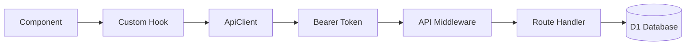

## はじめに

「サプリ、いつ飲めばいいんだっけ...」

iHerbで海外サプリを買い始めてから、この悩みが尽きませんでした。調べれば調べるほど「食事と一緒」「空腹時」「寝る前NG」など条件が複雑で、結局管理しきれず適当に飲む日々。

**ないなら作ろう**ということで、Cloudflare Workers + Hono + Reactでサプリ管理PWAを作りました。

## 作ったもの

**DailyDose** - バーコードでサプリを登録し、最適な摂取タイミングを提案・管理するPWAです。

https://daily-dose.pavegy.workers.dev/

### 主な機能

- **バーコードスキャン**: カメラでサプリのバーコードを読み取り、即座に登録（iHerb等の海外製品にも対応）
- **AIタイミング提案**: 登録したサプリの成分や相互作用を考慮し、最適な摂取タイミングを自動提案
- **スケジュール管理**: 「起床時」「食後」「就寝前」など細かいタイミングで設定
- **トレーニーモード**: トレーニング日/休息日で異なるスケジュールを設定可能（オプション）
- **Web Push通知**: 設定した時間にリマインダー通知
- **マイスタックのシェア**: 自分のサプリ構成をSNSでシェア（動的OGP画像生成）

---

## なぜ作ったか

サプリの種類が増えるにつれて、いくつかの課題に直面しました。

### 課題1: 飲むタイミングが複雑すぎる

- ビタミンDは食事と一緒がいい
- 鉄分は空腹時、でもビタミンCと一緒だと吸収が良い
- カルシウムとマグネシウムは時間を空けた方がいい
- カフェイン系は寝る前NG

調べれば調べるほど複雑になり、結局「適当に全部朝飲む」という状態に。

### 課題2: 飲み忘れ・管理の煩雑さ

- 「今日飲んだっけ？」が分からなくなる
- 複数のサプリを異なるタイミングで飲むと把握しきれない
- 外出先で飲み忘れに気づいても手遅れ

特にiHerbで購入すると英語パッケージなので、どのサプリがどれか分からなくなることも。

### 課題3: 既存アプリへの不満

広告が多い、サブスク高い、UIが古い、日本語対応が不十分、海外製品のバーコードが読めない...

エンジニアなら誰でも思うやつです。**「ないなら作ろう」**。

---

## 技術スタック

「エッジで動く」「低コスト」「型安全性」を重視した構成です。

### 全体構成

| レイヤー | 技術                                 |
| -------- | ------------------------------------ |
| Monorepo | pnpm workspaces                      |
| Backend  | Cloudflare Workers + Hono            |
| Database | Cloudflare D1 (SQLite)               |
| Storage  | Cloudflare R2 (画像キャッシュ)       |
| Frontend | React 18 + Vite + TypeScript         |
| State    | Jotai + TanStack Query               |
| UI       | shadcn/ui + Tailwind CSS             |
| PWA      | vite-plugin-pwa + Workbox            |
| AI       | OpenAI API (gpt-4o-mini)             |
| Auth     | JWT (HttpOnly Cookie) + Google OAuth |

### なぜCloudflare？

個人開発で一番気になるのはコスト。Cloudflareの無料枠は圧倒的です。

- **Workers**: 10万リクエスト/日
- **D1**: 読み取り500万行/日、書き込み10万行/日
- **R2**: 10GB保存、エグレス料金なし

個人開発レベルならほぼ0円で運用できます。しかもエッジ実行なので日本からも高速。

### なぜHono？

Cloudflare Workersで動くフレームワークとして最高の選択肢でした。

- Express/Fastifyライクで学習コストが低い
- Zodバリデーションとの統合が素晴らしい（zValidator）
- TypeScript完全対応
- 作者が日本人なのでドキュメントも充実

---

## アーキテクチャ

### データフロー



### ディレクトリ構成

```text
daily-dose/
├── apps/
│   ├── api/                 # Cloudflare Workers (Hono)
│   │   ├── src/
│   │   │   ├── routes/      # APIエンドポイント
│   │   │   ├── services/    # ビジネスロジック
│   │   │   ├── middleware/  # 認証など
│   │   │   └── lib/         # ユーティリティ
│   │   └── migrations/      # D1マイグレーション
│   └── web/                 # React PWA (Vite)
│       ├── src/
│       │   ├── components/  # UIコンポーネント
│       │   ├── hooks/       # カスタムフック
│       │   ├── pages/       # ページコンポーネント
│       │   ├── stores/      # Jotai atoms
│       │   └── sw.ts        # Service Worker
│       └── public/
└── packages/
    └── shared/              # 共有TypeScript型定義
```

---

## 技術的に面白かったポイント

### 1. Cloudflare Workersでの動的OGP生成

#### やりたかったこと

ユーザーの「マイスタック（サプリ構成）」をSNSでシェアできるようにしたい。でもOGP画像は静的ファイルが前提。ユーザーごとに異なる画像を動的に生成するには？

#### 解決策

`@cf-wasm/resvg` を使用してWorkers上でSVGからPNGを動的生成。

**工夫ポイント:**

- **R2キャッシュ**: 生成した画像は7日間キャッシュ。2回目以降は高速＆コスト削減
- **非同期保存**: `executionCtx.waitUntil()` でレスポンスをブロックせずにキャッシュ保存
- **フォント取得**: Google FontsからNoto Sans JPを動的取得（フォールバック付き）
- **テキスト処理**: XMLエスケープでXSS対策、長文は省略記号で切り詰め

### 2. トレーニーモード（オプション機能）の状態管理

#### 機能概要

トレーニング日と休息日で異なるサプリスケジュールを設定したい人向けのオプション機能です。例えば「プレワークアウトはトレ日のみ」「BCAAはトレ日のトレ前後だけ」といった設定が可能になります。

#### 課題

「摂取した後に『今日は休息日だった』に変更した場合、過去の摂取記録や達成率はどうなるか？」

これは意外と厄介な問題です。単純に「今日の状態」をDBで持つだけでは、後から変更されたときに過去の統計が壊れてしまいます。

#### 解決策: スナップショット方式

摂取記録を保存する際に、その時点の「トレ日/休息日」状態をスナップショットとして一緒に保存します。

**ポイント:**

- **日付ごとの状態テーブル**: 「今日はトレ日」「今日は休息日」を日付単位で保存
- **摂取記録にスナップショット**: 摂取時点の状態を記録に埋め込む
- **統計計算時**: スナップショット値を使用（現在の設定値は参照しない）

これにより、後から「やっぱり今日は休息日だった」と変更しても、既に記録された摂取履歴や達成率は変わりません。

### 3. AIによる摂取タイミング提案

#### 機能概要

登録したサプリの成分や相互作用を考慮し、「起床時」「食後」「トレ前」などに自動振り分け。

#### プロンプトエンジニアリングのポイント

- **JSON出力を強制**: レスポンス形式を厳密に指定し、パース可能なJSONのみを出力させる
- **タイミングガイドラインを事前定義**:
  - 脂溶性ビタミン（A,D,E,K）→ 食事と一緒
  - 鉄分 → 空腹時 or ビタミンCと一緒
  - カルシウム＆マグネシウム → 時間を空ける
  - Bビタミン → 寝る前NG（覚醒作用）
  - マグネシウム＆亜鉛 → 寝る前OK
  - アミノ酸 → トレ前後（アスリート向け）
  - プロバイオティクス → 空腹時
  - カフェイン → 寝る前NG
  - プレワークアウト → トレ日のみ、20-30分前
- **相互作用の警告**: サプリ同士の相互作用（吸収阻害など）も検出して警告
- **トレーニング日対応**: pre_workoutやpost_workoutは自動的に「トレ日のみ」フラグを付与

### 4. バーコードスキャン

#### 使用ライブラリ・API

- **html5-qrcode**: カメラAPIを抽象化し、QRコードとバーコード（EAN/UPC）の両方に対応
- **UPCitemdb API**: 世界最大級のバーコードデータベース。iHerb等の海外製品も豊富に収録

#### なぜUPCitemdb？

日本国内の商品DBでは海外サプリが登録されていないことが多いですが、UPCitemdbはグローバルな製品を幅広くカバーしています。特にiHerb、Amazon、Costco等で購入した海外製サプリメントのバーコードが高確率でヒットします。

**工夫ポイント:**

- **デバウンス処理**: 300msのデバウンスでAPI負荷を軽減
- **レースコンディション対策**: INSERT OR IGNOREで同時リクエストによる重複を防止
- **カテゴリ自動判定**: UPCitemdbの商品カテゴリから、アプリ内カテゴリ（vitamin, mineral, etc.）を推定
- **フォールバック**: 外部APIで見つからない場合は手動入力に誘導

---

## コスト最適化戦略

### Cloudflare無料枠の活用

| サービス | 無料枠               | 実際の使用量（想定） |
| -------- | -------------------- | -------------------- |
| Workers  | 10万リクエスト/日    | 数千リクエスト/日    |
| D1       | 読み取り500万行/日   | 数万行/日            |
| D1       | 書き込み10万行/日    | 数千行/日            |
| R2       | 10GB保存             | 数百MB               |
| R2       | 1000万クラスB操作/月 | 数万操作/月          |

**個人開発レベルでは、ほぼ0円で運用可能です。**

### キャッシュ戦略

- **ブラウザキャッシュ**: 静的アセットは長期キャッシュ
- **React Query**: staleTime: 5分でAPI負荷を軽減
- **R2キャッシュ**: OGP画像を7日間キャッシュ
- **D1キャッシュテーブル**: AIコンテンツは永続キャッシュ（product_ai_contentテーブル）

### OpenAI API コスト

gpt-4o-miniを採用（gpt-4の約1/10のコスト）:

- 入力: $0.15 / 1Mトークン
- 出力: $0.60 / 1Mトークン

1回のAI分析で約1000トークン使用と仮定すると、**1回あたり約0.01円**。

---

## UI/UXのこだわり

### PWAとしての完成度

**Service Worker設定（Workbox）**

vite-plugin-pwa + Workbox でService Workerを構成:

- **静的アセット**: プリキャッシュで即座に表示
- **API呼び出し**: NetworkFirst戦略（オフライン時はキャッシュにフォールバック）
- **Push通知**: push/notificationclickイベントをハンドリング

**iOS対応のハック**

iOSのPWAには独特の癖があり、いくつかのハックが必要でした。

1. **キーボード表示時のスクロール問題**: iOSではキーボードが表示されると、入力フィールドが隠れることがあります。スタンドアロンモード検出後、focusinイベントで入力要素を画面中央にスクロールさせる処理を追加しました。

2. **インストールプロンプト**: iOSにはbeforeinstallpromptイベントがないため、User-Agentでの検出とdisplay-mode: standaloneの判定を組み合わせて、独自のインストール案内UIを表示しています。

3. **OAuth認証のスタンドアロン対応**: PWAスタンドアロンモードでは、OAuth認証のリダイレクトが正常に動作しないことがあります。Safari経由でのOAuth認証後、トークンを受け取る工夫が必要です。

### ショートカット機能

PWAのマニフェストでショートカットを定義:

```json
{
  "shortcuts": [
    {
      "name": "今日のスケジュール",
      "short_name": "今日",
      "url": "/",
      "icons": [{ "src": "/icons/icon-192.png", "sizes": "192x192" }]
    },
    {
      "name": "サプリ一覧",
      "short_name": "サプリ",
      "url": "/products",
      "icons": [{ "src": "/icons/icon-192.png", "sizes": "192x192" }]
    }
  ]
}
```

ホーム画面のアイコンを長押しすると、クイックアクションが表示されます。

### shadcn/uiの採用

UIコンポーネントはshadcn/uiを全面採用:

- Radix UIベースでアクセシビリティ対応
- Tailwind CSSで一貫したデザイン
- コピペ方式なのでカスタマイズ自由
- ダークモード対応が容易

---

## 認証設計

### HttpOnly Cookie + JWT

**セキュリティのポイント:**

- **HttpOnly Cookie**: JavaScriptからアクセス不可（XSS対策）
- **Secure属性**: HTTPS通信のみ（本番環境）
- **SameSite=Lax**: CSRF対策
- **短命Access Token**: 15分で期限切れ
- **Refresh Token Rotation**: 使用するたびに新しいトークンを発行
- **ハッシュ保存**: Refresh TokenはDB上でハッシュ化して保存

**Google OAuth対応**

パスワード管理が面倒なユーザー向けに、Google OAuthも実装。

---

## データベース設計

Cloudflare D1（SQLite）を使用し、15テーブルで構成。ORMは使わず、素のSQLでマイグレーション管理しています。

**主要な設計ポイント：**

- **全テーブルUUID主キー**: `crypto.randomUUID()`で生成
- **CASCADE DELETE**: user_id外部キーは親削除時に自動削除
- **スナップショット保存**: 摂取記録には、スケジュール削除後も履歴を保持するため商品情報をスナップショットとして保存
- **プリセットマスタ**: タイミングコンテキスト（起床時、食後など）は事前にシードデータとして投入

---

## タイミングベースの通知システム

### 機能概要

「起床時」「朝食後」「トレ前」など、タイミングコンテキスト単位で通知時刻を設定できます。単純な「8時にリマインド」ではなく、「起床時タイミングを7時に設定 → そのタイミングに紐づく全サプリを一括通知」という設計です。

### 8つのタイミングコンテキスト

| コンテキスト | デフォルト時刻 |
| ------------ | -------------- |
| 起床時       | 07:00          |
| 朝食前       | 07:30          |
| 朝食後       | 08:00          |
| 昼食後       | 13:00          |
| トレ前       | 17:00          |
| トレ後       | 19:00          |
| 夕食後       | 20:00          |
| 就寝前       | 23:00          |

### 実装のポイント

- **タイムゾーン変換**: Workers はUTCで動くため、JSTに変換してから時刻比較
- **効率的なクエリ**: 1回のクエリで「時刻マッチ」「有効なサプリ」「タイミング情報」を全取得
- **通知の重複防止**: Web Push の tag でタイミング×日付のユニークキーを設定し、同じ通知が複数回表示されることを防止

---

## 法規制への配慮

### 薬機法・健康増進法について

サプリメント関連アプリを開発する際は、薬機法（医薬品医療機器等法）と健康増進法への配慮が必要です。

**本アプリでの対応:**

1. **効能効果を謳わない**
   - AIのタイミング提案は「一般的な摂取タイミングの提案」であり、「○○に効く」といった効能効果は表示しない
   - 「ビタミンDは食事と一緒に摂ると吸収が良い」→ OK（一般的な栄養学的事実）
   - 「ビタミンDで骨が強くなる」→ NG（効能効果の標榜）

2. **医療アドバイスではないことの明示**
   - アプリ内で「本アプリは医療アドバイスを提供するものではありません」と明示
   - 体調に異変がある場合は医師への相談を推奨

3. **ユーザー自身の判断を尊重**
   - AI提案はあくまで「参考情報」として提示
   - 最終的な摂取判断はユーザーに委ねる設計

---

## まとめ

DailyDoseは、Cloudflareの無料枠をフル活用して、**維持費ほぼ0円**で運用できるサプリ管理PWAです。

**技術的なハイライト:**

- **Cloudflare Workers + D1**: サーバーレスでスケーラブル、かつ低コスト
- **動的OGP生成**: Edge環境で@cf-wasm/resvgを使ったPNG生成
- **トレーニング日管理**: スナップショット方式で履歴の整合性を保持
- **AI活用**: gpt-4o-miniで低コストなタイミング提案
- **PWA**: iOS対応含め、ネイティブアプリライクな体験

個人開発でも、適切な技術選定をすれば本格的なアプリを低コストで運用できます。

「Cloudflareでここまでできるのか」という参考になれば幸いです。質問があればコメント欄でお気軽にどうぞ！

---

## 関連記事

- [Cloudflare Workers × Hono プロジェクトで Zod から Valibot に移行してバンドルサイズを89%削減した話](/blog/2025/zod-to-valibot-migration)
