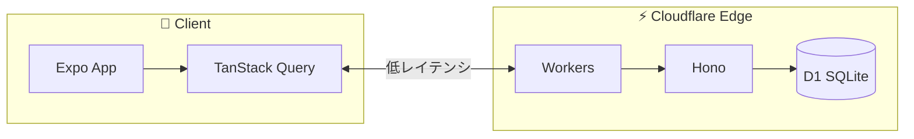

先日、[「筋トレアプリのUX設計 - 操作を半分に減らしたZero Friction手法」](/blog/2025/zero-friction-workout-app-ux)という記事を書きました。

前回の記事では「いかにユーザーの操作を減らすか（Zero Friction）」という**UX/設計思想**にフォーカスしました。
今回は、そのUXを支える<strong>技術的な裏側（Tech Stack）</strong>の美学について解説します。

最高のUXを実現するために、技術選定においても「Zero Friction」を徹底しました。
キーワードは **"Speed is a Feature"**（速度は機能である）です。

## TL;DR

- **Edge First**: Cloudflare Workers + D1 で「物理的な距離」を最小化
- **Optimistic UI**: TanStack Query で「通信待ち時間」を体感ゼロに
- **Offline Ready**: 電波の悪いジムでも使える「完全オフライン対応」
- **DX**: Hono + Expo で、個人開発でも「爆速」で機能提供

> この技術スタックで作られた筋トレ記録アプリ **Attain** を公開中。
> PWA対応なので、ブラウザからインストール不要で試せます。
> 👉 [アプリを見る](https://attain-app.com/lp)

---

## 全体アーキテクチャ

個人開発において「開発体験（DX）」と「ユーザー体験（UX）」、そして「コスト効率」を最大化するために選んだスタックがこちらです。

| Layer            | Technology          | Why?                                      |
| ---------------- | ------------------- | ----------------------------------------- |
| **Frontend**     | Expo (React Native) | PWAとして最速リリース & Native化への布石  |
| **UI Framework** | Tamagui             | 高パフォーマンス & クロスプラットフォーム |
| **State/Data**   | TanStack Query      | 楽観的更新 & オフライン対応               |
| **Backend**      | Cloudflare Workers  | Edge実行による低レイテンシ                |
| **Framework**    | Hono                | 超軽量 & Web標準準拠                      |
| **Database**     | Cloudflare D1       | Edgeで動くSQLite                          |



いわゆる **"The Edge Stack"** とも呼べる構成です。
なぜこの構成なのか？ その哲学を3つのポイントで紹介します。

---

## 哲学1: Speed is a Feature（速度は機能である）

ジムという環境は過酷です。地下で電波が悪かったり、インターバル中の限られた時間で操作する必要があります。
ユーザーには「ロード中」のスピナーを見ている暇などありません。

この課題に対して、3つのレイヤーで解決策を講じました。

### 1. 物理的な距離をゼロに (Edge + D1)

従来の構成（東京リージョンのコンテナなど）ではなく、ユーザーの最も近くでコードが動く **Cloudflare Workers** を採用しました。
データベースも **Cloudflare D1** (SQLite on Edge) を採用することで、データアクセスも含めてEdgeで完結します。

これにより、コールドスタートの影響をほぼ受けず、世界中どこからでも爆速なレスポンスを実現しています。

### 2. 通信待ち時間をゼロに (Optimistic Updates)

どんなに高速なAPIでも、通信環境が悪ければ意味がありません。
そこで **TanStack Query** を活用し、徹底的な **Optimistic Updates（楽観的更新）** を実装しています。

1. ユーザーが「完了」ボタンを押す
2. **APIリクエストを待たずに**、即座にUIを「完了状態」に書き換え
3. 裏側でAPIリクエストを送信
4. 成功したらそのまま、失敗したらロールバック

UI上の「待ち時間」は文字通り **0ミリ秒** です。
「通信中...」というストレスを、UXから完全に排除しました。

### 3. インターネットさえも不要に (Offline Persistence)

さらに、**TanStack Query Persist Client** と **AsyncStorage** を組み合わせることで、アプリケーションの状態を丸ごとデバイス内に永続化しています。

```typescript
export const queryClient = new QueryClient({
  defaultOptions: {
    queries: {
      gcTime: 1000 * 60 * 60 * 24 * 7, // 7日間キャッシュを保持
      networkMode: 'offlineFirst', // オフラインでもキャッシュがあれば表示
    },
  },
});

export const asyncStoragePersister = createAsyncStoragePersister({
  storage: AsyncStorage,
  key: 'ATTAIN_QUERY_CACHE',
});
```

これにより、以下の体験を実現しました。

1. **アプリ起動と同時にデータが表示**（スプラッシュ画面すらほぼ見えない）
2. **完全オフライン**でも、過去7日間のデータを見ながらトレーニング可能
3. オンラインに戻った瞬間に同期

「電波がないから使えない」という言い訳を、技術の力でなくしました。

> **トレードオフ: キャッシュ管理の難しさ**
> 一方で、強力なキャッシュは諸刃の剣でもあります。
> APIの型定義が変わった際に古いキャッシュと整合性が取れなくなる「Hydration Error」や、意図せず古いデータが表示され続ける問題には常に悩まされています。これらは将来的に **キャッシュバージョニング（buster文字列）** 等の導入で対策する予定ですが、現状は開発者の頭を悩ませる大きな課題です。

---

## 哲学2: Developer Experience（個人開発の継続性）

個人開発では、コンテキストスイッチのコストが致命傷になります。
「フロントエンドを書いて、APIの仕様を思い出して、バックエンドを修正して...」という往復を極限まで減らす必要がありました。

### Code Sharing (@attain/shared)

モノレポ構成（Turborepo）を採用し、型定義やバリデーションロジック（Valibot）を `@attain/shared` パッケージで共有しています。

APIのレスポンス型をフロントエンドが直接インポートして使えるため、**API仕様書は不要**です。
バックエンドの仕様変更は、型エラーとして即座にフロントエンドに伝わります。Hono RPCに近い体験を、より疎結合な形（型定義の共有）で実現しています。

### PWA First, Native Ready

「アプリストアの審査待ち」も開発スピードを落とす要因です。
**Expo (React Native)** を採用しつつ、まずは **PWA (Progressive Web App)** としてWebでリリースしました。

- **Webのスピード感**: `git push` で即デプロイ、即ユーザーの手元へ反映。
- **Nativeの品質**: React Nativeで書いているため、いつでもiOS/Androidアプリとしてビルド可能。

Tamaguiを採用したことで、WebとNativeでスタイルを99%共有できています。
「Webで検証し、完成度が高まったらStoreへ」という、個人開発として最も効率的なロードマップを歩めています。

> **本音: PWAの限界とNativeへの渇望**
> 正直なところ、iOSにおけるPWA動作には多くの制約があり、「早くネイティブアプリとして出したい」というのが本音です。
> Haptics（触覚フィードバック）の挙動、`expo-audio`等の機能差、Web特有の操作感の違い、そしてEdge-to-Edgeで画面を作り込もうとした際の難易度など、UXを突き詰めるほど壁にぶつかります。
>
> 「PWAが限界だ」と感じたその瞬間に、コードを捨てずに `EAS Build` でネイティブ化に移行できる。これこそが、React Native (Expo) を選んだ最大の理由であり、保険でもあります。

---

## 哲学3: Cost Efficiency（持続可能な運営）

「ユーザーが増えれば増えるほど赤字」という構成は、精神衛生上よくありません。

Cloudflare Workers と D1 は、個人開発規模であれば実質無料で運用可能です。
Vercel等のServerless Functionと比較しても、Requests単位の課金は非常に安価で、Duration（実行時間）課金に怯える必要もありません。

Apple Developer Programへの登録料（$99/年）は避けて通れませんが、せめてインフラ費用だけでも「固定費ほぼゼロ」に抑えることで、心の余裕を生み、機能開発への集中を可能にします。

---

## Deep Dive: Hono + D1

実際のバックエンドコードは驚くほどシンプルです。Honoの記述量は、ExpressやNestJSに比べて圧倒的に少ないです。

```typescript
import { Hono } from 'hono';
import { d1 } from 'd1-driver'; // イメージ

const app = new Hono<{ Bindings: Bindings }>();

app.get('/workouts/:id', async (c) => {
  const id = c.req.param('id');
  // D1へのクエリもこれだけ
  const result = await c.env.DB.prepare('SELECT * FROM workouts WHERE id = ?')
    .bind(id)
    .first();

  return c.json(result);
});

export default app;
```

複雑なORMを使わずとも、SQLのシンプルさとD1のパフォーマンスで十分に戦えます。
デプロイは **Cloudflare Workers Builds** を利用しており、`main` ブランチにプッシュするだけで、ビルド・DBマイグレーション・全世界への展開が自動で完了します。

---

## おわりに

**「爆速のレスポンスは、最高のUXの一部である」**

Attainは、単なる筋トレアプリではなく、こうした現代の「Edge Tech Stack」の実験場でもあります。
しかし、ユーザーにとっては「技術」などどうでも良いことです。ただ「爆速で動く」ことだけが重要です。
技術へのこだわりは、誰にも気づかれない形で、最高のユーザー体験として還元されるべきだと考えています。

もしあなたがエンジニアで、「待たされないアプリ」「サクサク動く気持ちよさ」を体感してみたいなら、ぜひAttainを触ってみてください。Google認証で一瞬で始められます。

👉 **[Attainを試す](https://attain-app.com/lp)**

---

質問・フィードバックは [X (@paveg\_)](https://x.com/paveg_) まで！
