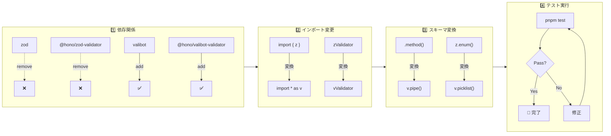

## はじめに

PWA（Progressive Web App）の開発において、バンドルサイズはユーザー体験に直結する重要な指標です。特にモバイルユーザーや低速回線環境では、数十KBの差がアプリの初回表示時間に大きく影響します。

今回、サプリメント摂取管理アプリ「DailyDose」のAPIバックエンド（Cloudflare Workers + Hono）で使用していたスキーマバリデーションライブラリを Zod から Valibot に移行し、バンドルサイズを約89%削減することに成功しました。

この記事では、移行の動機、具体的な変換パターン、そして移行時の注意点を解説します。

## 移行の動機：バンドルサイズの比較

| ライブラリ | Minified | Gzipped |
| ---------- | -------- | ------- |
| Zod        | ~59KB    | ~14KB   |
| Valibot    | ~6KB     | ~2KB    |

**約89%のサイズ削減**を実現できます。

この差が生まれる理由は、両ライブラリの設計思想の違いにあります：

- **Zod**: メソッドチェーンによる直感的なAPI。全機能がバンドルされる
- **Valibot**: 関数合成ベースのモジュラー設計。使用する機能のみがtree-shakingで抽出される

Cloudflare Workersには1MBのサイズ制限があるため、この差は特に重要です。

## 技術スタック

移行対象のプロジェクト構成：

- **ランタイム**: Cloudflare Workers
- **フレームワーク**: Hono
- **バリデーション**: Zod → Valibot
- **Honoミドルウェア**: @hono/zod-validator → @hono/valibot-validator

---

## 変換パターン早見表

実際のコードで使用した変換パターンをまとめます。

### 基本的な型定義

| Zod                   | Valibot               |
| --------------------- | --------------------- |
| `z.object({})`        | `v.object({})`        |
| `z.string()`          | `v.string()`          |
| `z.number()`          | `v.number()`          |
| `z.boolean()`         | `v.boolean()`         |
| `z.array(z.string())` | `v.array(v.string())` |

### バリデーションルール

Zodではメソッドチェーンで記述しますが、Valibotでは `v.pipe()` で関数を合成します。

| Zod                       | Valibot                                |
| ------------------------- | -------------------------------------- |
| `z.string().min(1)`       | `v.pipe(v.string(), v.minLength(1))`   |
| `z.string().max(100)`     | `v.pipe(v.string(), v.maxLength(100))` |
| `z.string().email()`      | `v.pipe(v.string(), v.email())`        |
| `z.string().uuid()`       | `v.pipe(v.string(), v.uuid())`         |
| `z.string().url()`        | `v.pipe(v.string(), v.url())`          |
| `z.string().regex(/pat/)` | `v.pipe(v.string(), v.regex(/pat/))`   |

### オプショナル・デフォルト値

| Zod                                | Valibot                              |
| ---------------------------------- | ------------------------------------ |
| `z.string().optional()`            | `v.optional(v.string())`             |
| `z.string().nullable()`            | `v.nullable(v.string())`             |
| `z.string().default('foo')`        | `v.optional(v.string(), 'foo')`      |
| `z.string().optional().nullable()` | `v.optional(v.nullable(v.string()))` |

### Enum・リテラル

| Zod                       | Valibot                       |
| ------------------------- | ----------------------------- |
| `z.enum(['a', 'b', 'c'])` | `v.picklist(['a', 'b', 'c'])` |
| `z.literal('value')`      | `v.literal('value')`          |

### レコード型

| Zod                                 | Valibot                             |
| ----------------------------------- | ----------------------------------- |
| `z.record(z.string(), z.unknown())` | `v.record(v.string(), v.unknown())` |

---

## 実際の移行例

### 例1: シンプルなログインスキーマ

**Before (Zod)**

```typescript
import { z } from 'zod';
import { zValidator } from '@hono/zod-validator';

const loginSchema = z.object({
  email: z.string().email(),
  password: z.string(),
});

app.post('/login', zValidator('json', loginSchema), async (c) => {
  const { email, password } = c.req.valid('json');
  // ...
});
```

**After (Valibot)**

```typescript
import * as v from 'valibot';
import { vValidator } from '@hono/valibot-validator';

const loginSchema = v.object({
  email: v.pipe(v.string(), v.email()),
  password: v.string(),
});

app.post('/login', vValidator('json', loginSchema), async (c) => {
  const { email, password } = c.req.valid('json');
  // ...
});
```

### 例2: 複雑なパスワードバリデーション

**Before (Zod)**

```typescript
const passwordSchema = z
  .string()
  .min(12, 'Password must be at least 12 characters')
  .regex(/[A-Z]/, 'Password must contain at least one uppercase letter')
  .regex(/[a-z]/, 'Password must contain at least one lowercase letter')
  .regex(/[0-9]/, 'Password must contain at least one number')
  .regex(
    /[^A-Za-z0-9]/,
    'Password must contain at least one special character',
  );
```

**After (Valibot)**

```typescript
const passwordSchema = v.pipe(
  v.string(),
  v.minLength(12, 'Password must be at least 12 characters'),
  v.regex(/[A-Z]/, 'Password must contain at least one uppercase letter'),
  v.regex(/[a-z]/, 'Password must contain at least one lowercase letter'),
  v.regex(/[0-9]/, 'Password must contain at least one number'),
  v.regex(
    /[^A-Za-z0-9]/,
    'Password must contain at least one special character',
  ),
);
```

### 例3: オプショナルフィールドとデフォルト値

**Before (Zod)**

```typescript
const createLogSchema = z.object({
  scheduleId: z.string().uuid(),
  date: z
    .string()
    .regex(/^\d{4}-\d{2}-\d{2}$/)
    .optional(),
  status: z.enum(['taken', 'skipped']).default('taken'),
  skipReason: z.enum(['injury', 'sick', 'other']).optional(),
  skipNote: z.string().max(200).optional(),
});
```

**After (Valibot)**

```typescript
const createLogSchema = v.object({
  scheduleId: v.pipe(v.string(), v.uuid()),
  date: v.optional(v.pipe(v.string(), v.regex(/^\d{4}-\d{2}-\d{2}$/))),
  status: v.optional(v.picklist(['taken', 'skipped']), 'taken'),
  skipReason: v.optional(v.picklist(['injury', 'sick', 'other'])),
  skipNote: v.optional(v.pipe(v.string(), v.maxLength(200))),
});
```

---

## Honoとの統合

Honoでは `@hono/valibot-validator` パッケージを使用することで、Zodと同じ使用感でValibotを利用できます。

```typescript
import { Hono } from 'hono';
import * as v from 'valibot';
import { vValidator } from '@hono/valibot-validator';

const app = new Hono();

// JSONボディのバリデーション
app.post('/api/users', vValidator('json', userSchema), (c) => {
  const data = c.req.valid('json');
  // ...
});

// クエリパラメータのバリデーション
app.get('/api/stats', vValidator('query', querySchema), (c) => {
  const { period, date } = c.req.valid('query');
  // ...
});

// URLパラメータのバリデーション
app.get('/api/items/:id', vValidator('param', paramSchema), (c) => {
  const { id } = c.req.valid('param');
  // ...
});
```

---

## 移行時の注意点

### 1. pipe() の理解

Valibotの最大の特徴は `v.pipe()` による関数合成です。Zodのメソッドチェーンに慣れていると最初は違和感がありますが、この設計がtree-shakingを可能にしています。

```typescript
// Zodのメソッドチェーン
z.string().min(1).max(100).email();

// Valibotの関数合成
v.pipe(v.string(), v.minLength(1), v.maxLength(100), v.email());
```

### 2. enum → picklist

Zodの `z.enum()` は Valibotでは `v.picklist()` に対応します。名前が異なるので注意が必要です。

### 3. デフォルト値の書き方

Zodでは `.default()` メソッドを使いますが、Valibotでは `v.optional()` の第2引数にデフォルト値を渡します。

```typescript
// Zod
z.string().default('default');

// Valibot
v.optional(v.string(), 'default');
```

### 4. nullable と optional の順序

両方を組み合わせる場合、Valibotでは外側から内側へネストします。

```typescript
// Zod
z.string().optional().nullable();

// Valibot
v.optional(v.nullable(v.string()));
```

---

## テスト戦略

移行の成功を確認するため、既存のAPIテストを活用しました。

```bash
# 全テストを実行
pnpm test:run
# 結果: 171 tests passed
```

スキーマバリデーションの振る舞いはAPIのレスポンスに直接影響するため、既存のインテグレーションテストが通れば機能的な互換性が担保されます。

また、TypeScriptの型チェックも重要な検証手段です。

```bash
pnpm typecheck
```

Valibotは型推論が優れており、Zodと同等の型安全性を提供します。

---

## 移行の手順まとめ



**1. 依存関係の更新**

```bash
pnpm remove zod @hono/zod-validator
pnpm add valibot @hono/valibot-validator
```

**2. インポートの変更**

```typescript
// Before
import { z } from 'zod';
import { zValidator } from '@hono/zod-validator';

// After
import * as v from 'valibot';
import { vValidator } from '@hono/valibot-validator';
```

**3. スキーマの変換**（この記事のパターン表を参照）

**4. テストの実行で動作確認**

---

## 結果

- **移行ファイル数**: 11ファイル
- **テスト**: 171件すべてパス
- **バンドルサイズ削減**: 約53KB（89%削減）
- **API互換性**: 完全維持

---

## まとめ

ZodからValibotへの移行は、特にバンドルサイズに敏感なエッジ環境（Cloudflare Workers）やPWAにおいて大きなメリットがあります。

**移行のポイント：**

- `v.pipe()` による関数合成パターンを理解する
- `enum` → `picklist` などの名前の違いに注意
- 既存テストを活用して互換性を確認

Valibotは積極的に開発が進んでおり、Zodに匹敵する機能を提供しながらも軽量さを維持しています。新規プロジェクトでは最初からValibotを採用することも検討に値するでしょう。

---

## 参考リンク

- [Valibot 公式ドキュメント](https://valibot.dev/)
- [Hono Valibot Validator](https://hono.dev/docs/middleware/valibot-validator)
