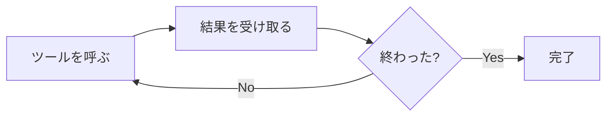
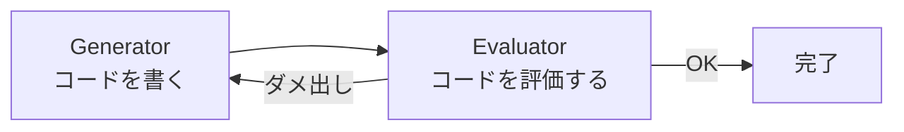
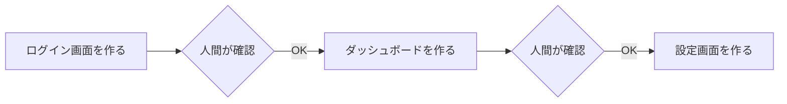
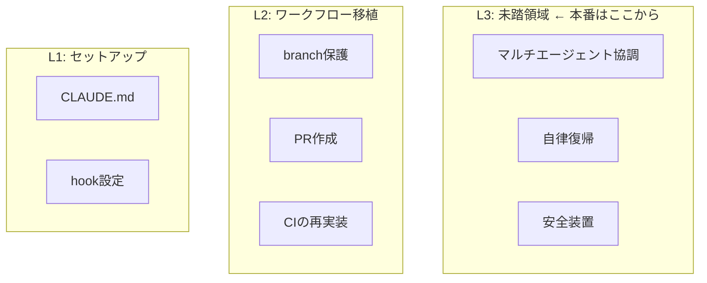
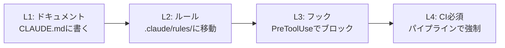

## ハーネスエンジニアリングとは

AIコーディングエージェント（Claude Code、Codex、Copilot CLI など）に仕事を任せるとき、**エージェントの行動を構造的にガイドする仕組みを設計する**エンジニアリング分野です。

名前の由来は馬具（harness）。馬の脚力を殺すのではなく、方向を制御することで馬が走ることに集中できるようにする装置です。

2026年春に入って、OpenAIとAnthropicが相次いでこの概念を言語化しました。日本でもいくつかの記事やOSSが出てきています。「みんな似たことを言っている部分」と「実は全然違うことを言っている部分」がありそうだったので、9つの資料を読み比べてみました。

僕自身、Claude Codeのハーネスを `.claude/rules/` 配下で半年ほど運用しています。今回の調査で [superpowers](https://github.com/obra/superpowers) からいくつか取り込んだりもしたので、そのあたりも書きます。

## 調べたもの

### 記事

- [OpenAI — "Harness engineering"](https://openai.com/index/harness-engineering/) — 3人で100万行・手書きコード0行の体験記
- [Anthropic — "Harness design for long-running application development"](https://www.anthropic.com/engineering/harness-design-long-running-apps) — generator-evaluator分離パターンの提案
- [おしお — "ハーネスエンジニアリング、そのGit Workflowをbashで書き直してるだけでは"](https://zenn.dev/shio_shoppaize/articles/shogun-harness-engineering) — メタ批評としての3レイヤー分類
- [@nogataka — "ハーネスエンジニアリング入門"](https://qiita.com/nogataka/items/d1b3fcf355c630cd7fc8) — 5要素による体系化と段階的導入アプローチ
- [梶川琢馬 — "実践ハーネスエンジニアリング"](https://speakerdeck.com/kajitack/implementing-herness-engineering) — 158リポジトリでの実運用事例

### OSS

- [multi-agent-shogun](https://github.com/yohey-w/multi-agent-shogun) — tmux+bashで最大10エージェントを戦国軍制で並列制御
- [OpenHarness](https://github.com/HKUDS/OpenHarness) — Claude Codeのハーネス層をPythonで再実装
- [harness](https://github.com/revfactory/harness) — 「ハーネスを作るハーネス」6パターンのメタスキル
- [Hive](https://github.com/aden-hive/hive) — YC支援のDAGベースマルチエージェントランタイム

## 共通していたこと

9つを読み比べたところ、 **5つのパターン** がほぼ全リソースに共通していました。

### 1. エージェントループ

全リソースに登場した最も基本的なパターンです。

人間がREPLでコマンドを打つのと構造的には同じなんですが、エージェントは自分でループを回し続けるので、 **止め方・曲げ方のほうが大事** になります。

OpenHarnessがコードで最も明示的に示していて、multi-agent-shogunはtmuxの各ペインが個別にこのループを回す構成になっています。

### 2. 生成と評価の分離

9つ中7つに登場しています。自分で書いたコードを自分でレビューすると甘くなる、という問題への対処です。~~人間でもそうですよね。~~

Anthropicが最も体系的に論じていて、GAN（敵対的生成ネットワーク）からの着想だと明かしています。書く側と評価する側を別のエージェントにして、評価のフィードバックが次の生成に返るループです。

呼び方は各リソースでバラバラですが、構造は同じです。

| リソース | 生成側 | 評価側 |
| :------- | :----- | :----- |
| Anthropic | generator | evaluator |
| OpenAI | worker | agent-to-agent review |
| harness (revfactory) | producer | reviewer |
| multi-agent-shogun | 足軽 | 軍師 |
| Hive | pipeline stage | JudgeProtocol |
| SpeakerDeck | tdd-web-engineer | code-reviewer + spec-reviewer |

僕のハーネスでも `.claude/rules/harness-engineering.md` に「自分の出力を自分で最終評価するな、別のサブエージェントを立てろ」と書いています。superpowersの影響で、 **仕様準拠レビュー → コード品質レビューの2段階** にしています。「正しいものを作ったか？」を先に確認してから「綺麗に作ったか？」を見る順番がポイントです。逆にすると、綺麗だけど仕様と違うコードが普通に通ってしまうので。

### 3. ファイルベースの知識管理

6つに登場しました。CLAUDE.md / AGENTS.md をエントリーポイントにして、プロジェクトのルール・慣習・禁止事項を構造化ドキュメントとして管理するパターンです。

OpenAIが明確に言語化しています。 **「Codexが見えないものは存在しない」** ——ドキュメントに書かれていない知識はエージェントにとって存在しないのと同じ、という考え方です。

ただ、ここには落とし穴があります。Qiita記事の@nogatakaさんが指摘していた「Markdownだとエージェントが勝手にタスクを完了にしたり、意思決定ログを改変する」という問題です。書ける＝壊せる。ファイルベースの知識管理は便利なんですが、 **エージェントが自分のルールを書き換えられてしまう** という構造的リスクがあります（めちゃくちゃ怖い）。

### 4. 権限と安全モデル

5つに登場しました。`git push --force`、`rm -rf`、リンター設定の改変など、破壊的な操作を構造的にブロックする仕組みです。

OpenHarnessが最も精緻で、Default / Auto / Plan Mode の3段階権限、パスルール、コマンドdenyリストを持っています。

実運用で効くのは、Qiita記事で挙げられていた**フックによる `--no-verify` 阻止**のような具体例です。エージェントはpre-commitフックが邪魔だと感じると `--no-verify` で飛ばそうとします。これをフック側でブロックすると、「じゃあESLintの設定を緩めよう」と別の抜け道を探し始めます。 **ルールを迂回する創造性だけはめちゃくちゃある** ので、穴をひとつずつ塞ぐ作業になるのでした。

### 5. コンテキスト管理

6つに登場しました。エージェントのコンテキストウィンドウが埋まっていく問題への対処です。

Anthropicはこれを「context anxiety」と呼んでいます。ウィンドウが残り少なくなるとエージェントが焦って雑な出力を出し始める現象で、対策は大きく2つあります。

- **リセット**: 新セッションを立てて状態をファイル経由で引き継ぐ（multi-agent-shogunのYAML外部化）
- **progressive disclosure**: AGENTS.mdを目次にして必要な情報だけ都度読み込む（OpenAI）

## 共通していなかったこと

ここからは各リソースだけが持つ独自の切り口です。「面白いけど実用度は？」という視点で見ていきます。

### Anthropic: モデルが良くなったらハーネスを削れ

> ハーネスの各コンポーネントは、モデルの限界についての仮説をエンコードしている

今回読んだ中でいちばん刺さった一文です。

具体例で説明します。以前のAnthropicのハーネスでは、エージェントに「ログイン画面を作れ」「次にダッシュボードを作れ」とタスクを小分けにして、1つ終わるたびに人間が確認していました。

なぜこの仕組みが必要だったかというと、「まとめて全部作れ」と任せるとエージェントが途中で方向をズラしてしまうからです。つまりこのガードレールは、 **「モデルは長い仕事を一気に任せると暴走する」という仮説** に基づいていました。

でもモデルが賢くなってその仮説が崩れたら？ ガードレールは不要になります。実際にAnthropicはOpus 4.5→4.6でこの小分け方式を除去して、「難しいタスクだけevaluatorを付ければいい」ということを実験で示しています。

僕自身のハーネスにも「Harness Simplification」というセクションがあって、「各ガードレールが前提としている仮説が、まだ成り立つかを定期的に問い直せ」と書いています。ガードレールは足しやすいけど削りにくいです。~~放っておくと際限なく増えます。~~ だからこそ「削る基準」を持っておくのが大事かなと思います。

**評価**: 非常に実用的です。ハーネスを「足す」話ばかりの中で、「削る基準」を示した唯一のリソースでした。

### OpenAI: doc-gardening agent

ドキュメントは書いた瞬間から腐り始めます。OpenAIはこれを自動検出して修正PRを出す「doc-gardening agent」で対処しています。

**評価**: 組織規模では有用です。個人開発では CLAUDE.md の量が少ないのでオーバーキル気味かなと思います。

### Zenn おしお: 「9割はGit Workflow移植」

ハーネスエンジニアリングを3レイヤーに分類しています。

そして「世の記事の9割はレイヤー1-2で、本当のエンジニアリングはレイヤー3から」と指摘しています。

この批評は正しいと思う一方で、L1-2を「ただの移植」と切り捨てるのも少し違うかなと考えています。CIの再実装だって、エージェントの挙動に合わせてフィードバックループを組み直すと、元のCIとは似て非なるものになります。「移植」というより「翻訳」に近い作業です。

**評価**: 方向性を示す地図として有用です。ただし「レイヤー3の具体例」は少ないので、これを読んだ上で自分で考える必要があります。

### multi-agent-shogun: ゼロAPIコスト通信

8エージェントをAPIで回すと \$100+/時間。CLI定額サブスクリプション（\$200/月）を使えば固定費だけで済みます。エージェント間通信もYAMLファイル + `flock`（排他ロック）で完結して、オーケストレーションにトークンを消費しません。

APIコストの問題は他のリソースがほとんど触れていない盲点です。「理想のアーキテクチャ」を語っても、月額が現実的でなければ普通に誰も使えません。

**評価**: 経済的に合理的です。ただしCLI定額制の利用規約（同時起動数、商用利用）は要確認です。

### Qiita nogataka: エスカレーションラダー

ルール違反が3回起きたら、ルールの強度を1段階上げるという仕組みです。

最初からL4（全部フックでブロック）にすると開発速度が落ちますし、L1（ドキュメントだけ）だと守られません。違反の頻度に応じて段階的に締める、という発想は運用として筋がいいです。

**評価**: 実用的です。「いきなり全部入りは失敗する」という知見は、もっと広まるべきだと思います。

### SpeakerDeck kajitack: CIが通っても完了にしない

Chrome DevTools MCPでブラウザを実際に操作させて、スクリーンショットとコンソールエラーを確認するアプローチです。

「CIがグリーン ≠ 動く」という問題意識は、フロントエンド開発をしている人なら痛いほど分かると思います。テストは通るけど見た目が壊れている、みたいなケースをエージェントは普通に「完了」と宣言します（本当にやめてほしい）。

**評価**: フロントエンド開発では非常に実用的です。適用範囲を選ぶ切り口です。

### OpenHarness: Claude Codeの民主化

Claude Codeのハーネス層（43ツール、54コマンド、権限管理、フック、スキル）をPythonで再実装しています。Anthropic / OpenAI / Ollama 等の任意のLLMバックエンドで動きます。

**評価**: 技術的に面白い再実装です。ただしClaude Codeの進化速度に追従し続けられるかが課題かなと思います。

### harness (revfactory): ハーネスを作るハーネス

ドメイン分析 → 6種のアーキテクチャパターンから選択 → `.claude/agents/` と `.claude/skills/` を自動生成します。A/Bテストで品質スコア+60%を実証しています。

**評価**: 新規プロジェクトのブートストラップには便利です。既にハーネスがあるプロジェクトでは「既存との整合」が課題になりそうです。

### Hive: チェックポイントとコスト制御

`CheckpointConfig` によるクラッシュ復旧（ノード開始/完了時にチェックポイント）、`CostGuardStage` によるリクエスト単位の予算超過拒否を備えています。DAGが失敗すると自動再構成して再デプロイする「グラフ進化」もあります。

**評価**: エンタープライズ向けのランタイム機能です。個人開発には過剰ですが、ビジネスプロセス自動化には欲しい機能群だと思います。

## 全体を通して感じたこと

### 誰も語っていないもの

9つの資料を横断して気づいたのは、 **「ハーネス自体のテスト」を体系的に語っている資料がほとんどない** ことです。

CLAUDE.mdに「TDDで開発せよ」と書きます。でもそのルール自体が効いているかどうかは、どうやって確認するのでしょうか。エージェントが本当にTDDで開発しているかを検証するテストは誰が書くのか。

この問題に唯一正面から取り組んでいたのが [superpowers](https://github.com/obra/superpowers) でした。superpowersは「スキル（ルール定義）にもTDDを適用する」という方針を取っています。まずスキルなしでエージェントを動かして失敗パターンを記録し（Red）、そのパターンをブロックするスキルを書き（Green）、エッジケースでスキルが破られないか検証する（Refactor）。ハーネスのハーネスをテストする、みたいな話です（メタすぎる）。

もうひとつ足りないと思ったのは、 **ハーネス間の相互運用** です。CLAUDE.md / AGENTS.md / copilot-instructions.md は形式が違うけど言いたいことは同じ、というケースが多いです。multi-agent-shogunだけがこれを自動ビルドで解決しようとしていますが、他のリソースは「うちはClaude Code専用」で閉じています。

### 自分のハーネスを棚卸しして学んだこと

今回の調査をきっかけに、superpowersの設計から自分のハーネスに5つ取り込みました。

- **TDDの「言い訳つぶしテーブル」**: 「シンプルすぎてテスト不要」「手動で確認した」など、エージェントが使う典型的な逃げ道を6パターン列挙してブロック
- **完了前検証の厳格化**: 「should pass」「probably works」を禁止ワードに指定。検証コマンドの出力を同じメッセージ内で示すことを義務化
- **Systematic Bug Fixing**: 「バグを見つけたらとにかく直せ」から「まず調査せよ、3回失敗したら再設計」に方針転換
- **ブレスト→設計→計画の3段階ゲート**: plan modeに入る前にブレストを義務化
- **レビューの受け側規律**: 盲従禁止。「指摘が技術的に正しいか検証してから実装せよ」

取り込んでみて思ったのは、superpowersが特に強いのは **「エージェントの逃げ道を具体的に列挙する」** という手法です。「TDDで開発せよ」とだけ書くと、エージェントは「これはシンプルだからテスト不要」と自分を説得してスキップします。でも「"シンプルだからテスト不要" はシンプルなコードも壊れるので却下」と先回りしておくと、その抜け道が使えなくなります。

これは人間のチーム運営でも同じで、ルールを作るときに **「このルールを破りたくなる典型的な言い訳」を一緒に列挙しておく** のは、地味だけどめちゃくちゃ効果的なプラクティスだと感じました。~~自分のことを棚に上げて言っています。~~

## まとめ

共通する5パターン（エージェントループ、生成評価分離、ファイル知識、権限安全、コンテキスト管理）は、今のモデルなら **どれも必要な基礎的制約** です。ここが欠けているハーネスは動かないと思います。

一方、独自の切り口はチームやプロダクト固有の課題から生まれた応用的制約で、全部入りにする必要はありません。自分の開発で何が痛いかを見て、必要なものだけ足していくのが現実的です。

Anthropicの「ハーネスの各要素はモデル限界の仮説をエンコードしている」というテーゼは、足す判断にも削る判断にも使える指針になります。「このガードレールは何を防いでいるのか？ その前提はまだ成り立つか？」を定期的に問い直すこと。ハーネスエンジニアリングの本質は、ガードレールを足す技術ではなく、 **仮説を管理する技術** なのかもしれません。

それでは、またね。
