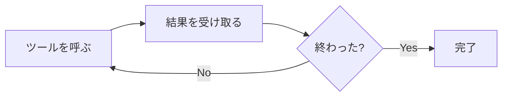
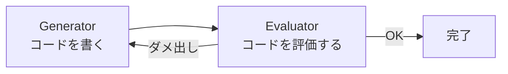
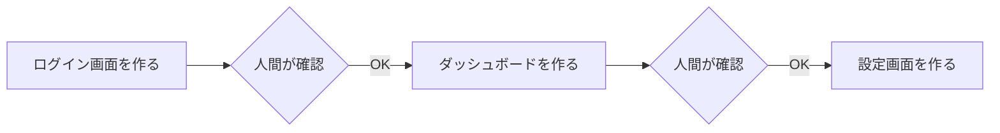
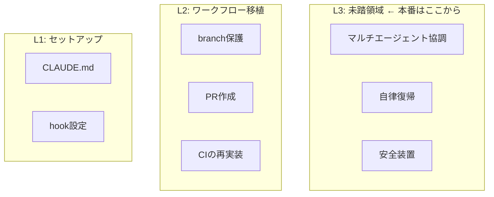
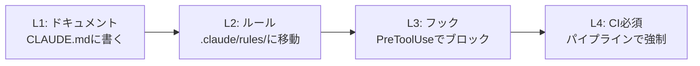

## ハーネスエンジニアリングとは

AIコーディングエージェント（Claude Code、Codex、Copilot CLI など）に仕事を任せるとき、**エージェントの行動を構造的にガイドする仕組みを設計する**エンジニアリング分野です。

名前の由来は馬具（harness）。馬の脚力を殺すのではなく、方向を制御することで馬が走ることに集中できるようにする装置です。"Harness Engineering" という名前を与えて整理した代表例として知られているのは [Mitchell Hashimoto](https://mitchellh.com/writing/my-ai-adoption-journey) の記事で、本人も「業界で確立した用語があるかは知らないが、自分はこれを harness engineering と呼ぶようになった」というニュアンスで紹介しています。AGENTS.mdの継続的改善と、エージェントが自分の出力を検証するためのツール群、というコンパクトな整理です。その後いろんな人が乗っかって概念が広がっていきますが、起点を押さえておくと各資料の射程の違いが見えやすくなります。

ただし「ハーネス」という言葉のスコープには注意が必要です。エージェントの **作り手側** が設計するハーネス（内部ハーネス：LangChainやAnthropicが語る領域）と、**使い手側** が設計するハーネス（外部ハーネス：CLAUDE.mdやフックで行動をガイドする領域）は別物で、同じ言葉なのにスコープが違うことで記事によって話が噛み合わないことがあります。この内部/外部の分類は[watanyさんの記事](https://zenn.dev/watany/articles/d8b692bbca65a3)が詳しく、本記事では主に **外部ハーネス** ——使い手として何ができるか——を扱います。

2026年春に入って、OpenAIとAnthropicが相次いでこの概念を言語化しました。日本でもいくつかの記事やOSSが出てきています。「みんな似たことを言っている部分」と「実は全然違うことを言っている部分」がありそうだったので、11の資料を読み比べてみました。

僕自身、Claude Codeのハーネスを `.claude/rules/` 配下で半年ほど運用しています。今回の調査で [superpowers](https://github.com/obra/superpowers) からいくつか取り込んだりもしたので、そのあたりも書きます。

## 調べたもの

### 記事

- [OpenAI — "Harness engineering"](https://openai.com/index/harness-engineering/) — 3人で100万行・手書きコード0行の体験記
- [Anthropic — "Harness design for long-running application development"](https://www.anthropic.com/engineering/harness-design-long-running-apps) — generator-evaluator分離パターンの提案
- [おしお — "ハーネスエンジニアリング、そのGit Workflowをbashで書き直してるだけでは"](https://zenn.dev/shio_shoppaize/articles/shogun-harness-engineering) — メタ批評としての3レイヤー分類
- [@nogataka — "ハーネスエンジニアリング入門"](https://qiita.com/nogataka/items/d1b3fcf355c630cd7fc8) — 5要素による体系化と段階的導入アプローチ
- [梶川 琢馬 — "実践ハーネスエンジニアリング"](https://speakerdeck.com/kajitack/implementing-herness-engineering) — 158リポジトリでの実運用事例
- [watany — "AIエージェントの"ハーネス"に関わる混乱と私見"](https://zenn.dev/watany/articles/d8b692bbca65a3) — 内部ハーネス/外部ハーネスの分類とベンダーポジション批評
- [逆瀬川ちゃんのほーむぺーじ — "Harness Engineering ベストプラクティス 2026"](https://nyosegawa.com/posts/harness-engineering-best-practices-2026/) — 7原則・アンチパターン・最小実行可能ハーネス（MVH）までの体系的実践ガイド

### OSS

- [multi-agent-shogun](https://github.com/yohey-w/multi-agent-shogun) — tmux+bashで最大10エージェントを戦国軍制で並列制御
- [OpenHarness](https://github.com/HKUDS/OpenHarness) — Claude Codeのハーネス層をPythonで再実装
- [harness](https://github.com/revfactory/harness) — 「ハーネスを作るハーネス」6パターンのメタスキル
- [Hive](https://github.com/aden-hive/hive) — YC支援のDAGベースマルチエージェントランタイム

## 共通していたこと

11のリソースを読み比べたところ、 **5つのパターン** がほぼ全リソースに共通していました。

### 1. エージェントループ

全リソースに登場した最も基本的なパターンです。

人間がREPLでコマンドを打つのと構造的には同じなんですが、エージェントは自分でループを回し続けるので、 **止め方・曲げ方のほうが大事** になります。

OpenHarnessがコードで最も明示的に示していて、multi-agent-shogunはtmuxの各ペインが個別にこのループを回す構成になっています。

### 2. 生成と評価の分離

11中8つに登場しています。自分で書いたコードを自分でレビューすると甘くなる、という問題への対処です。~~人間でもそうですよね。~~

Anthropicが最も体系的に論じていて、GAN（敵対的生成ネットワーク）からの着想だと明かしています。書く側と評価する側を別のエージェントにして、評価のフィードバックが次の生成に返るループです。

呼び方は各リソースでバラバラですが、構造は同じです。

| リソース             | 生成側           | 評価側                                         |
| :------------------- | :--------------- | :--------------------------------------------- |
| Anthropic            | generator        | evaluator                                      |
| OpenAI               | worker           | agent-to-agent review                          |
| harness (revfactory) | producer         | reviewer                                       |
| multi-agent-shogun   | 足軽             | 軍師                                           |
| Hive                 | pipeline stage   | judge stage（評価ステージ）                    |
| SpeakerDeck          | tdd-web-engineer | code-reviewer + spec-reviewer + perf-reviewer  |
| 逆瀬川ちゃん         | agent            | 決定論的ツール（リンター・テスト・型チェック） |

僕のハーネスでも `.claude/rules/harness-engineering.md` に「自分の出力を自分で最終評価するな、別のサブエージェントを立てろ」と書いています。superpowersの影響で、 **仕様準拠レビュー → コード品質レビューの2段階** にしています。「正しいものを作ったか？」を先に確認してから「綺麗に作ったか？」を見る順番がポイントです。逆にすると、綺麗だけど仕様と違うコードが普通に通ってしまうので。

ここで逆瀬川ちゃんが面白いのは、 **「評価側をエージェントにしない」** という逆張りを提唱している点です。リンター・テスト・型チェッカーのような決定論的ツールが使える場面では常にそちらを使うべきで、LLMは高価で遅いうえにコンテキスト腐敗の影響も受ける、と。エージェント同士をぶつけて品質を担保するAnthropic流とは方向性が逆ですが、「機械的に判定できるものは機械に任せる」という設計原則は強烈にシンプルで、どちらを主軸にするかはチームの状況次第かなと思います。

### 3. ファイルベースの知識管理

7つに登場しました。CLAUDE.md / AGENTS.md をエントリーポイントにして、プロジェクトのルール・慣習・禁止事項を構造化ドキュメントとして管理するパターンです。

OpenAIが明確に言語化していて、要約すると **「リポジトリにマークダウン／スキーマ／実行可能コードとして存在しない知識は、Codex から見れば存在しないも同然」** ——ドキュメントに書かれていない情報はエージェントにとって存在しないのと同じ、という考え方です。

ただ、ここには落とし穴があります。Qiita記事の@nogatakaさんが指摘していた「Markdownだとエージェントが勝手にタスクを完了にしたり、意思決定ログを改変する」という問題です。書ける＝壊せる。ファイルベースの知識管理は便利なんですが、 **エージェントが自分のルールを書き換えられてしまう** という構造的リスクがあります（めちゃくちゃ怖い）。

もう一つの落とし穴は「長く書けば書くほど守られる、という幻想」です。逆瀬川ちゃんが紹介していた[IFScaleの研究](https://arxiv.org/abs/2507.11538)によると、 **150〜200指示の時点でprimacy bias（先頭の指示への偏り）が顕著になり性能が劣化** し始めます。「150まで大丈夫」ではなく「150から壊れ始める」と読むべき、という解釈は刺さりました。[Vercelの事例](https://vercel.com/blog/agents-md-outperforms-skills-in-our-agent-evals)では40KBのAGENTS.mdを8KBに圧縮しても100%のパス率を維持しています。CLAUDE.md / AGENTS.md は **ルーティング用のポインタ** として設計し、詳細はSkillsや `.claude/rules/` 配下にオンデマンドで置く、という使い分けが現実解です。~~書き始めるとすぐ200行超えるんですけどね。~~

### 4. 権限と安全モデル

6つに登場しました。`git push --force`、`rm -rf`、リンター設定の改変など、破壊的な操作を構造的にブロックする仕組みです。

OpenHarnessが最も精緻で、Default / Auto / Plan Mode の3段階権限、パスルール、コマンドdenyリストを持っています。

実運用で効くのは、Qiita記事で挙げられていた**フックによる `--no-verify` 阻止**のような具体例です。エージェントはpre-commitフックが邪魔だと感じると `--no-verify` で飛ばそうとします。これをフック側でブロックすると、「じゃあESLintの設定を緩めよう」と別の抜け道を探し始めます。 **ルールを迂回する創造性だけはめちゃくちゃある** ので、穴をひとつずつ塞ぐ作業になるのでした。

この「設定を緩める」ムーブへの対抗策として、逆瀬川ちゃんは **リンター設定保護フック** の具体的な実装を載せています。PreToolUseフックで `.eslintrc` / `biome.json` / `pyproject.toml` / `tsconfig.json` 等の設定ファイル編集をブロックして、「コードを直す代わりに設定を緩める」という抜け道を構造的に潰す発想です。ここまでやるかと思いつつ、 **エージェントがやりそうなことは先回りして塞ぐ** という哲学として筋が通っています。

なお、この種のHooksはこれまでClaude Codeの強みでしたが、 **Codex 側でも [rust-v0.117.0](https://github.com/openai/codex/releases/tag/rust-v0.117.0) で shell-only の PreToolUse / PostToolUse が追加** されました（既存の Hooks 仕組みへの拡張）。対象が Bash のみという制約はありますが、Codexはファイル操作をBash経由で行うアーキテクチャなのでカバレッジは実質的に確保できます。プラットフォーム間のハーネス機能差は急速に縮まりつつあります。

### 5. コンテキスト管理

7つに登場しました。エージェントのコンテキストウィンドウが埋まっていく問題への対処です。

Anthropicはこれを「context anxiety」と呼んでいます。ウィンドウが残り少なくなるとエージェントが焦って雑な出力を出し始める現象で、対策は大きく2つあります。

- リセット型は新セッションを立てて状態をファイル経由で引き継ぐ（multi-agent-shogunのYAML外部化）
- progressive disclosure型は AGENTS.md を目次にして必要な情報だけ都度読み込む（OpenAI）

逆瀬川ちゃんが引用していた[Chroma の context rot 研究](https://research.trychroma.com/context-rot)では、 **18のフロンティアモデル全てでコンテキスト長の増加に伴い性能が低下** することが確認されています。「ウィンドウが大きいから大丈夫」というモデル選びは罠で、 **無関係・古い情報をリポジトリに残しておくこと自体が性能劣化の原因** になる、という結論です。エージェントには「これは3ヶ月前のメモで今は古い」という直感がないので、grep可能な範囲にあるテキストは全部等しく権威的に扱われてしまいます（ここがエージェント運用と人間運用で一番違うところかもしれません）。

## 共通していなかったこと

ここからは各リソースだけが持つ独自の切り口です。「面白いけど実用度は？」という視点で見ていきます。

### Anthropic: モデルが良くなったらハーネスを削れ

> ハーネスの各コンポーネントは、モデルの限界についての仮説をエンコードしている

今回読んだ中でいちばん刺さった一文です。

具体例で説明します。以前のAnthropicのハーネスでは、エージェントに「ログイン画面を作れ」「次にダッシュボードを作れ」とタスクを小分けにして、1つ終わるたびに人間が確認していました。

なぜこの仕組みが必要だったかというと、「まとめて全部作れ」と任せるとエージェントが途中で方向をズラしてしまうからです。つまりこのガードレールは、 **「モデルは長い仕事を一気に任せると暴走する」という仮説** に基づいていました。

でもモデルが賢くなってその仮説が崩れたら？ ガードレールは不要になります。Anthropic 所属のエンジニア（記事著者）は Opus 4.6 のリリースを受けて、自身のハーネスから sprint 分割の仕組みを丸ごと取り除く実験を行い、「難しいタスクだけevaluatorを付ければ十分」という体感を共有しています（組織としての公式実験ではなく、書き手個人の運用実験という位置付けです）。

僕自身のハーネスにも「Harness Simplification」というセクションがあって、「各ガードレールが前提としている仮説が、まだ成り立つかを定期的に問い直せ」と書いています。ガードレールは足しやすいけど削りにくいです。~~放っておくと際限なく増えます。~~ だからこそ「削る基準」を持っておくのが大事かなと思います。

**評価**: 非常に実用的です。ハーネスを「足す」話ばかりの中で、「削る基準」を示した唯一のリソースでした。

### OpenAI: doc-gardening agent

ドキュメントは書いた瞬間から腐り始めます。OpenAIはこれを自動検出して修正PRを出す「doc-gardening agent」で対処しています。

**評価**: 組織規模では有用です。個人開発では CLAUDE.md の量が少ないのでオーバーキル気味かなと思います。

### Zenn おしお: 「9割はGit Workflow移植」

ハーネスエンジニアリングを3レイヤーに分類しています。

そして「世の記事の9割はレイヤー1-2で、本当のエンジニアリングはレイヤー3から」と指摘しています。

この批評は正しいと思う一方で、L1-2を「ただの移植」と切り捨てるのも少し違うかなと考えています。CIの再実装だって、エージェントの挙動に合わせてフィードバックループを組み直すと、元のCIとは似て非なるものになります。「移植」というより「翻訳」に近い作業です。

**評価**: 方向性を示す地図として有用です。ただし「レイヤー3の具体例」は少ないので、これを読んだ上で自分で考える必要があります。

### Zenn watany: 内部ハーネスと外部ハーネス

冒頭で触れた内部/外部ハーネスの分類を提唱した記事です。[Martin Fowlerのハーネスエンジニアリング記事](https://martinfowler.com/articles/harness-engineering.html)の図を起点に、LangChainやAnthropicが語る作り手側のハーネスと、Mitchell HashimotoやOpenAIの利用者ガイドが語る使い手側のハーネスを明確に区別しています。

独自性が光るのはベンダー批評の部分です。Anthropicの内部ハーネスへの言及は **ベンダー側の機能アピール・製品戦略** であって、ユーザーが参考にしてハーネスを作っても、競合したら本家に奪われるのではないか——という懸念を提起しています（ClineとClaude Code、OpenClawへの定額適用禁止などを具体例に挙げている）。

振り返ると、本記事で取り上げた他のリソースはAnthropicの記事を除けば **ほぼ全て外部ハーネスの話** でした。僕自身のCLAUDE.mdルールもすべて外部ハーネスです。内部と外部を混ぜて議論すると話が噛み合わなくなる、というのは確かにそうだなと思います。

**評価**: ハーネスエンジニアリング全体の見取り図として有用です。「なぜこの議論はモヤモヤするのか」を言語化してくれた記事でした。

### multi-agent-shogun: ゼロAPIコスト通信

8エージェントをAPIで回すと \$100+/時間。CLI定額サブスクリプション（\$200/月）を使えば固定費だけで済みます。エージェント間通信もYAMLファイル + `flock`（排他ロック）で完結して、オーケストレーションにトークンを消費しません。

APIコストの問題は他のリソースがほとんど触れていない盲点です。「理想のアーキテクチャ」を語っても、月額が現実的でなければ普通に誰も使えません。

**評価**: 経済的に合理的です。ただしCLI定額制の利用規約（同時起動数、商用利用）は要確認です。

### Qiita nogataka: エスカレーションラダー

ルール違反が3回起きたら、ルールの強度を1段階上げるという仕組みです。

最初からL4（全部フックでブロック）にすると開発速度が落ちますし、L1（ドキュメントだけ）だと守られません。違反の頻度に応じて段階的に締める、という発想は運用として筋がいいです。

**評価**: 実用的です。「いきなり全部入りは失敗する」という知見は、もっと広まるべきだと思います。

### SpeakerDeck 梶川 琢馬: CIが通っても完了にしない

Chrome DevTools MCPでブラウザを実際に操作させて、スクリーンショットとコンソールエラーを確認するアプローチです。

「CIがグリーン ≠ 動く」という問題意識は、フロントエンド開発をしている人なら痛いほど分かると思います。テストは通るけど見た目が壊れている、みたいなケースをエージェントは普通に「完了」と宣言します（本当にやめてほしい）。

**評価**: フロントエンド開発では非常に実用的です。適用範囲を選ぶ切り口です。

### OpenHarness: Claude Codeの民主化

Claude Codeのハーネス層（43ツール、54コマンド、権限管理、フック、スキル）をPythonで再実装しています。Anthropic / OpenAI / Ollama 等の任意のLLMバックエンドで動きます。

**評価**: 技術的に面白い再実装です。ただしClaude Codeの進化速度に追従し続けられるかが課題かなと思います。

### harness (revfactory): ハーネスを作るハーネス

ドメイン分析 → 6種のアーキテクチャパターンから選択 → `.claude/agents/` と `.claude/skills/` を自動生成します。A/Bテストで品質スコア+60%を実証しています。

**評価**: 新規プロジェクトのブートストラップには便利です。既にハーネスがあるプロジェクトでは「既存との整合」が課題になりそうです。

### Hive: チェックポイントとコスト制御

ノード開始／完了時の **チェックポイントベースのクラッシュ復旧**、リクエスト単位の **予算上限・スロットル・自動モデル劣化ポリシー** によるコスト統制を備えています。DAGが失敗すると自動再構成して再デプロイする **「グラフ進化（graph evolution）」** もあります。

**評価**: エンタープライズ向けのランタイム機能です。個人開発には過剰ですが、ビジネスプロセス自動化には欲しい機能群だと思います。

### 逆瀬川ちゃん: 7原則 + アンチパターン + MVH

体系化のレベルがいちばん高いリソースでした。リポジトリ衛生、決定論的ツール、AGENTS.md設計、計画と実行の分離、E2Eテスト戦略、セッション間の状態管理、プラットフォーム固有戦略の **7原則** を整理した上で、5つのアンチパターンと、Week 1 / Week 2-4 / Month 2-3 / Month 3+ の段階導入ロードマップ（MVH: Minimum Viable Harness）まで提示しています。

独自性が際立つのは **E2Eテスト戦略の網羅性** です。Web・Mobile・CLI・API・Desktop・Infra・AI/MLまで、アプリタイプ別に推奨ツールスタックが整理されています。特に印象的だったのが **「MCP税」** の数字で、Playwright MCPが1タスクで約114,000トークンを消費するのに対し、Playwright CLIは約27,000トークン、agent-browserは約5,500トークン相当です。MCPサーバーを便利に繋げていくと、知らないうちにコンテキストの大半をツール定義が食っていた、みたいな話で、これは他のリソースがほとんど触れていない論点です。

| アプリタイプ | 推奨の構造化テキストインターフェース                  |
| :----------- | :---------------------------------------------------- |
| Web          | アクセシビリティツリー（Playwright CLI/agent-browser) |
| Mobile       | アクセシビリティツリー（mobile-mcp/XcodeBuildMCP)     |
| CLI          | 標準出力/エラー出力（bats/pexpect)                    |
| API          | HTTPレスポンス（Hurl）                                |
| Desktop      | ネイティブアクセシビリティAPI（Terminator等）         |
| Infra        | Plan出力/スキーマ（terraform test/conftest)           |
| AI/ML        | 評価メトリクス（lm-eval-harness/DeepEval)             |

「アクセシビリティツリーをユニバーサルインターフェースとして使う」という統一原則があるので、ただのツール紹介に終わっていないのが良いです。

**評価**: 実践用のリファレンスとして非常に有用です。本記事のような「俯瞰」と組み合わせると、 **全体像を掴む → 自分のスタックに合わせて該当章を深く読む** という運用がしやすくなると思います。~~本記事の存在意義がだいぶ揺らぎました。~~

## 全体を通して感じたこと

### 誰も語っていないもの

11の資料を横断して気づいたのは、 **「ハーネス自体のテスト」を体系的に語っている資料がほとんどない** ことです。

CLAUDE.mdに「TDDで開発せよ」と書きます。でもそのルール自体が効いているかどうかは、どうやって確認するのでしょうか。エージェントが本当にTDDで開発しているかを検証するテストは誰が書くのか。

この問題に正面から取り組んでいる例として [superpowers](https://github.com/obra/superpowers) があります。superpowers は `writing-skills` という「新規・修正スキルの書き方」スキルを持っていて、その中にスキル開発のためのテスト方法論が含まれている設計です（一般的なTDD 適用先がコード実装なのに対し、 **スキル定義そのものにテストの発想を持ち込む** という珍しい方向です）。ハーネスのハーネスをテストする、みたいな話で、メタすぎて頭が痺れます。

もうひとつ足りないと思ったのは、 **ハーネス間の相互運用** です。CLAUDE.md / AGENTS.md / copilot-instructions.md は形式が違うけど言いたいことは同じ、というケースが多いです。multi-agent-shogunが自動ビルドで解決しようとしていて、逆瀬川ちゃんの記事では [AAIF（Agentic AI Foundation）](https://www.linuxfoundation.org/press/linux-foundation-announces-the-formation-of-the-agentic-ai-foundation) が **MCP / AGENTS.md / goose** を founding standards として採択した点や、別軸で Anthropic が公開した **Skills（SKILL.md）** が他ベンダーにも取り込まれつつある——といった2方向のエコシステム収束に触れられていました（AAIF が SKILL.md を含むわけではなく、AGENTS.md と SKILL.md は別経路で広がっている関係）。とはいえ自分のリポジトリで CLAUDE.md と AGENTS.md を両方メンテする手間はまだ残っているので、ここはツール側の対応を待ちつつ、 **片方を正として `@AGENTS.md` でインクルードする** あたりが現実解かなと思います。

### 自分のハーネスを棚卸しして学んだこと

今回の調査をきっかけに、superpowersの設計から自分のハーネスに5つ取り込みました。

- TDDの「言い訳つぶしテーブル」を導入。「シンプルすぎてテスト不要」「手動で確認した」など、エージェントが使う典型的な逃げ道を6パターン列挙してブロックする
- 完了前検証の厳格化として「should pass」「probably works」を禁止ワードに指定。検証コマンドの出力を同じメッセージ内で示すことを義務化した
- Systematic Bug Fixing は「バグを見つけたらとにかく直せ」から「まず調査せよ、3回失敗したら再設計」に方針転換した
- ブレスト→設計→計画の3段階ゲートを設け、plan mode に入る前にブレストを義務化
- レビューの受け側規律として盲従を禁止。「指摘が技術的に正しいか検証してから実装せよ」と明記

取り込んでみて思ったのは、superpowersが特に強いのは **「エージェントの逃げ道を具体的に列挙する」** という手法です。「TDDで開発せよ」とだけ書くと、エージェントは「これはシンプルだからテスト不要」と自分を説得してスキップします。でも「"シンプルだからテスト不要" はシンプルなコードも壊れるので却下」と先回りしておくと、その抜け道が使えなくなります。

これは人間のチーム運営でも同じで、ルールを作るときに **「このルールを破りたくなる典型的な言い訳」を一緒に列挙しておく** のは、地味だけどめちゃくちゃ効果的なプラクティスだと感じました。~~自分のことを棚に上げて言っています。~~

## まとめ

共通する5パターン（エージェントループ、生成評価分離、ファイル知識、権限安全、コンテキスト管理）は、今のモデルなら **どれも必要な基礎的制約** です。ここが欠けているハーネスは動かないと思います。

一方、独自の切り口はチームやプロダクト固有の課題から生まれた応用的制約で、全部入りにする必要はありません。自分の開発で何が痛いかを見て、必要なものだけ足していくのが現実的です。

Anthropicの「ハーネスの各要素はモデル限界の仮説をエンコードしている」というテーゼは、足す判断にも削る判断にも使える指針になります。「このガードレールは何を防いでいるのか？ その前提はまだ成り立つか？」を定期的に問い直すこと。ハーネスエンジニアリングの本質は、ガードレールを足す技術ではなく、 **仮説を管理する技術** なのかもしれません。

それでは、またね。

## 追記 (2026-04-21)

公開後に [逆瀬川ちゃんの "Harness Engineering ベストプラクティス 2026"](https://nyosegawa.com/posts/harness-engineering-best-practices-2026/) を読みました。取り上げ損ねていたのが明らかに惜しい資料だったので、調査対象に加えた上で、以下を本文に反映しています。

- 冒頭の定義に **Mitchell Hashimotoの原典** を追加（Harness Engineeringという言葉を最初に名指しで定義した記事）
- 「ファイルベースの知識管理」に **IFScaleの150〜200指示問題** と **Vercelの40KB→8KB圧縮事例** を追記
- 「コンテキスト管理」に **Chromaのcontext rot研究**（18モデル全てで性能劣化）を追記
- 「権限と安全モデル」に **リンター設定保護フック** と **Codex の rust-v0.117.0 で shell-only Pre/PostToolUse が追加された件** を追記
- 「生成と評価の分離」に **評価側を決定論的ツールに寄せるという逆張り** の論点を追加
- 「共通していなかったこと」に **逆瀬川ちゃんの7原則 + アンチパターン + MVH** を追加
- 「ハーネス間の相互運用」の節を、AAIF標準とSkillsのオープン化に触れる形で補足
