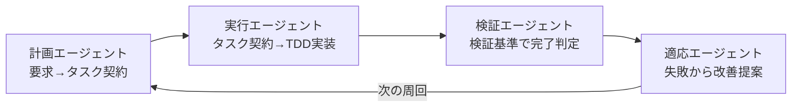
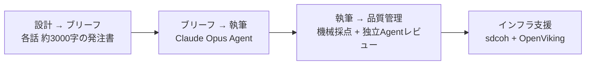

## 「現在地」記事の答え合わせ

先日 [ハーネスエンジニアリングの現在地](/2026/harness-engineering-landscape) という記事を公開しました。11の記事・OSSを横断して、共通する5パターンと各リソース固有の切り口を整理したものです。

そのフォローアップとして、メルカリで開催された [Harness Engineering Meetup Tokyo #1](https://aiau.connpass.com/event/387290/) に **一参加者として** 聴きに行きました。テーマは「プロンプト一発でコードは出る。でも、本番に載せるまでが本当の勝負」。**オンラインで集めた情報と現場の議論がどこでズレてどこで一致したか** を書いておきます。

先に結論を書いておくと、「現在地」記事の大筋は間違っていませんでした（ホッ）。ただ、**Meetupでしか聞けない3つのこと** がありました。

1. Kinopeeさんによる **ハーネスエンジニアリングの5流派分類**（理論的な地図として強力すぎ）
2. Gotaさん（cc-sdd作者）の **「ハーネスをやりすぎた話」の生々しい規模**（スクリプト 25,000行 / マークダウン 10,000行 / フック 1,500行）
3. **小説執筆へのハーネス適用**（osushi_crさん）——コード以外のドメインに方法論が拡張可能であることの具体証明

## トップバッター: Kinopeeさんによる「ハーネスエンジニアリングとは？」

トップバッターのLTにして、内容は **概念の整理そのもの** でした。資料: [ハーネスエンジニアリングとは？](https://speakerdeck.com/kinopeee/hanesuenziniaringutoha)。

### 5流派

同じ「ハーネスエンジニアリング」でも、論者により実装重心が違うという整理です。

| 流派            | 代表                                                                                               | 中核主張                                                                                                                          |
| :-------------- | :------------------------------------------------------------------------------------------------- | :-------------------------------------------------------------------------------------------------------------------------------- |
| **Chase派**     | Harrison Chase（LangChain、2025年10月のブログ「Agent Frameworks, Runtimes, and Harnesses」が起点） | モデル以外のすべてをハーネスに畳み込む（旗印フレーズは Vivek Trivedy の **"If you're not the model, you're the harness"**）       |
| **Hashimoto派** | Mitchell Hashimoto（HashiCorp創業者、2026年2月の自身のブログが起点）                               | 失敗を再発不能にする環境設計の累積（AGENTS.md に失敗防止ルールを1行ずつ追加）                                                     |
| **Fowler派**    | Martin Fowler（Thoughtworks）                                                                      | コンテキスト設計の特殊形としてハーネスを定義（guides × sensors の両輪）                                                           |
| **Chawla派**    | Avi Chawla（教育系）                                                                               | LLMのOS層、三重の入れ子（CPU/RAM/device driver 比喩）                                                                             |
| **Codex派**     | Ryan Lopopolo（OpenAI Codexチーム）                                                                | プロダクションスケール特有の故障モードを解くのがハーネス（**"Agents aren't hard; the Harness is hard"**、3人で百万行・95%AI生成） |

さらに **包含関係の対立** も指摘されていました。

- Chase / Chawla派: **harness ⊃ context**
- Fowler派: **context ⊃ harness**（harnessはcontextの特殊形）

「現在地」記事で僕は「5つの共通パターン」（エージェントループ / 生成評価分離 / ファイル知識 / 権限安全 / コンテキスト管理）を抽出したのですが、Kinopeeさんの5流派は **「実装パターン」ではなく「思想の系譜」** で切っています。同じ現象を別の軸で見ている形で、競合ではなく補完関係にあります（むしろ「現在地」記事の冒頭で系譜整理から入るべきだったかなと思いました）。

### ハーネス vs ガードレール の役割分離

これは「現在地」記事に明示的に書いていなかった整理軸でした。

| 要素             | 比喩             | 役割                       | 具体例                                               |
| :--------------- | :--------------- | :------------------------- | :--------------------------------------------------- |
| **ハーネス**     | 馬具（轡と手綱） | **事前設計**：走り方を指示 | カスタムインストラクション／スキル／サブエージェント |
| **ガードレール** | 防護柵           | **事後検証**：逸脱を検知   | リンター／型チェック／テスト／ビルド                 |

自分のルールファイルでも無意識にこの2つを混ぜて書いていて、Kinopeeさんの整理で気づいてハッとしました。**「これはハーネスだから事前設計で書く」「これはガードレールだから事後検証で機械化する」** を分けて運用すると、ルールの肥大化を抑えやすくなる気がします。~~自分の `.claude/rules/` を見返したら事前と事後が普通に同じファイルに混ざっていました。~~

### Kinopeeさんの3つの名言

- 「実装が先、命名は後」——日本の現場は既に類似実践を行っていた
- 「定義より結果」
- 「**機械的な判定が強いほど、エージェントにハンドルを預けられる**」

最後のは自律性の根本原理を一行で言い切っていて、めちゃくちゃ刺さりました。エージェントの自律度は信頼関数で、信頼は機械検証の厚みで作る——というシンプルな理屈です。逆に言えば、機械検証が弱い領域で「エージェントに任せよう」と思った時点で、もう制御はできていないということ（耳が痛いです）。

## Kuuさん: 各自の見解とポジションの比較

Kinopeeさんの直後に登壇された Kuuさん の発表は、**「ハーネスエンジニアリング」という同じ語を使っているのに、論者によって何が違うのか** を並列比較する内容でした。

Kinopeeさんの5流派分類が **思想の系譜** で切るのに対して、Kuuさんは **現場の各自がどこに重心を置いているか** という現場目線での座標づけ——同じ景色を、片方は地図、片方は実測の足跡で見せている関係です。

> **同じ言葉を使っていても、想定スコープがズレていると会話が噛み合わない**

——という当たり前だけど見落とされがちな事実を、最初の30分で会場全体に共有してくれたのは構成として絶妙でした。これがあったおかげで、後続発表の位置取りが全部読みやすくなりました（運営の采配がうまい）。

## OpenAI 石田さん: タイトなフィードバックループを作る

3番手は OpenAI 石田さんによる「Harness Engineeringでタイトなフィードバックループを作る」。残念ながら **本記事執筆時点では公開資料が見つかりませんでした**（[connpass の Media 欄](https://aiau.connpass.com/event/387290/presentation/) にも未掲載）。なので内容の詳細整理は割愛しますが、タイトル単体からも十分に系譜が読めます。

ベースになっている思想は、OpenAI が公式に出している [エージェントファーストの世界における Codex の活用](https://openai.com/ja-JP/index/harness-engineering/) です。「3人で100万行・数週間で出荷」という規模感の裏で何が起きているかを、観測スタック（ログ・メトリクス・トレース）をエージェントに丸ごと渡してフィードバックループを閉じる、という設計で説明している記事です。「現在地」記事でも触れた **「Codexが見えないものは存在しない」** の出典でもあります。

「タイトなフィードバックループ」というキーフレーズは、Kinopeeさんの **「機械的な判定が強いほど、エージェントにハンドルを預けられる」** と完全に同じ筋の主張です。検証が速く・正確で・自動化されているほど、エージェントは思い切って試行できる。この後の発表（Gotaさんの4エージェント化、藤川さんのモデルルーティング）も、このテーゼの異なる切り口の実装と読めます。資料の公開を待ちつつ、**Meetup 全体の縦串** にあたる発表だったと思います。

## Gotaさん「ハーネスをやりすぎた話」——5万行/8時間の裏面

Meetupで最もインパクトがあったのはGotaさん（[cc-sdd](https://github.com/gotalab/cc-sdd) 作者）の発表でした。

### 定量的成果

まず **5万行 / 8時間** の長時間フィードバックループ（証跡付き）を達成した、という数字から始まります。人間エンジニアのプロダクションコードが 20〜50 行/日 だとすると、500〜1000倍 のスループットです（桁が変わりすぎていて実感が追いつきません）。

これは「現在地」記事で触れたAnthropicのテーゼ「ハーネスは効果的で、モデルを固定したまま環境を作るだけで精度が向上する」の、日本発の量的証明と言って良いと思います。

### 肥大化した具体規模

ここからが「やりすぎ」パートです。

| 要素         | 規模         |
| :----------- | :----------- |
| スクリプト   | **25,000行** |
| マークダウン | **10,000行** |
| フック       | **1,500行**  |
| 設定ファイル | **300行超**  |

症状として:

- タスクテンプレート1個の変更で **10箇所の整合性調整** が必要
- **全体テスト 1時間**
- 「ハーネスでなんでもやろうとすると、エージェント制御の仕組み自体が制御不能になる」

**「最悪の成功体験」**（5万行/8時間の成功）が機能拡張を招いて制御不能になった、という流れです。「現在地」記事で引用したAnthropicの「各ガードレールはモデル限界の仮説をエンコードしている／定期的に仮説を問い直せ」というテーゼの **失敗事例として** 、Gotaさんの話は生々しく響きました。~~他人事にできないやつです。~~

### 解体後の4エージェント構造

結論は **機能分割** です。

これは PDCA と同型ですが、**適応を一級扱いに昇格させた** のがエージェント時代らしい。人間のPDCAは脳が勝手に学習しますが、エージェントは外部記憶に紐付けないと学習が揮発してしまいます。cc-sddでは `tasks.md` の `## Implementation Notes` と `brief.md` でこれを実装しているそうです。

### cc-sdd 思想ドキュメントの核心句

発表後に [cc-sdd の思想ドキュメント](https://github.com/gotalab/cc-sdd/blob/main/docs/guides/why-cc-sdd.md) を読みに行ったら、解体の思想が明文化されていました。

> "Boundaries are not overhead. They are what lets you move freely inside while protecting the outside."

> "If the discipline feels like overhead, your specs are probably too big. Break them smaller."

> "cc-sdd is not trying to put a formal spec around every change, only the ones where the contract between parts of the system actually earns its cost."

3本目が特に効いています。**「すべての変更に仕様を書く必要はない。契約がコストを上回るときだけ書け」** という自己抑制が、ツール開発者自身の言葉で書かれている（作った本人がいちばん冷静というパターン）。「現在地」記事で批評した「ハーネスをやりすぎる癖」への構造的な処方箋です。

## Bitkey: アーキテクチャ自体がハーネス

[佐藤拓人さん（@takuuuuuuu777、Bitkey / homehub）](https://speakerdeck.com/bitkey/the-ai-code-trust-gap-reducing-the-review-burden) の発表は「AIコードを信じられない問題」へのチーム開発視点での回答でした。

### 信頼ギャップ（Trust Gap）

AI生成コードに対してレビュアーはドメイン知識が不足していて、**幻覚／コンテキスト不備にどう気づくか** が本質的な課題。プロンプトを書いた本人は自分の前提にバイアスがかかっていて、見落としが残ったまま通してしまう。

解決策は4つ:

1. **知識の構造化** — ミッション / システム境界 / アプリケーション詳細 / チーム用語の体系化
2. **責務の分離** — Bounded Contexts / EDA / CQRS / 型ファースト / イベントソーシング
3. **プロセス再設計** — 上流で合意形成、QAがテスト分析に参加
4. **チーム分散** — ペア / モブプログラミングで知識サイロ防止

### 「アーキテクチャ自体がハーネス」というレンズ

Bitkey 関連の [戦略的アーキテクチャ資料](https://speakerdeck.com/bitkey/enabling-adaptable-ai-through-strategic-architecture) も併せて読むと、**アーキテクチャ自体がハーネスである** という強い主張が見えてきます。

6つの手法:

- Bounded Context — AI自律性の影響範囲を限定
- イベント駆動アーキテクチャ（EDA） — 命令ではなくイベント通知で疎結合
- CQRS — コマンド／クエリ分離で検査強度をコントロール
- 常に妥当なドメインモデル — 不正な状態を持たないモデル
- 型ファースト — 状態・制約を型で表現
- イベントソーシング — 事実の時系列記録

核心は **「細粒度のコンテキストほど単一ファイルのAI生成精度が向上する」** です。これまで CQRS の採用理由と言えば「読み書きのスケール分離」や「複雑ロジック管理」でしたが、ここに **「AIフレンドリー」という新しい採用理由** が加わった形です。

「現在地」記事では「共通パターン」として機能面の5つを抽出しましたが、こちらは **アーキテクチャ設計そのものがハーネスになり得る** という異なるレイヤーの切り口でした。CQRSを「今さら？」と敬遠していたモジュラモノリス界隈の一部は、AI時代の再評価があるかもしれません（採用理由って後付けで増えていくんだなと普通に感心しました）。

## osushi_crさん: 小説執筆のハーネスエンジニアリング

個人的にいちばん面白かった発表が [osushi_crさんの小説執筆事例](https://speakerdeck.com/yoshitetsu/xiao-shuo-zhi-bi-nohanesuenziniaringu) でした。

### プロジェクト規模

| 項目   | 規模                      |
| :----- | :------------------------ |
| 本編   | 10万字（18話）            |
| 設計書 | **23万字（本編の2.3倍）** |
| 伏線   | 47本                      |

設計書が本編の2倍超え、というのが普通に強烈で、もはや設計書こそが本体じゃないかという気すらしてきます。

### 4段階ワークフロー

### 使用ツール

- **sdcoh**（自作） — 設計書間の依存関係管理
- **[OpenViking](https://github.com/volcengine/OpenViking)**（volcengine / ByteDance製） — ファイルシステム流のAIエージェント用コンテキストDB。`viking://` URIスキームでL0（要約）/L1（概要）/L2（詳細）の3層オンデマンド配信
- **Claude Opus** — 執筆エージェント

### キーフレーズ

> **「一発の精度より、揮発しない手順」**

これがエージェント時代の方法論を一行で表していて、Meetup全体を通して **最も持ち帰りたい一言** でした。プロンプトに賭ける勝負から、手順の設計に賭ける勝負へ——という重心移動が、コードでも小説でも同じ姿で起きていることが分かります。

### 意義

小説執筆でハーネスが機能するなら、ハーネスエンジニアリングは**コーディング固有の方法論ではなく、長時間かつ主観評価を含む知的作業全般への方法論** と主張できます。企画書、ADR、設計ドキュメント、マーケコピー、法務ドラフト——どれにも転用可能。

「現在地」記事ではコーディング文脈に閉じていましたが、osushi_crさんの事例は **ドメイン横断適用性の証拠** として強力です。

## 藤川裕一さん（Alibaba）: モデルルーティングによるコスト最適化

モデルルーティングの話はシンプルに経済の話として効きます。

- Opus全投げ vs 適切なルーティングで **10〜50倍のコスト差**
- ルーティングパターン: カスケード（安いモデルで試行 → 失敗時に高級モデルへ）／タスク分類器／専用モデル／プロンプトキャッシング
- **評価側が堅いほど、生成側で安いモデルを選べる**

最後の点が構造的にめちゃくちゃ重要で、ハーネスエンジニアリングはコスト最適化の **前提条件** だということです。検証層が弱いと安いモデルの失敗を検知できないので、結局 Opus 全投げに戻るしかなくなる（戻った時の請求書が普通に怖い）。「現在地」記事で触れた「生成と評価の分離」は、品質の話だけでなく **予算の話でもある** という追加レイヤーが見えました。

## Anthropic提唱のエージェントの2つの限界

Meetup全体を貫く整理軸として、Anthropic が提示している **記憶** と **評価** の2軸が繰り返し引用されていました。

- **記憶**: コンテキストウィンドウが有限、セッション間で失われる
- **評価**: 自己採点ができない、較正された不確実性が弱い

発表群を2軸で並べると:

| 発表                                    |         記憶          |         評価          |
| :-------------------------------------- | :-------------------: | :-------------------: |
| Kinopee — 5流派 / 役割分離              |           ◯           |           ◯           |
| Bitkey — アーキテクチャ自体がハーネス   |           ◯           |           ◯           |
| osushi_cr — 小説執筆 (sdcoh/OpenViking) |           ◎           |           ◯           |
| 藤川 — モデルルーティング               |    ◯（キャッシュ）    |  ◯（カスケード判定）  |
| Gota — やりすぎた / 4エージェント       | ◯（適応エージェント） | ◎（検証エージェント） |

**全施策がこの2軸のどちらか（両方）に効く** という整理は、診断ツールとして強力です。「現在地」記事では「5つの共通パターン」で並べましたが、2軸に圧縮するとさらに本質的な枠組みになります。

## 「現在地」記事に追加したい4つのこと

Meetupを踏まえて、[「現在地」記事](/2026/harness-engineering-landscape) に補足したい論点を書いておきます（本文には追記しません、本記事で差分として残します）。

### 1. 5流派の系譜分類を「共通パターン」と並立して紹介する

「現在地」記事は実装パターンの抽出で、Kinopeeさんの分類は思想の系譜です。どちらも有用で、**実装を語るか思想を語るかで使い分ける** 必要があります。

### 2. ハーネス vs ガードレール の用語分離

事前設計（ハーネス）と事後検証（ガードレール）の混同が、ルール肥大化の遠因になっていた自分の気づきです。この2語を意識的に使い分けると、ルールファイルの整理がしやすくなります。

### 3. アーキテクチャ自体がハーネス

「現在地」記事は外部ハーネス（CLAUDE.md やフック）に閉じていましたが、Bitkeyの発表は **アーキテクチャ自体がハーネス** という異なるレイヤーでした。CQRS / EDA / 型ファーストをAIフレンドリーの理由で採用するという視点は、「現在地」記事では触れていません。

### 4. ドメイン横断の適用性

osushi_crさんの小説執筆事例は、ハーネスエンジニアリングが **コーディング以外にも適用可能** であることの最初の具体例だと思います。「現在地」記事は11のリソースがすべてコーディング中心でしたが、今後は「長時間 × 主観評価を含むあらゆる知的作業」に拡張していく気配があります。

## 逆方向：「現在地」記事からMeetupに持ち込みたい3つの論点

ここまでは「Meetup → 「現在地」記事」の補強でしたが、せっかくなので逆方向、**「現在地」記事に書いたけれどMeetupでは正面から扱われていなかった論点** も整理しておきます。発表者の方々の話と組み合わせるとさらに効きそうな気がしたものです。

### 1. Gotaさんの肥大化と、IFScale / Chroma の量的接続

「現在地」記事では [IFScale](https://arxiv.org/abs/2507.11538) の **「150〜200指示で先頭優先バイアス（primacy bias）による性能劣化が始まる」** という研究と、[Chroma の context rot 研究](https://research.trychroma.com/context-rot)（18のフロンティアモデルすべてで長コンテキスト性能劣化）を引用しました。

Gotaさんの **マークダウン 10,000行 / フック 1,500行** という規模は、これらの数字から見ると **完全に先頭優先バイアス領域** に入っています。「やりすぎたから壊れた」のではなく、**論文と分析の両方で事前に予測されていた壊れ方** がそのまま現実化した、と読み替えられます。

つまりGotaさんの話は **「やりすぎ警告」を文学的に語った話** ではなく、**「ハーネス指示は150〜200を超えると経験的に劣化する」という量的な事実の、現場での実演** でした。これに気づくと、4エージェント化（計画／実行／検証／適応）は単なる機能分割ではなく、 **各エージェントのコンテキスト窓を150〜200指示以下に保つための量的設計** として再解釈できます（~~Gotaさん本人がそこまで意図していたかは分かりませんが~~）。

### 2. MCP税という、モデルルーティングの隣にある盲点

藤川さんのモデルルーティングは **生成側のコスト軸**（Opus全投げ vs カスケード）でした。一方、「現在地」記事で逆瀬川ちゃんが指摘していた **「MCP税」** は **コンテキスト側のコスト軸** です。具体的には、Playwright MCP は1タスクあたり約114,000トークンを消費するのに対し、Playwright CLI は約27,000トークン、agent-browser は約5,500トークン相当という数字でした。

この2つを並べると、ハーネスのコスト最適化は **2軸構造** になります。

| 軸                 | 削減対象                    | 代表手法                                       |
| :----------------- | :-------------------------- | :--------------------------------------------- |
| **生成側**         | モデル単価 × 呼び出し回数   | カスケード／タスク分類器／プロンプトキャッシュ |
| **コンテキスト側** | 1呼び出しあたりのトークン量 | MCP→CLI置換／段階開示                          |

藤川さんの発表は前者だけでしたが、後者がザルだと前者の節約は秒で吸い取られます。「Opus全投げのコストは下げたけど、MCP経由で1リクエスト10万トークン食ってます」みたいな状態は、 **節約した気になる典型的な失敗パターン** だと思います（普通にやらかしそう）。

### 3. ハーネス自体の最適化——研究は先行、現場（Meetup）が追いついていない

「現在地」記事で **「ハーネス自体のテストを体系的に語っている資料がほとんどない」** と書きましたが、Meetupでもこの論点は正面からは扱われませんでした。検証エージェントや独立エージェントレビューはあくまで **生成物のテスト** であって、ハーネス（ルール・スキル・フック）自体が機能しているかの評価ではありません。

ただ、**研究側ではすでに先行している領域** です。たとえば [Meta-Harness: End-to-End Optimization of Model Harnesses](https://arxiv.org/abs/2603.28052)（Chelsea Finn / Omar Khattab らによる、2026年3月）は、まさに **「ハーネスコード自体を外側から最適化する」outer-loopシステム** の論文で、過去のハーネス候補のソースコード／スコア／実行トレースをファイルシステム越しに参照する agentic proposer がハーネスを探索する設計です。報告されている数字も乾いていて、オンラインテキスト分類で **コンテキストトークン使用量を 4分の1 に削減しつつ精度を 7.7 ポイント改善**、IMOレベル200問のRAG数学推論で **+4.7 ポイント**、TerminalBench-2 で手作りベースラインを上回る、という結果になっています。

つまり **メタハーネス** ——ハーネスを最適化するハーネス——は **2026年3月時点で既に学術的に始まっている** テーマで、Meetupに足りなかったのは **問題意識** ではなく **現場実装レベルでの言語化** です。Gotaさんの「やりすぎた話」が起きた構造的な理由のひとつは、 **メタハーネスに相当する評価関数がなかったから** とも言えます。25,000行のスクリプトと10,000行のマークダウンが「本当に意図通りエージェントを誘導できているか」をスコアで返す仕組みがあれば、肥大化の臨界点はもっと早く検知できたはずです。

個人レベルでは [superpowers](https://github.com/obra/superpowers) が **「スキルにもTDDを適用する」** という発想（スキルなしで失敗パターンを記録 → ブロックするスキルを書く → エッジケースで破られないか検証）でこのテーマに踏み込んでいて、研究側のMeta-Harnessが自動最適化アルゴリズムで踏み込んでいる。この2つの間にある **「自前メタハーネスの最小構成」あたりが、次回 Meetup の本命テーマになりそう** と勝手に予想しておきます。

## ここから先の課題：チームでハーネスを回すこと

Meetupの内容を自分の現場に持ち帰ろうとすると、最大の壁は **個人ハーネスからチームハーネスへの拡張** だなと改めて感じています。モデル＋ハーネスの精度は明確に上がっていて、ここから先の伸びしろは **「精度を支えるコンテキスト注入を、チーム・組織でどう回していくか」** に移ってきている気がします。

### レビュー導線がそのままハーネス更新速度の上限になる

PRレビューを丁寧にやっているチームほど、 **ナレッジ（ドキュメント／ルール）の更新にもレビューが必須** という構造になります。CLAUDE.md や `.claude/rules/` を雑に書き換えてエージェントが暴走したら誰も責任を取れないので、レビュー必須そのものは妥当な設計です。ただ代償として、 **レビューのリードタイムがそのままハーネス更新速度・ナレッジの難易度の上限** になります。

- 失敗パターンを発見したら即ハーネスに反映、というのが個人レベルでの強み
- チームではここに常にレビューが挟まる
- 結果、 **ハーネス更新速度がコードレビュー速度に律速される**

Gotaさんの「やりすぎた話」は個人（か少人数）だからこそ10,000行のマークダウンまで一気に積み上がったわけで、チーム運用ではむしろ **積み上がる前に詰まる** という逆方向の問題が顔を出します（~~どっちにしろ詰まるんかい~~）。

### 監査要件（SOCなど）があるとさらに厳しい

ここに変更管理・アクセス制御の監査要件（SOC 2など）が乗ると、ハーネス更新を個人裁量で回すこと自体が構造的に難しくなります。 **「失敗パターン発見 → 翌日ハーネス反映」が、「変更チケット → レビュー → 承認 → デプロイ」になる** という当たり前の重力で、コントロールが難しそうだなと感じています。

### 設計フェーズの厚みで吸収する、という仮説

ここに対して今のところ自分が考えている方向は、 **設計段階に1〜2日しっかりかけて前提・境界・契約を固めきり、その後は開発しながら短いフィードバックループを回す** ——という形に開発手法そのものを生成AIと寄り添った形に寄せていくことです。

Bitkeyの「上流で合意形成」「QAがテスト分析に参加」と同じ方向の話で、 **ハーネスを毎日いじるのではなく、設計の解像度で精度を担保する**（頻度ダウン × 一発の強度アップ）戦略になります。設計が薄いまま走り出すと、後段でハーネスを毎日いじって帳尻を合わせる羽目になり、それは前述のレビュー律速問題に直撃します。

### Stacked PR は本質解になるか？

GitHubが提案している [Stacked PR](https://github.github.com/gh-stack/)（執筆時点では private preview）は、PRを **積み重ねたチェーン状** に並べて、各PRが直前のPRのブランチをターゲットにする形でレビュー単位を小さく刻む方向の解です。GitHubのUIに **スタックマップ** が出て、ブランチ保護やCIは最終ターゲットブランチ基準で評価される——という、地味だけど運用上効く統合がなされています。

注目すべきは、 **AIエージェント統合** が機能の柱として最初から並んでいる点です。`gh skill install github/gh-stack` でエージェントに「大きな差分をスタックに分解する／最初からスタックで開発する」ことを教える、という設計になっていて、これは明らかにハーネスエンジニアリングと地続きの方向です。 **「PR分割という認知負荷の高い作業をエージェントの責務にする」** 新しいレイヤーを開きにかかっています。

ただ、 **チーム規模のレビュー律速問題に本質的に効くかは、今のところ判断がつきません**。

- レビュー粒度を細かくしても、レビュアーの認知コストの総量は減らないことが多い
- むしろ「PRが大量に来た」という気持ち悪さだけ増える可能性もある
- エージェントが切ったスタック単位とレビュアーの認知単位がズレる懸念がある（機械的にきれいに分割されても、人間が読む順序として自然かは別問題）
- 最終的には **「誰がどの粒度で何をレビューするか」** という運用設計の問題に収束しそう

——というのが今の見立てです。Stacked PR + エージェント統合は打ち手の一つではあるけれど、本丸は **レビューを誰に / 何のために / どこまでやらせるか** の運用設計だと思っていて、ここはツールよりチームの規律で決まる領域です。private preview が外れて実運用が出回り始めるあたりで、このへんの実例も Meetup で聞けるようになるんじゃないかと期待しています。

このあたり、次回以降の Meetup で **チーム／組織レベルのハーネス運用** を語る人が出てきてくれると、個人的にはとても聞きたいテーマです。

## 個人的に良かった2つのこと

参加者の視点から、特に持ち帰りになった2点を記録しておきます。

### 1. 考え方の軸が（予想通り）ブレていなかったことの再確認

僕は普段ソフトウェア開発者なので、「ハードウェア／組込み／安全クリティカル系の現場で培われてきた厳密な手法」とは少し距離があります。でもHarness Engineering という語自体が馬具に由来していて、Sam Akadaさん（SONY／リーダー電子で組込み出身）のような方まで同じ会場で同じ言葉を使っている。

Meetup 全体を通して、**扱うレイヤー（ソフト／ハード／組込み／AIエージェント）が違っても、長時間タスクを安全に回すための骨格は共通** という感覚がありました。

- 「事前に契約を書く / 事後に機械検証する」という二段階（Bitkey / Kinopee）
- 「境界を引いて、外からは壊れないようにする」（cc-sdd の思想）
- 「結果を記録して次周に渡す」（osushi_crさんの"揮発しない手順"、Gotaさんの適応エージェント）

どれも、組込みやミッションクリティカル系では当たり前の発想です。AIエージェントに向き合うときに自分が使っていた直感が、**他ドメインでも同じ姿で動いていた**ことを再確認できました。これは安心感があります。

### 2. Codex 側エコシステムに触れられたこと

僕は Claude Code 中心で、Codex や OpenAI 系のツールを直接触った経験がほとんどありませんでした。今回Kinopeeさんの5流派で **Codex派（Ryan Lopopolo）** の位置付けを整理してもらえたのと、藤川さんのモデルルーティング発表で実運用上の GPT / Qwen との組み合わせ方を具体的に聞けたのが大きかったです。

後追いで調べた中では以下が特に学びになりました:

- [Codex の Agent Approvals & Security](https://developers.openai.com/codex/agent-approvals-security) — サンドボックス＋承認ポリシーの2層、`.git` / `.agents` / `.codex` を常に読み取り専用に固定する設計
- [Codex Thread Automations](https://developers.openai.com/codex/app/automations#thread-automations) — ハートビート方式の起動による長時間監視

ただ、OpenAI Codex の実装の流れや Claude Code の変更履歴を見ていると、**良い設計は両者の中心に比較的早く反映される** 傾向があります。Codex のフック機構には [rust-v0.117.0](https://github.com/openai/codex/releases/tag/rust-v0.117.0) で **shell-only の PreToolUse / PostToolUse** が追加され（既存のフック仕組みへの拡張）、逆に OpenAI のスキル方面を Claude Code 陣営が取り込む、といった双方向の流入があります。

なので、**どちらが今月時点で優れているか** でアービトラージを取ることにはやや懐疑的です。機能差は一時的で、数ヶ月単位で埋まっていく。むしろ投資すべきは **ツール非依存のハーネス設計スキル**（仕様の切り方、境界の置き方、評価層の厚み）のほうで、そこが厚ければツールを乗り換えてもコストが比較的小さく済みます。

Kinopeeさんが「実装が先、命名は後」「定義より結果」と言っていたのと同じ筋の話で、**重要なのはどのツールを使うかではなく何を動かせるか** ——という整理に落ち着きそうです。

## Meetup全体の核心テーゼ

最後に、Meetup全体で繰り返し言及された一つのテーゼを書いておきます。

> **「ハーネスは効果的で、モデルを固定したまま環境を作るだけで精度が向上する」**

これは Anthropic のハーネス設計記事が提示していた主張ですが、Gotaさんの **5万行/8時間** という数字で量的に裏打ちされた形です。経済的含意は:

- `Sonnet + 良ハーネス > Opus + 粗ハーネス` が普通に成立する
- ハーネス投資は、モデル投資（Opus固定）より ROI が高い場合が多い
- ハーネスを整えるスキルは、プラットフォームエンジニアリングの次世代形態になる

スキル論として捉え直すと、**プロンプトエンジニアリングから環境エンジニアリング（PE）への重心移動** が今まさに進行中なのだと思います。Mitchell Hashimoto が AI 導入の旅路（adoption journey）のステージ5を明確に "Harness Engineering" と名付けているのも、同じ景色の別の角度からの表現です。~~うっかりステージ1のままプロンプト芸を磨いていると、ある日急に時代に置いていかれそうで普通に怖いです。~~

## まとめ

日本のハーネスエンジニアリング論は、2026年春時点で:

- **理論整理** は Kinopeeさんの5流派分類と、Anthropic 記憶／評価2軸で十分
- **実装パターン** は「現在地」記事の5つの共通項で押さえられる
- **失敗事例** は Gotaさんの「やりすぎた話」が最も生々しい教材
- **越境事例** は osushi_crさんの小説執筆で「全知的作業への転用可能性」が示された
- **経済面** は藤川さんのモデルルーティングが10〜50倍のコスト差を定量化

これだけ切り口の違う発表を一晩で続けて聞けたのは、参加者として普通に贅沢な時間でした。

「現在地」記事の最後に僕は「ハーネスエンジニアリングの本質は、ガードレールを足す技術ではなく、**仮説を管理する技術** なのかもしれません」と書きました。Meetupを経て、この見方は強化されました。各発表者は暗黙に異なる仮説を管理していて、仮説が変われば採用する手法も変わる。**「何を前提にしているか」を問い直し続けること** が、ハーネスエンジニアリングの本体です。

それでは、またね。

## 参考リンク

### 当日の登壇資料

- [ハーネスエンジニアリングとは？ - Kinopee](https://speakerdeck.com/kinopeee/hanesuenziniaringutoha)
- [ハーネスエンジニアリングをやりすぎた話 - Gota](https://speakerdeck.com/gotalab555/hanesuenziniaringuwoyarisugitahua-sonohanesuhajie-ti-sareta)
- [The AI Code Trust Gap - 佐藤拓人 / Bitkey](https://speakerdeck.com/bitkey/the-ai-code-trust-gap-reducing-the-review-burden)
- [Enabling Adaptable AI through Strategic Architecture - Bitkey](https://speakerdeck.com/bitkey/enabling-adaptable-ai-through-strategic-architecture)
- [AIバイブコーディングでキーボード不要？！ - Sam Akada](https://speakerdeck.com/samakada/ai-baibukoteingudekibodobu-yao)
- [小説執筆のハーネスエンジニアリング - osushi_cr](https://speakerdeck.com/yoshitetsu/xiao-shuo-zhi-bi-nohanesuenziniaringu)

### 理論的バックボーン

- [Effective Harnesses for Long-Running Agents - Anthropic](https://www.anthropic.com/engineering/effective-harnesses-for-long-running-agents)
- [Harness Design for Long-Running Applications - Anthropic](https://www.anthropic.com/engineering/harness-design-long-running-apps)
- [OpenAI Codex Thread Automations](https://developers.openai.com/codex/app/automations#thread-automations)
- [OpenAI Codex Agent Approvals & Security](https://developers.openai.com/codex/agent-approvals-security)
- [Meta-Harness: End-to-End Optimization of Model Harnesses (arxiv)](https://arxiv.org/abs/2603.28052)
- [My AI adoption journey - Mitchell Hashimoto](https://mitchellh.com/writing/my-ai-adoption-journey)

### 実装・ツール

- [cc-sdd (gotalab)](https://github.com/gotalab/cc-sdd)
- [OpenViking (volcengine)](https://github.com/volcengine/OpenViking)
- [GitHub Stacked PRs](https://github.github.com/gh-stack/) — `gh stack` CLI と `gh skill install github/gh-stack` によるエージェント統合

### 関連

- [ハーネスエンジニアリングの現在地——11の記事・OSSを横断して見えた共通項と独自性](/2026/harness-engineering-landscape)
- [イベントページ (connpass)](https://aiau.connpass.com/event/387290/)
