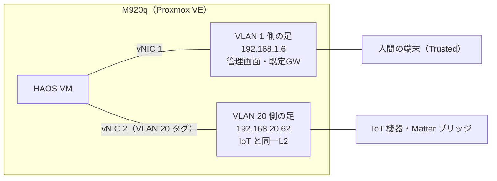

[前回](/blog/2026/unifi-network-vlan-wifi7/)はネットワーク編でした。
今回は予告どおり Home Assistant 編です。
スマートホームの頭脳になる Home Assistant（以下 HA）を、どのハードに載せて、ネットワークのどこに住まわせるか。

結論から書くと、**ヤフオクで ¥20,760 の中古 Tiny PC（Lenovo M920q）に Proxmox VE を入れ、HA は VM として稼働させています**。
そして前回持ち越した「VLAN をまたぐ HA の置き場所問題」は、VM に仮想 NIC を 2 枚生やして両方の VLAN に足を置く、デュアル NIC 構成で決着しました。
なぜそうしたのかを、検討の行き来も含めて書きます。

## 想定読者

- Home Assistant を Raspberry Pi や中古 PC で始めたい人
- VLAN 分離したネットワークで、HA と IoT 機器の相性問題（機器が見つからない）に悩んでいる人
- 中古の法人 PC を自宅サーバにする際の検品手順を知りたい人

## ハード選定——中古 Tiny PC という選択肢

HA の公式ハードには Home Assistant Green（¥30-40K）があり、素直に始めるならこれで十分です。
それでも僕が中古の法人向け Tiny PC を選んだのは、HA 以外も同居させたいからです。
具体的には監視スタック（Grafana など）と、将来のカメラ人物検知（Frigate）。
特に Frigate は Intel の QuickSync（ハードウェア動画デコード）が効くので、**Intel の T 付き CPU を積んだ 1L サイズの法人中古がちょうどいい**、という判断でした。

比較した候補はこのあたりです。

| 候補                         | 価格の目安 | 見送った理由                         |
| ---------------------------- | ---------- | ------------------------------------ |
| Home Assistant Green         | ¥30-40K    | HA 専用機。同居できない              |
| Beelink Mini S12 Pro（新品） | ¥45K       | 新品の安心感はあるが、予算の倍の価格 |
| 店舗中古 ThinkCentre M720q   | ¥27-32K    | 保証付きで安心だが予算超過           |
| ヤフオク・フリマの M920q     | ¥20K 前後  | 保証なし。今回はここに賭けた         |

先に買い基準を「完動品の i5-8500T 搭載機で ¥22,000 以下、ダメなら保証付き店舗中古へ撤退」と決めてから探し始めました。
基準を先に固定しないと、相場を眺めているうちに「もう少し待てば安いのが出るのでは」と無限に待ってしまうからです（過去に何度もやりました）。
結果、i5-8500T / 8GB / NVMe 256GB / Win11 Pro の M920q を即決 ¥20,000 + 送料 ¥760 の総額 **¥20,760** で落札。

ひとつ注意点があります。
8 世代 Core の Tiny PC の中古相場は探してみると意外に高く、「完動品が ¥13,000 で買えた」ころの記事はもう参考になりません（Windows 10 のサポート終了で中古市場が動いた影響もありそうです）。
オークション相場サイトの平均落札価格も、ジャンクや部品取り品を含んだ数字なので当てになりません。
数日かけて完動品の出品だけをウォッチして、いま実際に付いている値段を確かめてから入札するのをおすすめします。

## 中古機の受け入れ検査——保証がないなら自分で検品する

ヤフオクの個人間取引は返品不可です。
保証がない以上、初期不良は**届いてから数日のうちに自分で見つけるしかありません**。
プリインストールの Windows がまだ生きているうちに、以下の検査を実施しました。

| 検査項目        | ツール          | 結果                                                       |
| --------------- | --------------- | ---------------------------------------------------------- |
| 構成の実査      | HWiNFO          | 出品情報どおり（i5-8500T / DDR4-2666 8GB ×1 / NVMe 256GB） |
| SSD の消耗      | CrystalDiskInfo | 健康状態 89%、使用 4,507 時間、総書込 8.9TB                |
| CPU・冷却の負荷 | OCCT            | 定格 35W 維持で CPU 78℃、サーマルスロットリング 0          |

SSD は使用 4,500 時間のわりに書き込みが少なく、冷却系もグリス劣化なし。
~~ヤフオクでこれは当たりを引いた気がします。~~
出品どおり外観には傷も汚れもありましたが、棚の上で 24 時間動く箱に見た目は関係ありません。

検査のついでに、仕込みを 2 つ済ませました。
BIOS が 2020 年のままだったので Lenovo 公式の更新ツールで最新化（こういう作業は Windows が残っているうちが楽です）。
それと仮想化支援の VT-x / VT-d を BIOS で有効化しました。
M920q ではこの項目が Security ではなく Advanced タブの下に居て、少し探しました。

## Proxmox に転んだ経緯——自分の決定を自分で覆す

実は設計段階では「HA 単独運用なら Proxmox は不要、HAOS をベアメタルで入れる」と、一度は結論を出していました。
HAOS 自体にスナップショット・自動バックアップ・アドオン基盤が揃っているので、仮想化レイヤーを挟む理由が「なんとなく柔軟そう」しかなかったからです。

その結論を覆したのは、用途の変化でした。
監視スタック（Grafana / Prometheus / UniFi のメトリクス収集）を同じハードに同居させると決めた時点で、**HA と無関係なサービスが同じ箱に住む＝仮想化で区画を切る意味が生まれる**。
Proxmox VE[^pve] を土台にして、HA は VM、監視はコンテナ（LXC）という住み分けにしました。
設計記録に「Proxmox は不要」と書いた 2 か月後に、自分の手でそれを取り消す注記を付けるのは、ちょっとした敗北感があります（覆した決定を消さずに注記で残すのは ADR という設計記録の流儀で、後から「なぜああ考えたか」を辿れるようにするためです）。

インストール自体は素直で、Proxmox VE 9.2 を既存の 256GB NVMe にデフォルト構成で入れただけです。
ひとつだけ非デフォルトにしたのは、インストーラの「Pin network interface names」を ON にしたこと。
将来 10GbE の NIC を増設すると Linux がネットワークインターフェース名を採番し直すことがあり、名前が変わると管理ネットワークごと死にます。
NIC が 1 枚の今のうちに名前を固定しておくのが、後から効いてくる保険です。

## HAOS の VM はスクリプト一発

Proxmox 上の HAOS 構築は、コミュニティのスクリプト集 [community-scripts の haos-vm](https://community-scripts.org/scripts/haos-vm) を使いました。
Proxmox ホストのシェルでワンライナーを実行すると、HAOS の公式イメージ取得から VM 作成（デフォルトで 2vCPU / RAM 4GB / ディスク 32GB / UEFI）までを一気にやってくれます。
気づけば HA のオンボーディング画面に到達していました。
拍子抜けするほど簡単なので、ここで語ることは正直あまりありません。
IP アドレスだけは HA 側では設定せず、UniFi の DHCP 予約で固定しました（機器側ではなくネットワーク側に台帳を寄せる方針です）。

## 本題——VLAN をまたぐ HA の置き場所問題

前回書いたとおり、うちのネットワークは VLAN で 3 分割されています。
家族の端末が居る Trusted（VLAN 1）、スマートホーム機器を全部押し込めた IoT（VLAN 20）、来客用の Guest（VLAN 30）。
IoT から Trusted への通信は遮断する一方向ポリシーです。

では、HA はどっちに置くべきか。
**HA は「IoT 機器と直接会話したい」のに、管理・操作する人間は Trusted 側に居る**。
この板挟みが問題の正体です。
論点は 3 つあります。

- HA が IoT 機器を発見できるか（mDNS などの discovery は基本的に VLAN を越えない）
- 人間が HA の管理画面に届くか
- HA 自体をどこまで守るか（HA は家の全機器を操作できる特権的な箱です）

### 3 つの選択肢

| 案  | 配置                     | 強み                    | 弱み                                                             |
| --- | ------------------------ | ----------------------- | ---------------------------------------------------------------- |
| A   | IoT VLAN に置く          | 機器発見が素直          | 管理アクセスが VLAN 越えになる。守りたい HA が隔離される側に住む |
| B   | Trusted VLAN に置く      | 管理が素直・HA を守れる | 機器発見を mDNS リフレクター頼みにする                           |
| C   | デュアル NIC（両方に足） | 両方の「素直」を取れる  | 構成がひと手間。HA が 2 つの VLAN をまたぐ                       |

B 案が一番楽に見えます。
UniFi には mDNS リフレクター（発見パケットだけ VLAN 越しに中継する機能）があるので、「発見だけ通せば、あとはルーティングで届くでしょ」と考えたくなる。
実際、Google Home のスピーカーへ音楽をキャストするような、発見さえできれば普通の IP 通信で済む相手なら、それで動きます。

決め手になったのは Matter でした。
Matter over IP の機器は、IPv6 のリンクローカルアドレス——**同一セグメント内でしか意味を持たないアドレス**——での通信に強く依存します[^matter]。
つまり mDNS リフレクターで「発見」だけ VLAN 越しに通しても、発見した先の「実通信」がリンクローカル宛てで、ルーター越えできずに詰まる。
B 案は「発見できるのにつながらない」という、原因の切り分けがいちばん厄介な形で失敗するわけです。

そこで C 案です。
仮想化しているおかげで、NIC を増やすのに追加ハードは要りません。
Proxmox のブリッジを VLAN aware にして、HAOS の VM に VLAN 20 タグ付きの仮想 NIC をもう 1 枚挿すだけ。
作業時間は 15 分ほどでした。



管理画面へのアクセスと外向き通信は VLAN 1 側、IoT 機器との会話は VLAN 20 側。
デフォルトゲートウェイを VLAN 1 側だけに置くのが構成の要で、これを両方に置くと経路が不定になります。

検証はあっさりでした。
問題はひとつだけ。
仮想 NIC は本来 VM を止めずに追加できる（ホットプラグ）はずが、HAOS に認識させるには結局 VM の再起動が必要でした。
それを越えたら、Aqara のハブと SESAME の Hub 3 を Matter ブリッジとして HA にコミッショニング。
どちらも問題なく通りました。
B 案を選んでいたら、こうすんなりとは通らなかったはずです。

もちろんタダではありません。
HA が 2 つの VLAN に足を持つということは、万一 HA が乗っ取られたときに VLAN 間を渡る踏み台になり得るということです。
「IoT → Trusted は遮断」という前回のポリシーに、HA という穴を 1 つ開けた自覚を持って運用します。
例外は少ないほど良い。
だからこそ、この特権は HA だけに限定しています。

## ハマりどころ——オンボード NIC の持病

構築後にひとつ、ネットワークがまるごと落ちる障害を踏みました。
ある晩、HA も Proxmox の管理画面も突然応答しなくなる。
モニタをつないでみるとホストも VM も生きていて、ネットワークだけが死んでいました。

正体は M920q のオンボード NIC（Intel I219）と e1000e ドライバの持病で、カーネルログに `Detected Hardware Unit Hang` が並びます[^e1000e]。
原因の特定は状況証拠どまりですが、発症時期はブリッジの VLAN aware 化と、Matter 機器の増加でマルチキャストが増えた時期に重なっていました。
対策として TSO / GSO（NIC へのオフロード機能）を無効化する設定を永続化してからは再発していません。

```text title="/etc/network/interfaces（該当行）"
post-up ethtool -K nic0 tso off gso off
```

古い法人 PC を自宅サーバにする人が割と踏む障害のようなので、「ホストは生きてるのにネットワークだけ死ぬ」を見たらカーネルログを疑ってみてください。

## バックアップは二段構え

HA は育てるほど「壊れたら困る度」が上がります。
そこで層の違うバックアップを 2 つ重ねました。

| 層                  | 頻度 | 中身                            | 守備範囲                      |
| ------------------- | ---- | ------------------------------- | ----------------------------- |
| HA 自動バックアップ | 毎日 | 設定・オートメーション・履歴 DB | 設定ミス・アップデート失敗    |
| Proxmox vzdump      | 週次 | VM まるごと                     | HAOS 自体が起動しなくなる事故 |

HA のバックアップは暗号化されるので、復号キーはパスワードマネージャに退避してあります（キーごと箱の中に置いておくと、箱が死んだとき一緒に死にます）。
vzdump の成否は Discord に通知を飛ばしていて、**毎週の成功通知が、バックアップ系が生きていることを示すハートビートを兼ねる**設計です。
バックアップでいちばん怖いのは、いつの間にか取れなくなっていて、それに気づけないことです。
だから異常の通知を待つのではなく、毎週の成功通知が来ているかを見ます。

先に白状しておくと、この二段構えの保存先はどちらも同じ NVMe です。
設定ミスや更新失敗には強くても、ディスクが物理的に壊れたら両方いっぺんに失われます。
オフホストへの退避は監視スタック導入時の宿題として残してあり、それまではディスクが壊れないことに賭けています。
~~SMART 健康度 89% を信じることにします。~~

## まとめ——費用と、向く人・向かない人

今回の支出は本体の ¥20,760 だけでした。
Proxmox も HAOS も community-scripts も無料です。
このあとメモリを 32GB×2 へ換装する予定があるので出費としては膨らんでいきますが、HA を動かす基盤そのものは 2 万円ちょっとで済みました。

**向いている人**:

- HA 以外（監視・カメラ検知など）も同じ箱に載せたい人。
  HA と監視を VM とコンテナに分けて載せられますし、仮想 NIC でネットワーク構成を自由に組めることが、今回の置き場所問題への回答そのものでした
- VLAN 分離済みのネットワークに HA を迎える人。
  デュアル NIC 構成なら「発見できるのにつながらない」Matter の落とし穴を構造の時点で回避できます

**注意が要る人**:

- HA だけ動けばいい人には Proxmox は過剰です。
  HAOS をベアメタルで入れるか、Home Assistant Green を買う方が早くて確実です（僕も一度はそう判断しました）
- 中古の保証なし個体は、受け入れ検査をやる前提の買い物です。
  検品の時間コストまで載せると、保証付き店舗中古との 1 万円弱の差は、思ったほどお得ではないかもしれません

次回は機器統合とオートメーション編の予定です。
Nature Remo・Aqara・SESAME を HA に束ね、「行ってきます」で家が寝る仕組みと、そこで踏んだ罠（`climate.turn_off` が効かないエアコン）を書きます。

それでは、またね。

[^pve]: Proxmox VE は Debian ベースのオープンソース仮想化基盤。KVM の仮想マシンと LXC コンテナを Web UI から管理できる。

[^matter]: Matter のトランスポートは IPv6 が必須で、Thread 側から来る機器やブリッジはリンクローカル（fe80::）やメッシュローカルのアドレスで応答することが多い。これらはルーター越えを前提としないアドレスなので、L3 で分離されたセグメントからの到達に難がある。

[^e1000e]: Intel I217/I218/I219 系 + e1000e ドライバで古くから報告されている症状で、TSO などのオフロード機能を無効化する回避策が定番。
