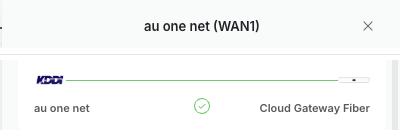
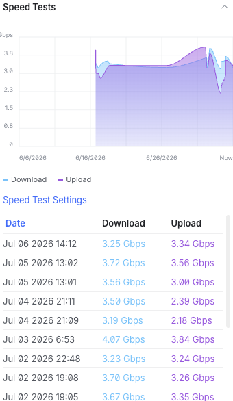
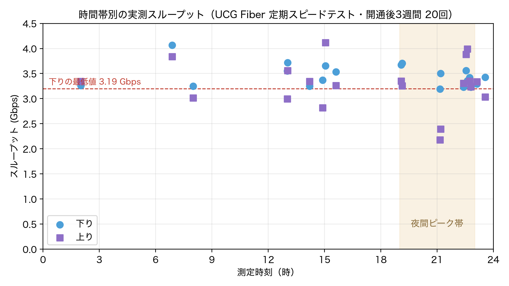

[前回の記事](/blog/2026/smarthome-design-overview/)で予告したとおり、今回は ISP 乗り換えの詳細です。

結論から書くと、NURO 光 1G（月額 5,700円）から **en ひかりクロス with v6 プラス（MAP-E）10G に乗り換えて、月額は 4,917円に下がりました**。ゲートウェイ（UCG Fiber）での定期スピードテストは開通後 3 週間の平均で**下り 3.4Gbps・レイテンシ 8ms 前後**、夜間の混雑時間帯でも 3.2Gbps を割りません（ISP 公式の計測では開通直後に約 4Gbps）。10G にして月額が下がったので、金銭的なトレードオフは存在しませんでした。

この記事では、乗り換え先の選び方、申込から開通までの流れ、UniFi ゲートウェイで v6 プラスを終端する構成、そして開通後 3 週間の実測データをまとめます。

## 想定読者

- NURO の速度やサポートに不満があり、乗り換え先を探している人
- フレッツ光クロス系の 10G 回線を検討していて、実測と落とし穴を知りたい人
- 市販ルーターではなく UniFi などの自前ルーターで IPoE（MAP-E）を終端したい人

## NURO をやめた理由

前回も触れましたが、あらためて整理します。

- **ONU とルーターの一体型が必須**で、UniFi ゲートウェイと共存できない。スマートホーム化でネットワークを UniFi に統一する計画（[前回記事](/blog/2026/smarthome-design-overview/)参照）にとって、ルーターを選べないのは致命的でした
- **混雑時間帯に 100Mbps 前後まで落ちる**ことが頻繁にあった。ダークファイバー網の理論上の強みが、少なくともうちの環境では体感に結びつきませんでした
- **サポートの応答が遅い**。問い合わせの待ち時間が長く、解決までに時間がかかる

引越が解約の強制イベントになったので、これを機に回線をゼロから選び直しました。

## 乗り換え先の選び方

### 前提の確定が先、ISP 選びは後

先にネットワーク構成側の要件を固めたことで、ISP の条件は自動的に「**フレッツ光クロス対応の光コラボ + ひかり電話なし**」に絞られました。ひかり電話を契約するとホームゲートウェイ（HGW）がほぼ必須になり、自前ルーターと相性が悪くなります。逆に言うと、ルーターを自分で選びたい人は、回線より先に「ひかり電話を使うか」を決めるのが正しい順序です。

その上での選定軸は次のとおりです。

| 軸                                     | 重要度 |
| :------------------------------------- | :----- |
| 物件のフレッツ光クロス対応             | 必須   |
| 月額料金（キャンペーン後の継続料金）   | 高     |
| 料金・契約条件の情報透明性             | 高     |
| 契約縛りの軽さ（賃貸・引越可能性あり） | 高     |
| IPv6 IPoE 対応                         | 高     |
| キャッシュバック条件の罠の少なさ       | 中     |

### 古い比較記事は業界再編で無効化されている

回線の比較記事を読むときの注意点をひとつ。この数年で ISP 業界は再編が進んでいて、**古い記事の定番候補がすでに新規契約できない**ことがあります。ぷらら光と OCN 光はどちらも新規受付を終了済みで（OCN 光は 2023年6月に受付終了しドコモ光内の「OCN インターネット」へ、ぷらら光は 2027年3月末でサービス提供自体が終了予定）、「ぷらら光がおすすめ」と書いてある記事は、その時点で情報が古いと判断できます。

もうひとつ、比較記事には構造的なバイアスがあります。比較サイトの収益源はアフィリエイト報酬なので、**報酬のない回線はどれだけ良くても推されにくい**。en ひかりにはアフィリエイトプログラム自体が存在しないため（広告販促費を削って月額に還元するモデルです）、検索結果での露出が実力に対して少なくなっています。裏を返すと、アフィリンクのない個人ブログほど en ひかりを推している傾向があるのは、この構造の帰結です。なお当然ながら、この記事にも en ひかりのアフィリンクはありません。そもそも存在しないので。

### 検討した候補と落選理由

10G プランの主要どころを比較した結果です（2026年初時点の認識。価格・キャンペーンは変動するため契約前に要確認）。

| ISP                   | 月額（10G・税込概算）    | 契約縛り | 見送った理由                                   |
| :-------------------- | :----------------------- | :------- | :--------------------------------------------- |
| GMO とくとく BB       | 約 5,940円               | 2年      | キャッシュバック条件が複雑、オプション加入の罠 |
| @nifty 光 10G         | 約 6,490円               | 3年      | 縛りが強く、特段の優位性なし                   |
| So-net 光 クロス      | 約 6,138円               | 3年      | キャッシュバック終了後の継続料金が割高         |
| BIGLOBE 光 10ギガ     | 約 6,270円               | 2〜3年   | 安定志向だが価格優位なし                       |
| ドコモ光 10ギガ       | 約 6,930円               | 2年      | ドコモ回線ユーザー以外には割高                 |
| ソフトバンク光 10ギガ | 約 7,150円 + BB ユニット | 2年      | 専用ユニット必須が構成の自由度を損なう         |

en ひかりクロスを選んだ決め手は 3 つです。

- **契約縛りが一切ない**。解約金・違約金ゼロ。賃貸で引越の可能性がある身には最重要
- **料金が透明**。キャッシュバックで釣って継続料金で回収する構造がなく、ウェブサイトの料金表がそのまま請求額になる
- **IPoE の接続方式を明示的に選べる**。v6 プラス（MAP-E）、Xpass（DS-Lite）、IPv6 オプションの 3 種から同額で選択できる。自前ルーターで終端する前提だと、この「方式が契約前に確定できる」ことの価値が大きい[^v6plus]

## 費用

| プラン                  | 月額       | 5年累計                                 |
| :---------------------- | :--------- | :-------------------------------------- |
| NURO 1G（旧・正規料金） | 5,700円    | 約 342,000円                            |
| en ひかりクロス 10G     | 4,917円    | 約 298,000円（事務手数料 3,300円 込み） |
| **差額**                | **-783円** | **約 -44,000円**                        |

補足すると、NURO の 5,700円は**正規料金**です。僕の契約は申込から 2 年間が 3,590円で、3 年目以降に 5,700円へ上がる二段料金でした。乗り換え時点ではすでに正規料金期に入っていたので、「このまま継続するか乗り換えるか」の判断としては表の比較で正しいのですが、**これから NURO を新規契約する人は最初の 2 年が en より安い**はずなので、この表の差額をそのまま鵜呑みにしないでください。ざっくり試算すると、新規契約の 5 年累計は NURO が約 291,000円（3,590円 × 24ヶ月 + 5,700円 × 36ヶ月）で、en の約 298,000円より**むしろ 7,000円ほど安くなります**。ただ、これは見方を変えると **1G と 10G が誤差レベルの同価格帯に並んでいる**ということです。同じ財布で帯域が 10 倍になるなら、それ自体が乗り換えの十分な理由で、縛りのなさとルーターの自由度、そして次に書く料金体系の性質が最後の背中を押しました。

フェアに書いておくと、この表は**素の月額同士の比較**です。NURO にも大手光コラボにもキャッシュバックがあり、満額を取り切れば実効額はもっと下がります。数字上は「キャッシュバック込みなら NURO 継続の方が安い」シナリオも作れるはずです。

それでも僕が素の月額で比較したのには理由があります。この種のキャッシュバックは「開通から 11ヶ月後に届くメールから 1ヶ月以内に申請」のような時間差設計が多く、僕は過去にこれを申込み忘れたことがあるからです。忘れたら実効額の計算は全部崩れますし、そもそも「忘れさせて回収する」前提の料金設計に付き合うこと自体が心理的にストレスでした。**請求額がそのまま比較値になる料金体系**を選んだ、というのが正直な決め手です。

細かい話ですが、検索してもなかなか出てこない情報を 2 つ。まず **en ひかりに日割り計算はありません**。月の途中に開通しても開通月は月単位の請求になるので、開通日を調整できる状況なら月初寄りに寄せた方が得です。そして 6月開通の場合、**初回請求は 8月の予定**です（6月分と 7月分の合算請求）。開通直後の 1〜2ヶ月は請求が来ませんが、未請求なだけで無料ではないので、家計簿をつけている人は覚えておくといいです。

## 申込から開通までのタイムライン

| 日付 | イベント                                                       |
| :--- | :------------------------------------------------------------- |
| 4/29 | 検討開始（引越先の物件がフレッツ光クロス対応であることを確認） |
| 5/16 | en ひかりクロス with v6 プラスを申込                           |
| 5/21 | 工事日確定の連絡                                               |
| 6/15 | 開通工事（午前中で完了）・即日疎通                             |

申込から開通までちょうど 1ヶ月でした。10G 回線の工事は混んでいることが多いので、引越が絡む場合は 1〜1.5ヶ月前の申込をおすすめします。

工事範囲は知っておくべきポイントです。**NTT の工事業者がやるのは 10G-EPON ONU の設置と疎通確認まで**。ルーターから先の接続・設定はすべて自分の作業です。市販の Wi-Fi ルーターを挿すだけの人には関係ない話ですが、この記事の読者はたぶん自分で設定したい人なので、次のセクションが本題になります。

なお、ひかり電話なしの契約だと ONU は 10GBASE-T 出力の単機能タイプが届きます。HGW ではないので、ルーター側の構成を制約するものは何もありません。

## 開通日の構築——UCG Fiber で MAP-E を終端する

うちのルーターは UniFi の Cloud Gateway Fiber（UCG Fiber）です。開通日にやったことは次のとおり。

1. **UniFi の Early Access を有効化**（後述。これをやらないと MAP-E の設定項目自体が出てきません）
2. NTT 工事完了後、ONU の 10GBASE-T ポートと UCG Fiber の WAN ポートを直結
3. UCG Fiber の WAN 設定で IPv6 を有効化し、**DHCPv6-PD** でプレフィックスを受信
4. v6 プラス（MAP-E）のルールで IPv4 over IPv6 の設定[^mape]
5. 既存の Wi-Fi ルーター（Aterm WX3600HP）はルーター機能を無効化し、UCG Fiber 配下のアクセスポイントに降格
6. 疎通確認

### つまずきポイント: MAP-E 対応は Early Access 扱い

ここが最大のつまずきポイントでした。開通時点（2026年6月）の UniFi では、**MAP-E のサポートが Early Access 扱いで、通常の安定版設定では WAN の接続方式に MAP-E が現れません**。設定項目を探し回っても見つからないので、「UCG Fiber は v6 プラスに対応していないのでは」と誤診しやすい状態です。

Early Access を有効化（UniFi の設定でリリースチャンネル/機能の Early Access を許可）すると、WAN 設定に MAP-E の選択肢が出てきて、あとは普通に設定できます。日本の IPoE 事情（MAP-E / DS-Lite）は UniFi にとって辺境の要件なので対応が後回しになりがち、という構図を知っておくと納得しやすいです。

Early Access は安定版より更新が粗い代わりに新機能が先に来るチャンネルなので、有効化のリスクは理解した上で。うちでは開通以来この構成で 3 週間、WAN まわりのトラブルはゼロです（一度だけ自宅サーバーが LAN から応答しなくなる障害はありましたが、原因はサーバー機のオンボード NIC の持病で、回線やゲートウェイとは無関係でした。この話はシリーズの後続記事で書きます）。

```bash
curl -4 ifconfig.io   # IPv4 (MAP-E 経由)
curl -6 ifconfig.io   # IPv6 (ネイティブ)
```

両方でアドレスが返ってくれば開通です。

当初は「開通直後は Aterm をルーターとして暫定運用し、UCG Fiber が届いてから切り替える」という二段構えを計画していましたが、UCG Fiber が開通前に届いたため、暫定構成を経由せず初日から本命構成で立ち上げられました。

注意点として、フレッツ光クロス + v6 プラスの契約は **IPoE 専用で、PPPoE の併用ができません**[^ipoe]。「とりあえず PPPoE で疎通させて後から IPoE に切り替える」という古典的な手順が使えないので、ルーターは最初から MAP-E 対応のもので臨む必要があります。

## 乗り換え組が必ず戸惑う罠

### WAN の IP が「KDDI」「au one net」表示になるが、正常です

開通後に UniFi の管理画面を見ると、WAN の ISP 表示が「au one net」、IP アドレスの帰属 AS が **AS2516（KDDI）** になっています。en ひかり（NTT 系の光コラボ）を契約したはずなのに KDDI の IP が付いている。契約を間違えたのかと一瞬焦りました。



これは正常です。v6 プラスの MAP-E サービスを提供しているのは JPIX（旧・日本ネットワークイネイブラー = JPNE。2023年に合併して現商号）で、**JPNE は設立時から KDDI が 55% を出資してきた KDDI 系の事業者**です。IPv4 アドレスブロックが KDDI の AS から割り当てられています。つまり「フレッツ網で運ばれ、JPNE で IPv4 化され、KDDI 帰属の IP で外に出る」という多段構造の見え方であって、契約はちゃんと en ひかりです。

IP ジオロケーションや ISP 判定系のサービスでも「KDDI」と表示されます。知らないと不安になるポイントなのに、まとまった解説がほとんど見当たらなかったので、ここに書き残しておきます。

### MAP-E はポートを自由に開けられない

MAP-E は 1 つの IPv4 アドレスを複数ユーザーで共有する仕組みなので、**利用できるポートが限られ、任意のポート開放ができません**。自宅サーバーを外部公開したい人には明確な制約です。

うちでは外部からのアクセスを全部 Tailscale に寄せているため、ポート開放の必要がそもそもありません。このあたりの構成は前回記事の[リモートアクセスの節](/blog/2026/smarthome-design-overview/)で触れたとおりで、詳細はシリーズの後続記事で書く予定です。ポート開放が必須の用途（ゲームサーバーの公開など）がある人は、v6 プラスではなく固定 IP オプションのある ISP や、Xpass（DS-Lite）との比較検討をおすすめします。

## 実測——10G はどこまで出るか

UCG Fiber の定期スピードテスト、開通後 3 週間・20 回分の統計です（測定はゲートウェイ自身が実行。LAN 側機器の性能に依存しない値です）。

| 項目       | 最小       | 平均           | 最大       |
| :--------- | :--------- | :------------- | :--------- |
| 下り       | 3,192 Mbps | **3,463 Mbps** | 4,069 Mbps |
| 上り       | 2,182 Mbps | **3,281 Mbps** | 4,115 Mbps |
| レイテンシ | 7 ms       | 8 ms           | 9 ms       |



数字そのものより、**分布の平坦さ**に注目してほしいところです。20 回の測定を時間帯にばらして見るとこうなります。



測定は深夜 2 時から夜のピークタイム（19〜23時）まで散らばっていますが、下りが 3.2Gbps を割った回は一度もありません。NURO 時代に体験した「夜になると 100Mbps」のような時間帯劣化は起きていません。フェアに断っておくと、NURO 時代の計測は端末からのスピードテストなので、ゲートウェイ計測の今回とは条件が揃っていません。ただ、測定経路の差で説明できるのはせいぜい数割で、30 倍の開きや「ピーク帯でも張り付く分布」は経路差からは出てきません。レイテンシも終始 8ms 前後で安定しています。

正直な注記もしておくと、この 3.4Gbps という値は「回線とゲートウェイの間」の話です。**うちの LAN 側は現状 2.5GbE が上限**（アクセスポイントのアップリンクと各機器の NIC）なので、端末単体で体感できるのは 2.5Gbps まで。回線の頭打ちより LAN の頭打ちが先に来ている状態で、LAN の 10G 化はネットワーク構成のフェーズ2 として計画中です。順番としては「回線を先に太くしておき、LAN は必要になったら追いつかせる」で正解だったと思っています。

## まとめ——誰に勧められるか

**勧められる人**:

- ルーターを自分で選びたい人（UniFi、OPNsense、高機能な市販ルーターなど）。ONU 単機能 + IPoE 方式が契約前に確定できる en ひかりは、この用途で最良クラス
- 夜間の速度劣化に悩んでいる人。IPoE（MAP-E）の混雑耐性は実測で裏付けられました
- 契約縛りを避けたい人。賃貸・転勤族との相性は抜群

**勧められない・注意が要る人**:

- 任意のポート開放が必須の人（MAP-E の構造的制約）
- 大手キャリアの手厚いサポートやキャッシュバックを重視する人。en ひかりは良くも悪くも素っ気ない事業者で、開通案内は郵送のみ、そして**一般のプロバイダにあるような会員マイページが存在しません**（クレジットカード登録は専用フォームで、契約まわりの手続きは書面と電話が基本）。Web で完結する管理画面を期待すると面食らいます

次回はネットワーク編として、UCG Fiber + U7 Pro での UniFi ネットワーク構築（VLAN 設計と Wi-Fi 7）を書く予定です。

それでは、またね。

[^v6plus]: [v6 プラス](https://www.jpne.co.jp/service/v6plus/)は JPNE（日本ネットワークイネイブラー）が提供する IPv6 IPoE + IPv4 over IPv6（MAP-E 方式）のサービス。フレッツ網の PPPoE 網終端装置を経由しないため、夜間の混雑の影響を受けにくい。

[^mape]: MAP-E は IPv4 over IPv6 のトンネリング方式のひとつ。1 つのグローバル IPv4 アドレスを複数ユーザーで共有し、ユーザーごとに利用可能なポート範囲を割り当てる。ルール（マッピング情報）が静的に計算できるため、対応ルーターなら事業者からの追加情報なしで設定できる。

[^ipoe]: IPoE は PPPoE に代わる IPv6 の接続方式。PPPoE のような網終端装置のボトルネックがなく、フレッツ網から直接インターネットに抜ける。フレッツ光クロスでは IPoE が前提で、PPPoE の併用はできない。
