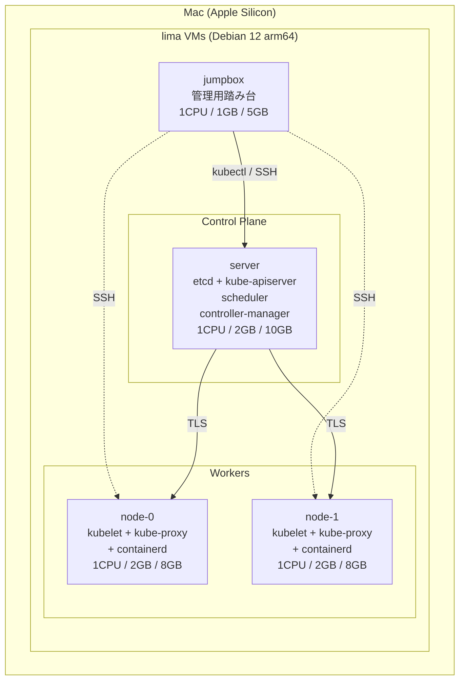

## はじめに

[Kubernetes The Hard Way](https://github.com/kelseyhightower/kubernetes-the-hard-way) は、Kelsey Hightower 氏による Kubernetes の手動構築チュートリアルで、コンポーネント (etcd / kube-apiserver / kubelet / etc.) を 1 つずつ自分の手で設定していきます。完成したクラスタを 5 分で用意する `kubeadm` とは正反対のアプローチで、`Pod が起動するまでに何が動いているか` を理解するための定番教材です。

ところが Hard Way の現行版 (2024 版) は **Debian 12 + ARM64/AMD64 両対応** にリニューアルされたとはいえ、VM の用意は読者任せで、公式手順は実質的に GCP / AMD64 を前提として書かれている部分が多いです。そのため Apple Silicon Mac で完結させたい人は、**Hard Way 本編に入る前の環境構築**でまず壁にぶつかります（僕も例外なくぶつかりました）。

このシリーズはその壁の超え方の記録です。Part 1 では `lima + socket_vmnet` で 4 VM を立てて [Chapter 1-3](https://github.com/kelseyhightower/kubernetes-the-hard-way/tree/master/docs) を消化するまでをカバーします。

### 想定読者

Apple Silicon Mac で Hard Way を完走したい人、`lima` を普段使いしていて Hard Way 用にネットワークまで踏み込みたい人、あるいは `kubeadm` のブラックボックスを剥がして Kubernetes 内部を覗きたい人を念頭に書いています。

逆に「とりあえず動くクラスタが欲しいだけ」なら `kind` や `minikube` の方が早いです。本シリーズは公式手順をなぞる過程で詰まる箇所だけに絞って書くので、Hard Way 自体の意義や CKA / CKS との関係は別の記事でまとめる予定です。

### 完成イメージ

最終的に立てる VM 構成はこのとおりです:



## VM プロバイダ選定

Hard Way には VM プロバイダの指定がないので、まず何で VM を立てるかを決める必要があります。検討した候補は以下です:

| 候補                     | 採否 | 理由                                                                      |
| ------------------------ | ---- | ------------------------------------------------------------------------- |
| GCP 公式版               | ✗    | 既存 Google アカウントだと $300 無料クレジットが使えない                  |
| Oracle Cloud Always Free | △    | ARM A1 24GB RAM が永続無料だが、申請ハードル + 日本リージョンのキャパ問題 |
| Hetzner Cloud            | △    | 週 ¥1,700、海外リージョンでレイテンシ                                     |
| multipass                | △    | Apple Silicon ネイティブで動くが lima と機能的に重複                      |
| **lima**                 | ✅   | colima 経由で同梱済み、Apple Virtualization.framework ネイティブ          |
| kind / k3d               | ✗    | Hard Way の意義 (各コンポーネント手動構築) が薄れる                       |

採用は `lima` です。理由は単純で、`colima` を入れている人は既に lima バイナリも入っており、追加インストールが要りません。Apple Virtualization.framework (vz driver) を使うので Apple Silicon ネイティブで高速、料金は ¥0、オフラインで完結します。

不採用にした候補のうち、Oracle Cloud Always Free は ARM A1 が太い無料枠で魅力的なのですが、本人確認のハードルや日本リージョンのキャパ不足に振り回されていると、Hard Way の開始まで辿り着けないリスクがあります。GCP は既存アカウントだと無料クレジットが付かないのが痛いところで、新規アカウントを切る手もあるものの、本筋から外れるので諦めました。

## VM 構成と公式差分

公式は VM 数 4 台 (jumpbox / server / node-0 / node-1) を要求し、各 server / node に 20GB のディスクを推奨しています。本記事では Mac のディスクを節約するため以下に縮小しました:

| VM      | CPU | Memory | Disk (宣言) | 役割                                                              |
| ------- | --- | ------ | ----------- | ----------------------------------------------------------------- |
| jumpbox | 1   | 1GB    | 5GB         | 管理用踏み台 (kubectl, etcdctl を叩く)                            |
| server  | 1   | 2GB    | 10GB        | control plane (etcd / apiserver / scheduler / controller-manager) |
| node-0  | 1   | 2GB    | 8GB         | worker (kubelet / kube-proxy / containerd)                        |
| node-1  | 1   | 2GB    | 8GB         | worker                                                            |

合計 4 CPU / 7GB RAM / ディスク 31GB（宣言値）。Apple Silicon Mac M3 24GB RAM の半分以下のリソースで収まります。

ディスクは `qcow2` の sparse なので宣言値より実使用が支配的で、4 VM 全起動後でも合計 **約 12GB** しか食いません。公式 20GB は余裕を持たせた値で、10GB でも Hard Way 全体を進めて余ります。

なお、`lima` のメモリ指定は GB 整数なので、公式の jumpbox 推奨 512MB は表現できません。最小 1GB に丸めています。Mac 側の空きは **30GB** ほど確保しておくと安心です (3GB/VM × 4 台 + Hard Way 進行中の証明書・バイナリ・etcd データで実測 14-15GB を使います)。

## lima 起動でのハマりポイント (前半)

ここからは VM 単体を立ち上げる過程で踏む、小さめのハマりポイントをまとめます。後半で扱う `socket_vmnet` 周りに比べると、ここはまだ軽傷です。

最初の VM (jumpbox) を作ります:

```bash
limactl create --name=jumpbox --cpus=1 --memory=1 --disk=5 template:debian-12 --yes
limactl start jumpbox
limactl shell jumpbox
```

ここで早速 1 つ目の罠です。**lima v2 から `template://debian-12` (スラッシュ 2 つ) ではなく `template:debian-12` (コロン 1 つ) が推奨形式**になっています。古い記事をコピペすると `template not found` で弾かれます（僕は最初の 5 分でやられました）。

VM 内に入ると `whoami` は Mac のユーザー名 (例: `ryota`) を継承していて、ホームディレクトリ `/Users/ryota` が自動 bind mount されます。**Mac で編集したファイルが VM から即見える**のは lima の強みで、Hard Way の証明書配布などでも便利です。

残り 3 VM を一気に作ります:

```bash
limactl create --name=server --cpus=1 --memory=2 --disk=10 template:debian-12 --yes
limactl create --name=node-0 --cpus=1 --memory=2 --disk=8  template:debian-12 --yes
limactl create --name=node-1 --cpus=1 --memory=2 --disk=8  template:debian-12 --yes

for vm in server node-0 node-1; do limactl start $vm; done
```

2 台目以降は image cache (`~/Library/Caches/lima/download/`) が効いて create が **5 秒以内**に終わります。初回 jumpbox は image DL (326MB) + nerdctl (242MB) で 70 秒程度かかります。

起動時に `TCP 127.0.0.1:5355 address already in use` という警告が出ますが、これは Mac の `mdnsd` が LLMNR ポートを使っているだけなので実害ありません。`PermitRootLogin` が無効など、Hard Way の SSH 周辺で詰まる箇所は次節以降に出てきます。

## socket_vmnet 化 — 全 VM 同 IP 問題

ここが Apple Silicon × Hard Way で **最大のハマりポイント** です。

各 VM の IP を `hostname -I` で確認すると、全部同じ値が返ってきます:

```text
server: 192.168.5.15
node-0: 192.168.5.15
node-1: 192.168.5.15
```

これは [lima のデフォルトネットワーク](https://lima-vm.io/docs/config/network/) (`user-v2` / usernet) の仕様で、各 VM が独立した NAT ゲートウェイを持ち、その NAT gateway IP (192.168.5.15) を「自分の IP」と認識しています。**VM 間の直接通信はこのネットワークではできません**。Hard Way の etcd クラスタや apiserver → kubelet 通信が全滅します。

解決策は [`socket_vmnet`](https://github.com/lima-vm/socket_vmnet) で shared network に切り替えることです。ただ、その切り替え自体がもう数段のハマりポイントを連れてきます。

### Step 1: socket_vmnet をインストール

```bash
brew install socket_vmnet
limactl sudoers | sudo tee /etc/sudoers.d/lima
sudo brew services start socket_vmnet
```

このまま進むと次のエラーで止まります:

```text
FATA[0000] networks.yaml field `paths.socketVMNet` error:
file "/opt/homebrew/opt/socket_vmnet" is a symlink
```

lima のセキュリティ設計で「特権を持つバイナリは symlink 経由で改竄されない」ことを要求しているのが原因です。macOS 特有の罠として:

- `/opt/homebrew/opt/<pkg>` は `/opt/homebrew/Cellar/<pkg>/<version>` への symlink
- `/var` は `/private/var` への symlink
- `/etc` は `/private/etc` への symlink

の 3 つが組み合わさってこのエラーになります。

### Step 2: 実体パスを書く

`~/.lima/_config/networks.yaml` で `socket_vmnet` の symlink ではなく Cellar 実体パスを書きます:

```yaml
paths:
  socketVMNet: /opt/homebrew/Cellar/socket_vmnet/1.2.2/bin/socket_vmnet
  varRun: /private/var/run/lima
  sudoers: /private/etc/sudoers.d/lima
```

これで動くかと思いきや、次のエラーが出ます:

```text
FATA[0000] dir "/opt/homebrew/Cellar/socket_vmnet/1.2.2"
is not owned by "root" (uid: 0), but by uid 501
```

lima は **socket_vmnet バイナリの親ディレクトリすべてが root 所有である**ことを要求します。`sudo brew services start` が `/bin/` 直下は root にしてくれますが、バージョンディレクトリ本体 (`Cellar/socket_vmnet/1.2.2`) はユーザー所有のままです。Cellar 全体を root にすると brew 自体が壊れるので、この方向では詰みました。

### Step 3: `/opt/socket_vmnet/` に手動コピー

lima 公式が推奨している方法に切り替えます:

```bash
sudo brew services stop socket_vmnet  # brew 経由の常駐は止める

sudo mkdir -p /opt/socket_vmnet/bin
# brew --prefix で symlink を取得し、cp はそのリンク先 (実体) をコピーする
sudo cp "$(brew --prefix socket_vmnet)/bin/socket_vmnet" /opt/socket_vmnet/bin/
sudo chown -R root:wheel /opt/socket_vmnet
sudo chmod -R go-w /opt/socket_vmnet

# networks.yaml を default パスに戻す (paths.socketVMNet: /opt/socket_vmnet/bin/socket_vmnet)
limactl sudoers | sudo tee /private/etc/sudoers.d/lima
```

なぜこの設計かというと、`socket_vmnet` を sudo NOPASSWD で起動できるようにするためには、**実行ファイル自身とそこに至るパス全体が root 所有 + 他ユーザー書込不可**でなければならないからです。さもないと「悪意あるバイナリに差し替えて sudo 経由で root 昇格」が成立してしまいます。Homebrew の Cellar 構造はユーザー所有前提なので、これと相性が悪い、という構図です。

副作用として、`brew upgrade socket_vmnet` を打っても `/opt/socket_vmnet/` 側は更新されません。アップグレードのたびに上記の `cp` を手で打ち直すしかなく、これが地味に忘れがちです。

### Step 4: 各 VM に shared network を追加

```bash
for vm in jumpbox server node-0 node-1; do limactl stop $vm; done

# limactl edit は対話式で $EDITOR が起動するため、ループ内で 4 回エディタを順に開いて
# 以下を追記して保存・終了する:
#   networks:
#     - lima: shared
for vm in jumpbox server node-0 node-1; do limactl edit $vm; done

for vm in jumpbox server node-0 node-1; do limactl start $vm; done
```

確認:

```bash
for vm in server node-0 node-1; do
  echo -n "$vm: "
  limactl shell $vm -- ip addr show lima0 | grep 'inet '
done
```

期待出力は **各 VM で異なる `192.168.105.x` の IP** です。ここまで来てやっと VM 間で `ping` が通る土台ができます。

公式 Hard Way は「各 VM に独立 IP がある」前提で書かれており、この `socket_vmnet` セットアップを省略すると [Chapter 7 (etcd)](https://github.com/kelseyhightower/kubernetes-the-hard-way/blob/master/docs/07-bootstrapping-etcd.md) で破綻します。Apple Silicon × Hard Way が世間でつまずく代表ポイントです。

## SSH 鍵配布と root ログイン

[Chapter 3 (Provisioning Compute Resources)](https://github.com/kelseyhightower/kubernetes-the-hard-way/blob/master/docs/03-compute-resources.md) はノード間通信のための SSH 鍵配布から始まります。公式は `ssh-copy-id root@${IP}` を使いますが、**lima では root のパスワードが設定されていないので `ssh-copy-id` が `Permission denied` で死にます**。

回避策は lima の管理経路 (パスワード不要) で直接 `authorized_keys` を配置することです:

```bash
PUBKEY=$(limactl shell jumpbox sudo cat /root/.ssh/id_rsa.pub)

for vm in server node-0 node-1; do
  limactl shell $vm sudo bash -c "
    mkdir -p /root/.ssh && chmod 700 /root/.ssh
    grep -qxF '$PUBKEY' /root/.ssh/authorized_keys 2>/dev/null \
      || echo '$PUBKEY' >> /root/.ssh/authorized_keys
    chmod 600 /root/.ssh/authorized_keys
    sed -i 's/^#*PermitRootLogin.*/PermitRootLogin yes/' /etc/ssh/sshd_config
    systemctl restart ssh
  "
done
```

ポイントは `grep -qxF ... || echo ... >>` で冪等性を担保しているところです。何度実行しても authorized_keys に重複が発生しません。`PermitRootLogin` は `sed 's/^#*PermitRootLogin.*/.../'` で既存設定の有無 (`#PermitRootLogin prohibit-password` と `PermitRootLogin yes` の両方) を 1 文で上書きできます。

## machines.txt と /etc/hosts 配布

Chapter 3 は最後に各ノードの `hostname` 設定と `/etc/hosts` 配布で締めます。ここで地味な落とし穴がいくつかあります。

### `machines.txt` 末尾空行で空ループ

```bash
while read IP FQDN HOST SUBNET; do
  ssh root@${IP} "..."
done < machines.txt
```

`machines.txt` の末尾に空行 (LF のみ) があると最後に空のイテレーションが走り、`ssh root@`（IP なし）として `Could not resolve hostname` で落ちます。ファイル側で `sed -i -e '/^[[:space:]]*$/d' machines.txt` を流して空行を消すか、ループの先頭に `[ -z "$IP" ] && continue` を入れるかのどちらかで回避できます。

### Debian cloud image に `127.0.1.1` 行がない

公式は `/etc/hosts` の `127.0.1.1` 行を sed で書き換える前提ですが、lima の Debian cloud image には**そもそもこの行がありません**:

```text
127.0.0.1    localhost
::1          localhost ip6-localhost ip6-loopback
192.168.5.2  host.lima.internal     ← lima が自動挿入
```

デスクトップ Debian なら `127.0.1.1 <hostname>` 行があるのですが、cloud image はミニマル仕様で省略されています。`sed` の置換が空振りして `/etc/hosts` が変わらず、`hostname --fqdn` が短縮名のままになります。

存在チェック付きで置換 or 追加するのが安全です:

```bash
ssh root@${IP} \
  "grep -q '^127.0.1.1' /etc/hosts \
    && sed -i 's|^127.0.1.1.*|127.0.1.1\t${FQDN} ${HOST}|' /etc/hosts \
    || echo '127.0.1.1\t${FQDN} ${HOST}' >> /etc/hosts"
```

### `echo -e` のターミナル幅折り返し事故

長いコマンドをターミナルに貼り付けると、ターミナル幅で折り返された箇所に literal newline が混入することがあります:

```text
127.0.1.1    server.kubernetes.local
   server                              ← 別行に切れた
```

これで `hostname --fqdn` が短縮名を返すようになります。`echo -e` の引数に literal newline が混ざると保存されてしまうのが原因で、`printf` に切り替えると安全です:

```bash
ssh root@${IP} "sed -i '/^127.0.1.1/d' /etc/hosts"  # 壊れたエントリを掃除
ssh root@${IP} "printf '127.0.1.1\t%s %s\n' '${FQDN}' '${HOST}' >> /etc/hosts"
```

`printf` は `%s` への引数展開を 1 個分の文字列として扱うので、引数に literal newline が混ざっても改行で分裂しません。

なお `sed` のクォート escape (`'\''`) は `limactl shell X bash -c '...'` のように外側に single quote がある場合のみ必要で、素の SSH 経由では使わない方が無難です。コピペする前に「いまどの実行コンテキストにいるのか」を一度確認する癖をつけたいところです。

## まとめ

Chapter 1-3 (環境構築) だけで以下を消化しました:

- VM プロバイダ選定 (lima 採用、socket_vmnet 必須)
- 4 VM 起動 (合計 4 CPU / 7GB / 12GB 実使用)
- VM 間通信のための shared network 化
- SSH 鍵配布 + root ログイン有効化
- `machines.txt` + `/etc/hosts` 配布

所要時間は **約 4 時間** でした。公式 Hard Way の進行時間目安には含まれていない部分で、Apple Silicon 経由だと +4 時間ぶんを覚悟しておくと精神的に楽です（僕は覚悟がないまま入って普通に疲弊しました）。

学びとしては:

- lima は「sudo でログインする普段使い Linux」という思想で、Hard Way が想定する「root SSH で一括設定する」というやり方とはそもそも文化が違います。Hard Way 用には別途すり合わせが必要です
- `socket_vmnet` の 3 段階エラー（symlink / Cellar owner / パス）は、Homebrew のディレクトリ構造と lima のセキュリティモデルがぶつかる箇所で、結局のところ `/opt/socket_vmnet/` への手動コピーが正解になります
- `/etc/hosts` 周辺は cloud image 特有のミニマル仕様にシェルのコピペ事故が重なって複雑に見えるだけで、`grep` で存在確認したうえで `printf` で書く、を徹底すれば事故はほぼ消えます

次回 [Part 2](/blog/2026/kubernetes-hard-way-apple-silicon-part2-bootstrap) は本格的に Kubernetes 内部に入ります。[Chapter 4 (Certificate Authority)](https://github.com/kelseyhightower/kubernetes-the-hard-way/blob/master/docs/04-certificate-authority.md) の PKI で **CA + 8 証明書** を発行し、[Chapter 7](https://github.com/kelseyhightower/kubernetes-the-hard-way/blob/master/docs/07-bootstrapping-etcd.md)-[8](https://github.com/kelseyhightower/kubernetes-the-hard-way/blob/master/docs/08-bootstrapping-kubernetes-controllers.md) で etcd / kube-apiserver の bootstrap を行い、[Chapter 12 (Smoke Test)](https://github.com/kelseyhightower/kubernetes-the-hard-way/blob/master/docs/12-smoke-test.md) まで通すところまでをカバーする予定です。途中で発見した **kube-apiserver 無言失敗** や **port-forward が全部 Forbidden になるバグ** なども記録するつもりです。

Hard Way 本編よりも、その手前の環境構築でハマっている人を最近よく見かける気がします。この記事が、socket_vmnet や `/etc/hosts` のあたりで止まっている誰かの 4 時間を取り戻せたら嬉しいです。それでは [Part 2](/blog/2026/kubernetes-hard-way-apple-silicon-part2-bootstrap) でまたお会いしましょう。

---

## シリーズ記事

- Part 1（本記事）: 環境構築編。lima + socket_vmnet で 4 VM を立てるところまで
- [Part 2: PKI から Smoke Test まで完走編](/blog/2026/kubernetes-hard-way-apple-silicon-part2-bootstrap)
- [Part 3: Tier 1 深堀り編 + 公式の隠れたバグ G25](/blog/2026/kubernetes-hard-way-apple-silicon-part3-tier1-and-upstream-bug)

## 関連リンク

- [Kubernetes The Hard Way (公式リポジトリ)](https://github.com/kelseyhightower/kubernetes-the-hard-way)
  - [Chapter 01: Prerequisites](https://github.com/kelseyhightower/kubernetes-the-hard-way/blob/master/docs/01-prerequisites.md)
  - [Chapter 02: Setting up the Jumpbox](https://github.com/kelseyhightower/kubernetes-the-hard-way/blob/master/docs/02-jumpbox.md)
  - [Chapter 03: Provisioning Compute Resources](https://github.com/kelseyhightower/kubernetes-the-hard-way/blob/master/docs/03-compute-resources.md)
- [lima (公式リポジトリ)](https://github.com/lima-vm/lima)
- [lima Networking ドキュメント](https://lima-vm.io/docs/config/network/)
- [socket_vmnet (公式リポジトリ)](https://github.com/lima-vm/socket_vmnet)
