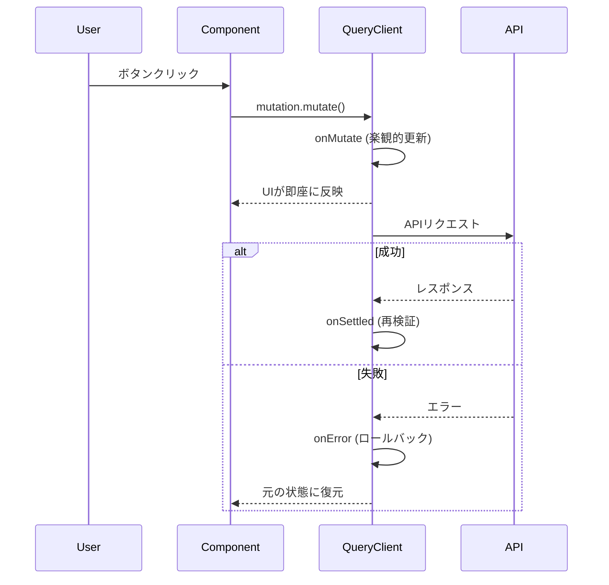

[前回の記事](/blog/2025/modern-edge-tech-stack)で、React Query（TanStack Query）を使ったオフラインファースト設計の**基礎概念**を紹介しました。

今回は、その**実装の細部**を深掘りします。「楽観的更新の概念はわかるけど、実際どう書くの？」という疑問に対して、**Create（追加）・Update（更新）・Delete（削除）・ネストされたオブジェクト更新**の4つの具体的なパターンで答えます。

オフラインの環境下でも、ユーザーに「即座に反映される」体験を提供するための、本番環境で実践している実装パターンです。



## TL;DR

- **楽観的更新の4パターン**: 配列追加・配列要素更新・配列要素削除・オブジェクトプロパティ更新のonMutate実装例
- **Context型安全性**: ロールバック用スナップショット管理をTypeScriptで型安全に
- **TTLプリセット**: 数秒～無限まで、用途別のstaleTime設定テンプレート
- **キャッシュバージョニング**: APIスキーマ変更時の古いキャッシュ自動クリーンアップ戦略

> この設計を実装した筋トレ記録アプリ **Attain** を公開中。
> 電波の悪いジムでも快適に使えます。
> 👉 [アプリを見る](https://attain-app.com/lp)

---

## 前提: QueryClientの設定

オフラインファーストの基本設定は[前回の記事](/blog/2025/modern-edge-tech-stack)で解説しました。ここでは追加のTTLプリセットを紹介します。

```typescript
// apps/mobile/src/lib/query-client.ts
export const TTL = {
  /** 30秒 - リアルタイムデータ（進行中のワークアウト） */
  REALTIME: 30 * 1000,
  /** 5分 - デフォルト */
  SHORT: ONE_MINUTE * 5,
  /** 10分 - 安定したデータ（ユーザー設定） */
  MEDIUM: ONE_MINUTE * 10,
  /** 1時間 - 変更が少ないデータ */
  LONG: ONE_HOUR,
  /** 無限 - 不変のマスターデータ（エクササイズカタログ） */
  STATIC: Infinity,
} as const;
```

使用例：

```typescript
// エクササイズ一覧（不変データ）
export const useExercises = () => {
  return useQuery({
    queryKey: ['exercises'],
    queryFn: fetchExercises,
    staleTime: TTL.STATIC, // 永久にキャッシュ
  });
};
```

---

## パターン1: 配列へのデータ追加（Create）- 一時IDで即座にUI反映

セットを追加する例です。**一時ID**を発行してUIを即座に更新し、APIレスポンス後に正式なデータで同期します。

```typescript
// apps/mobile/src/hooks/useWorkouts.ts
export const useAddSet = (sessionId: string) => {
  const queryClient = useQueryClient();

  return useMutation<
    SetResponse,
    Error,
    CreateWorkoutSet,
    { previousData: WorkoutResponse | undefined } // Context型
  >({
    mutationFn: async (data: CreateWorkoutSet) => {
      const res = await apiFetch(`/api/workouts/${sessionId}/sets`, {
        method: 'POST',
        body: JSON.stringify(data),
      });
      if (!res.ok) throw new Error('Failed to add set');
      return res.json();
    },

    // 1. 楽観的更新: APIリクエスト前に実行
    onMutate: async (newSet) => {
      // 進行中のクエリをキャンセル（競合を防ぐ）
      await queryClient.cancelQueries({ queryKey: ['workout', sessionId] });

      // 現在のキャッシュをスナップショット
      const previousData = queryClient.getQueryData<WorkoutResponse>([
        'workout',
        sessionId,
      ]);

      // キャッシュを楽観的に更新
      if (previousData) {
        const optimisticSet: WorkoutSetWithExercise = {
          id: `temp-${Date.now()}`, // 一時ID（後でサーバーのIDに置換）
          sessionId,
          exerciseId: newSet.exerciseId,
          weightKg: newSet.weightKg,
          reps: newSet.reps,
          rir: newSet.rir ?? null,
          isWarmup: newSet.isWarmup ?? false,
          isFailed: newSet.isFailed ?? false,
          isPr: false,
          completedAt: new Date().toISOString(),
          // 既存データからExercise情報を取得
          exerciseNameKey:
            previousData.sessionExercises.find(
              (e) => e.exerciseId === newSet.exerciseId,
            )?.exerciseNameKey ?? '',
          exerciseEquipment: 'barbell',
          exerciseCategory: 'chest',
        };

        queryClient.setQueryData<WorkoutResponse>(['workout', sessionId], {
          ...previousData,
          workoutSets: [...previousData.workoutSets, optimisticSet],
        });
      }

      // ロールバック用にスナップショットを返す
      return { previousData };
    },

    // 2. エラー時: ロールバック
    onError: (_err, _newSet, context) => {
      if (context?.previousData) {
        queryClient.setQueryData(['workout', sessionId], context.previousData);
      }
    },

    // 3. 完了時: サーバーの正しいデータで同期
    onSettled: () => {
      queryClient.invalidateQueries({ queryKey: ['workout', sessionId] });
    },
  });
};
```

### ポイント

1. **一時ID**: `temp-${Date.now()}` でUI表示用のIDを発行
2. **Exercise情報**: 既存のセットまたはsessionExercisesから取得
3. **onSettled**: 成功・失敗に関わらず、最終的にサーバーと同期

---

## パターン2: 配列内の要素更新（Update）- map()で該当要素を置換

既存のセットを更新する例です。**該当要素のみを差し替え**ます。

```typescript
type UpdateSetInput = {
  setId: string;
  weightKg?: number;
  reps?: number;
  rir?: number;
  isWarmup?: boolean;
  isFailed?: boolean;
};

export const useUpdateSet = (sessionId: string) => {
  const queryClient = useQueryClient();

  return useMutation<
    SetResponse,
    Error,
    UpdateSetInput,
    { previousData: WorkoutResponse | undefined }
  >({
    mutationFn: async (data: UpdateSetInput) => {
      const { setId, ...updateData } = data;
      const res = await apiFetch(`/api/workouts/${sessionId}/sets/${setId}`, {
        method: 'PATCH',
        body: JSON.stringify(updateData),
      });
      if (!res.ok) throw new Error('Failed to update set');
      return res.json();
    },

    onMutate: async (updatedSet) => {
      await queryClient.cancelQueries({ queryKey: ['workout', sessionId] });
      const previousData = queryClient.getQueryData<WorkoutResponse>([
        'workout',
        sessionId,
      ]);

      if (previousData) {
        // 該当セットのみをmapで更新
        queryClient.setQueryData<WorkoutResponse>(['workout', sessionId], {
          ...previousData,
          workoutSets: previousData.workoutSets.map((set) =>
            set.id === updatedSet.setId
              ? {
                  ...set,
                  weightKg: updatedSet.weightKg ?? set.weightKg,
                  reps: updatedSet.reps ?? set.reps,
                  rir: updatedSet.rir ?? set.rir,
                  isWarmup: updatedSet.isWarmup ?? set.isWarmup,
                  isFailed: updatedSet.isFailed ?? set.isFailed,
                }
              : set,
          ),
        });
      }

      return { previousData };
    },

    onError: (_err, _updatedSet, context) => {
      if (context?.previousData) {
        queryClient.setQueryData(['workout', sessionId], context.previousData);
      }
    },

    onSettled: () => {
      queryClient.invalidateQueries({ queryKey: ['workout', sessionId] });
    },
  });
};
```

### ポイント

1. **部分更新**: `updatedSet.weightKg ?? set.weightKg` で未指定フィールドは既存値を維持
2. **map関数**: 該当IDのみ更新、それ以外はそのまま返す

---

## パターン3: 配列から要素を削除（Delete）- filter()で対象を除外

セットを削除する例です。**filterで該当要素を除外**します。

```typescript
export const useDeleteSet = (sessionId: string) => {
  const queryClient = useQueryClient();

  return useMutation<
    DeleteResponse,
    Error,
    string, // setId
    { previousData: WorkoutResponse | undefined }
  >({
    mutationFn: async (setId: string) => {
      const res = await apiFetch(`/api/workouts/${sessionId}/sets/${setId}`, {
        method: 'DELETE',
      });
      if (!res.ok) throw new Error('Failed to delete set');
      return res.json();
    },

    onMutate: async (setId) => {
      await queryClient.cancelQueries({ queryKey: ['workout', sessionId] });
      const previousData = queryClient.getQueryData<WorkoutResponse>([
        'workout',
        sessionId,
      ]);

      if (previousData) {
        // filterで該当セットを除外
        queryClient.setQueryData<WorkoutResponse>(['workout', sessionId], {
          ...previousData,
          workoutSets: previousData.workoutSets.filter(
            (set) => set.id !== setId,
          ),
        });
      }

      return { previousData };
    },

    onError: (_err, _setId, context) => {
      if (context?.previousData) {
        queryClient.setQueryData(['workout', sessionId], context.previousData);
      }
    },

    onSettled: () => {
      queryClient.invalidateQueries({ queryKey: ['workout', sessionId] });
    },
  });
};
```

### ポイント

1. **filter関数**: 削除対象以外を残す
2. **引数の型**: `string`（setIdのみ）でシンプルに

---

## パターン4: ネストされたオブジェクトプロパティの更新 - Computed propertyで動的キーを設定

エクササイズ別のRPE（主観的運動強度）を更新する例。**オブジェクトのプロパティを動的に更新**します。配列ではなく、辞書型（キーバリューペア）の更新パターンです。

```typescript
type SetExerciseRpeInput = {
  exerciseId: string;
  rpe: number;
};

export const useSetExerciseRpe = (sessionId: string) => {
  const queryClient = useQueryClient();

  return useMutation<
    SetExerciseRpeResponse,
    Error,
    SetExerciseRpeInput,
    { previousData: WorkoutResponse | undefined }
  >({
    mutationFn: async (data) => {
      const res = await apiFetch(
        `/api/workouts/${sessionId}/exercises/${data.exerciseId}/rpe`,
        {
          method: 'PUT',
          body: JSON.stringify({ rpe: data.rpe }),
        },
      );
      if (!res.ok) throw new Error('Failed to set exercise RPE');
      return res.json();
    },

    onMutate: async (data) => {
      await queryClient.cancelQueries({ queryKey: ['workout', sessionId] });
      const previousData = queryClient.getQueryData<WorkoutResponse>([
        'workout',
        sessionId,
      ]);

      if (previousData) {
        // オブジェクトのプロパティを動的に更新
        queryClient.setQueryData<WorkoutResponse>(['workout', sessionId], {
          ...previousData,
          exerciseRpes: {
            ...previousData.exerciseRpes,
            [data.exerciseId]: data.rpe, // Computed property
          },
        });
      }

      return { previousData };
    },

    onError: (_err, _data, context) => {
      if (context?.previousData) {
        queryClient.setQueryData(['workout', sessionId], context.previousData);
      }
    },

    onSettled: () => {
      queryClient.invalidateQueries({ queryKey: ['workout', sessionId] });
    },
  });
};
```

### ポイント

1. **Computed property**: `[data.exerciseId]: data.rpe` で動的キーを設定
2. **スプレッド演算子**: 既存のRPE設定を保持しつつ、該当エクササイズのみ更新

---

## 高度なトピック: キャッシュバージョニング戦略

[前回の記事](/blog/2025/modern-edge-tech-stack)で「将来的に対策予定」と書いたキャッシュバージョニングを、実際に実装しました。

本番環境でスキーマ変更時の不整合を防ぐための、**必須の仕組み**です。

### 問題: Hydration Error

APIの型定義が変わると、古いキャッシュを読み込んだ際にパースエラーが発生します。

```text
TypeError: Cannot read property 'exerciseId' of undefined
```

### 解決: バージョン付きキャッシュキー

```typescript
// apps/mobile/src/lib/query-client.ts

/**
 * Cache Version
 *
 * WHEN TO BUMP:
 * - Breaking API schema changes
 * - Query key structure changes
 * - Major React Query upgrades
 */
export const CACHE_VERSION = 1;
export const QUERY_CACHE_KEY = `ATTAIN_QUERY_CACHE_v${CACHE_VERSION}`;

export const asyncStoragePersister = createAsyncStoragePersister({
  storage: AsyncStorage,
  key: QUERY_CACHE_KEY, // バージョン付きキー
  throttleTime: 3000,
});
```

### 古いキャッシュのクリーンアップ

```typescript
// apps/mobile/src/components/QueryProvider.tsx

async function cleanupOldCaches(): Promise<void> {
  const allKeys = await AsyncStorage.getAllKeys();
  const cacheKeys = allKeys.filter(
    (key) =>
      key.startsWith("ATTAIN_QUERY_CACHE_v") &&
      key !== QUERY_CACHE_KEY // 現在のバージョン以外
  );

  if (cacheKeys.length > 0) {
    await AsyncStorage.multiRemove(cacheKeys);
    console.log(`Cleaned up ${cacheKeys.length} old cache versions`);
  }
}

export const QueryProvider = ({ children }) => {
  return (
    <PersistQueryClientProvider
      client={queryClient}
      persistOptions={persistOptions}
      onSuccess={cleanupOldCaches} // 復元後にクリーンアップ
    >
      {children}
    </PersistQueryClientProvider>
  );
};
```

### バージョンアップのタイミング

| 変更内容                                  | バージョンアップ |
| ----------------------------------------- | ---------------- |
| APIレスポンスのフィールド追加（optional） | 不要             |
| APIレスポンスのフィールド削除             | **必要**         |
| APIレスポンスの型変更（string→number等）  | **必要**         |
| クエリキーの構造変更                      | **必要**         |
| React Queryのメジャーアップグレード       | **必要**         |

---

## 実装ガイド: パターン早見表

| 操作                 | onMutate内の処理          | 配列操作                                                      |
| -------------------- | ------------------------- | ------------------------------------------------------------- |
| **追加**             | スプレッドで末尾に追加    | `[...prev, newItem]`                                          |
| **更新**             | mapで該当要素を差し替え   | `.map(item => item.id === id ? {...item, ...updates} : item)` |
| **削除**             | filterで該当要素を除外    | `.filter(item => item.id !== id)`                             |
| **オブジェクト更新** | Computed propertyで上書き | `{ ...prev, [key]: value }`                                   |

楽観的更新は、同じパターンの繰り返しです。一度理解すれば、あらゆるCRUD操作に適用できます。

---

## 次のステップ: これらのパターンを実装したアプリ

この記事で紹介した楽観的更新とキャッシュバージョニング戦略は、すべて公開中の筋トレ記録アプリ **Attain** で実装されています。

### なぜこの設計が必要なのか

実務で遭遇する課題：

| 課題                     | Attainでの解決方法                            |
| ------------------------ | --------------------------------------------- |
| 低速ネットワーク（ジム） | 7日間のキャッシュ保持 + 楽観的更新で0msの反応 |
| API仕様の変更            | キャッシュバージョニングで自動クリーンアップ  |
| 数百行のコード重複       | CRUDの4パターンで全てカバー                   |
| UIの遅延反映             | onMutateで即座にState更新                     |

### 実際に動作するコードを確認

- **PWA対応** - ブラウザからインストール不要、オフラインでも動作
- **実装パターンを実践** - 記事のコードをそのまま活用可能
- **無料で試す** - コア機能は完全無料

👉 **[Attainをブラウザで試す](https://attain-app.com/lp)**

---

質問・フィードバックは [X (@paveg\_)](https://x.com/paveg_) まで！
