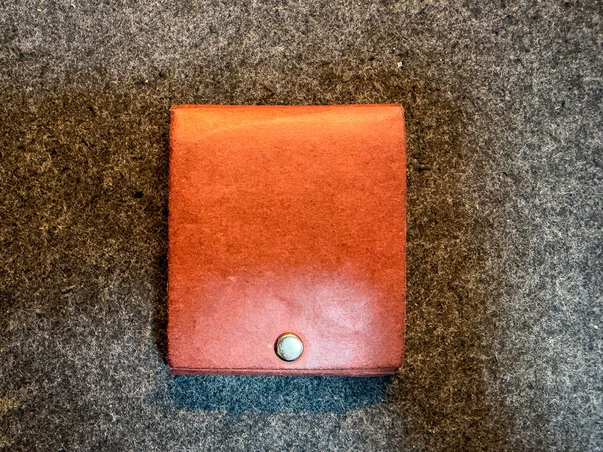
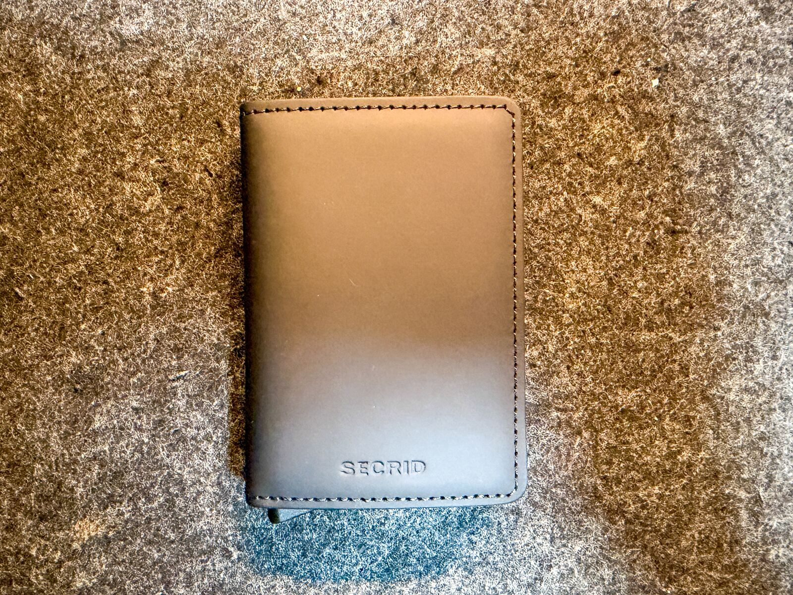
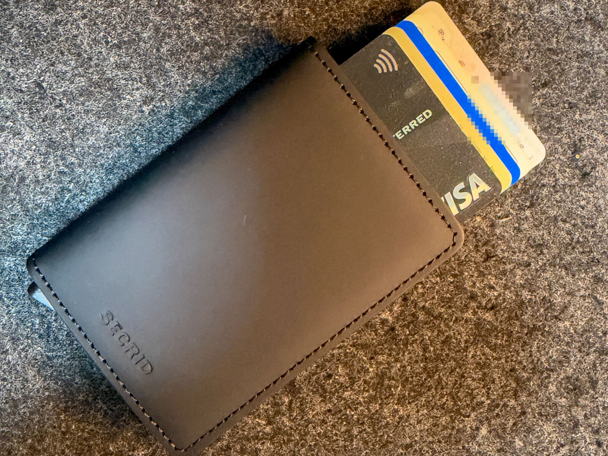
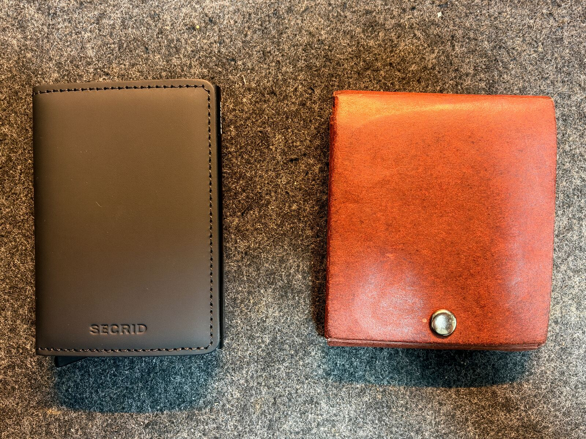
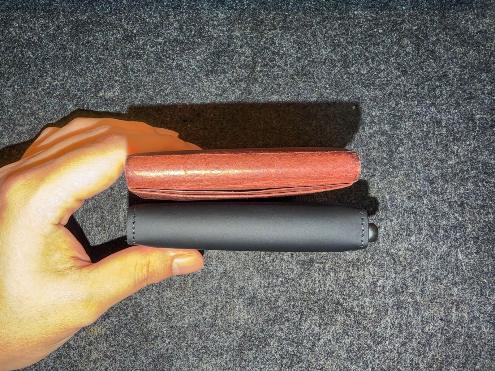
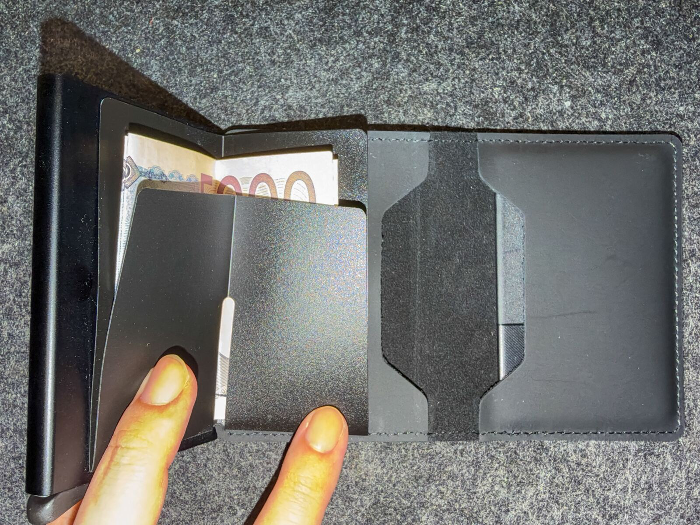
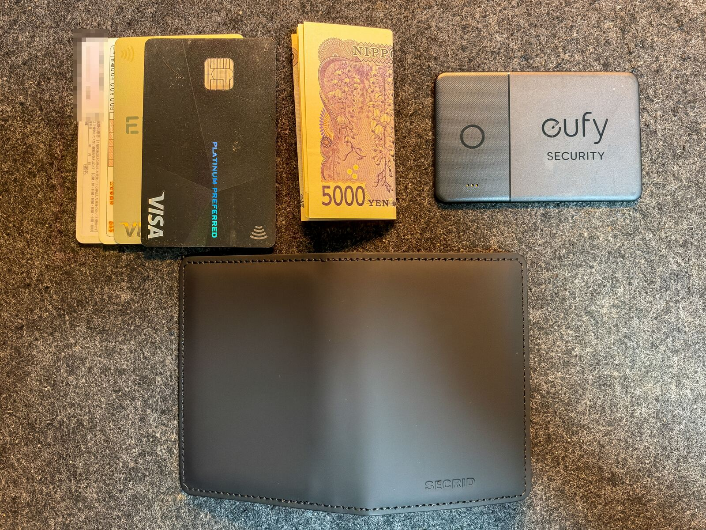

財布を KAMINO の「スリムな二つ折り財布」から SECRID（セクリッド）の Slimwallet に変えました。

一番変わったのは、カードの出し方です。財布を開かずに片手でカードを引き出せるので、中を探す手間がなくなりました。一方で小銭は入らないので、小銭を使う日は別に入れ物が必要になります。

**こんな人におすすめの記事:**

- 薄い財布・小さい財布を探している
- 小銭をほとんど使わなくなり、財布を見直したい
- SECRID がカードを何枚入れられて、現金はどう扱えるのか知りたい

## これまで使っていた KAMINO の財布

https://jp.kaminowallet.com/products/slim-bifold

KAMINO の前はアブラサスの薄い財布を使っていました。それを紛失してしまい、代わりに手頃な価格だった KAMINO を 2025 年 2 月 5 日に買いました。

KAMINO の財布は、ラテックス樹脂を染み込ませた特殊紙「コルドバ」を折って、ボタンで留めた作りです。接着剤も縫い目も使っていません（革ですらない）。価格は 6,490 円です（2026 年 10 月の執筆時点）。

気に入っていたのは、安いことと、雑に扱っても気にならないことです。紙なのに見た目は革に近く、使い込んだ風合いも悪くありませんでした。当然ながら、高級な革のようなヤレ感やアタリは出ません。長く育てるつもりなら、素直に革の財布をおすすめします。

## 乗り換えた理由

KAMINO に特に不満があったわけではありません。

きっかけは、小銭入れを使うのを意識的にやめたことです。小銭入れの付いた財布が要らなくなり、前から良いなと思っていたスマートなカードケース型の財布に替えることにしました。

## SECRID Slimwallet のスペック

https://secrid.com/en-us/slimwallet-matte-black/

僕が買ったのは Slimwallet の Matte Black です。御徒町の卸で 13,200 円でした。

SECRID の財布は、アルミ製のカードケース（Cardprotector）を革で包んだ構造です。ワンアクションで、財布を開かずに片手でカードを引き出せます。Cardprotector は RFID のスキミング対策も兼ねています。

## KAMINO と SECRID を比較する

| 項目         | KAMINO スリムな二つ折り財布    | SECRID Slimwallet（Matte Black）                               |
| :----------- | :----------------------------- | :------------------------------------------------------------- |
| サイズ       | 80 × 94 mm                     | 68 × 102 mm                                                    |
| 厚さ         | 10 mm（ボタン部以外は約 6 mm） | 16 mm                                                          |
| 重量         | 41 g                           | 72 g                                                           |
| 素材         | 特殊紙コルドバ                 | 牛革 + アルミ製カードケース                                    |
| カード       | 約 7 枚                        | 最大 12 枚（ケース内 6 枚、エンボスなら 4 枚 + 革の部分 6 枚） |
| 紙幣の扱い   | 約 20 枚まで収納               | 背面のクリップに折って挟む                                     |
| 小銭         | 収納あり                       | なし                                                           |
| 価格（税込） | 6,490 円                       | 13,200 円（購入価格）                                          |

価格は執筆時点（2026 年 10 月）のものです。KAMINO は公式ストアの価格、SECRID は僕が購入したときの価格です。

数字だけ見ると、ボタン部込みの厚さでも SECRID の方が 6 mm 厚く、31 g 重いです。ただ、横から並べると KAMINO の方が厚く見えます。KAMINO は紙なので、手で押さえて力をかけないと薄くならないからです。

## 使ってみて

### カードの出し入れ

カードの出し入れは楽になりました。ただ、会計はスマホで済ませることが多いので、カードを出す機会そのものはあまり多くありません。

### 現金の扱い

お札は折りたたんで、Cardprotector の背面にあるクリップに挟んでいます。

小銭は SECRID には入らないので、[STREAM のコインホルダー](https://www.amazon.co.jp/dp/B0BPSLRPB3) を別に用意しています。とはいえ、このコインホルダーは基本的に持ち歩きません。小銭そのものを極力持たないようにしているからです。

コインホルダーは片手で硬貨を取り出せるタイプですが、入る硬貨の枚数に上限があります。入りきらない分のために、小さなコインウォレットも別に欲しいと思っています。

### 中身の構成

写真に写っているのはカード 4 枚、折ったお札、eufy のカード型トラッカーです。カードの内訳は、クレジットカード 2 枚、運転免許証、マイナンバーカードです（なくしたときのことを考えると、マイナンバーカードは分けて持った方が良いとは思いつつ）。

このほかに診察券と健康保険の資格確認書も入れています（個人情報が多すぎるので撮影からは外しました）。この 2 枚と eufy のトラッカーは、Cardprotector に入れずに革の部分へ入れています。Cardprotector に入っているのは、写真のカード 4 枚です。

eufy のトラッカーは、アブラサスの財布をなくした反省から入れました。もう一度落としても、場所を追えるようにするためです。

## 総評

### 良かった点

- 片手のワンアクションでカードを出せる。カードが段々にずれて出てくるので、どれがどのカードか一目でわかる
- 見た目がよりスマートになった
- ほかの持ち物やアクセサリーと黒で統一できる

### 気になる点

- 小銭が必要な日は、コインホルダーを別に持ち歩く必要がある（しかも入る枚数に上限がある）

なお、僕は会計の多くをスマホで済ませるので、カードを出す場面はそもそも多くありません。

小銭を持ち歩くのをやめた人なら、カードと少しのお札だけを持つ財布として SECRID は候補に入れて良いと思います。それでは、またね。
