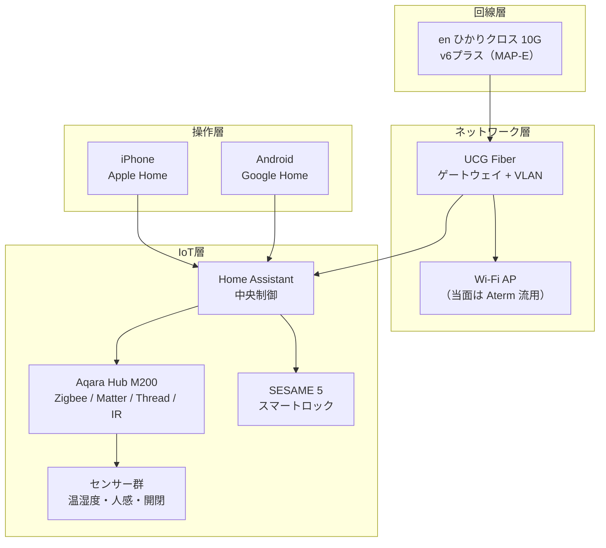

引越をきっかけに、自宅のスマートホーム化を本格的にやることにしました。

現状でも SESAME のスマートロックや Nature Remo で赤外線家電を操作するところまでは導入していますが、各デバイスがバラバラに動いているだけで「スマートホーム」と呼べるほどの統合はできていません。新居への引越は設計をゼロからやり直すにはちょうどいいタイミングです。

この記事では、引越前の設計段階で決めたことを全部まとめます。シリーズの第1回として全体像を俯瞰し、個別の機材レビューや構築手順は後続の記事で掘り下げます。

## 想定読者

- スマートホームに興味があるが、何から始めればいいか分からない人
- 賃貸で壁に穴を開けずにどこまでできるか知りたい人
- Home Assistant や UniFi の名前は聞いたことがあるが、実際の構成例を見たい人

## 前提: 賃貸の制約

引越先は賃貸マンション 2LDK（57.35m²）。間取りは玄関側に書斎（6.6帖）、対角線上に寝室（6.7帖）、中央に LDK（11.7帖）。

最大の制約は**壁内配線の新設不可**です。穴を開けられない以上、すべての配線はモール処理か既設配管の利用になります。機器も退去時に取り外せることが前提。

この制約から「フェーズ導入」という設計方針が導かれました。最初から完璧な構成を目指すのではなく、引越直後の暫定構成から段階的にアップグレードしていきます。

## 全体構成

設計は5つの層に分かれます。

この構成を一度に揃えるのではなく、4つのフェーズに分けて導入します。

## フェーズ導入の考え方

### フェーズ0: 引越直後（暫定運用）

手持ちの機器だけで最低限動く状態を作ります。

- **Wi-Fi**: 既存の Aterm WX3600HP をアクセスポイントモードで流用
- **配線**: Cat6A を玄関→書斎で先行敷設
- **IoT**: 既存の SESAME 5 + Nature Remo をそのまま移設
- **追加費用**: 約 3,000〜5,000円（Cat6A ケーブル + モール）

この段階では新しい機器をほとんど買いません。引越直後は生活を整えることが優先です。

### フェーズ1: 本格展開（引越後 3〜6ヶ月）

IoT の中枢となる Home Assistant と、ネットワークの要となる UniFi ゲートウェイを導入します。

- **ゲートウェイ**: UniFi[^unifi] Cloud Gateway Fiber（UCG Fiber）
- **Home Assistant[^ha] ホスト**: Lenovo ThinkCentre M720q Tiny（中古、i5-8500T / 16GB）を検討中
- **IoT ハブ**: Aqara[^aqara] Hub M200（Zigbee[^zigbee] / Matter[^matter] / Thread / 赤外線内蔵、取得済み）
- **センサー**: Aqara 温湿度 T1 × 3、人感 P1 × 2、FP2（ミリ波在席検知）× 1、開閉 T1 × 1〜2
- **スマートロック**: SESAME Bot 3 × 2（エントランス + 給湯リモコン）
- **追加費用**: 約 89,000〜111,000円

Home Assistant のホストはまだ購入前です。先にネットワーク（UCG Fiber + VLAN 構成）を固めてからホストを選定する予定。候補は中古 PC（Lenovo Tiny 16GB、約 27,000〜32,000円）か HA Green（公式、4GB、約 30,000〜40,000円）。将来カメラ映像解析などの拡張を考えると 4GB では心もとないので、中古 PC が有力です。

センサー類はネットワークと Home Assistant の基盤が整った後に導入します。温湿度センサーは空調自動化の基礎データになるので最優先。人感と開閉は廊下・トイレの照明自動化用で「あると便利」程度。FP2（ミリ波）は書斎の在席検知に特化していて、離席したらエアコンを切る自動化に使います。

### フェーズ1.5: Wi-Fi のアップグレード

Aterm の Wi-Fi 6 で不足を感じたタイミングで、UniFi U7 Pro（Wi-Fi 7）に置き換えます。約 30,000円の追加投資。既存の Aterm は売却して相殺。

### フェーズ2: 10G 有線 LAN（条件付き）

UCG Fiber 自体に 10G SFP+ ポートが3つあるので、PC 1〜2台との 10G 接続はスイッチなしで直結できます。10G スイッチが必要になるのは NAS など 3台以上の 10G 機器を相互接続する場合。現時点では「やらない」が正解です。

## ISP: NURO 1G から en ひかりクロス 10G へ

現行の NURO 光 1G（月額 5,700円）から en ひかりクロス with v6 プラス（MAP-E）10G に乗り換えます。

驚いたのは**10G なのに現行より月 783円安い**こと。

| プラン              | 月額       | 2年累計       |
| :------------------ | :--------- | :------------ |
| NURO 1G（現行）     | 5,700円    | 136,800円     |
| en ひかりクロス 10G | 4,917円    | 118,008円     |
| **差額**            | **-783円** | **-18,792円** |

NURO を継続しなかった理由は複数あります。

- **ONU とルーターの一体型が必須**で、UniFi ゲートウェイと共存できない。ルーターを自分で選べないのは構成の自由度を大きく制限する
- **混雑時間帯に 100Mbps 前後まで落ちる**ことが頻繁にあり、ダークファイバー回線にも関わらず速度面の恩恵が薄かった
- **サポートの対応が良くない**。問い合わせの待ち時間が長く、解決までに時間がかかる

en ひかりクロスは NTT フレッツ光クロスの光コラボなので ONU だけ設置され、その先は自由に構成できます。月額も安く、v6 プラスの MAP-E 接続で混雑の影響も受けにくい。

## ネットワーク: UCG Fiber を選んだ理由

当初は UniFi Dream Router 7（UDR7）でゲートウェイとアクセスポイントを一台にまとめるつもりでした。しかし Reddit で複数のネガティブレビュー（Wi-Fi の非対称性、ランダム切断、サポート遅延）を見たのに加えて、役割ごとに負荷を分散させたほうが安定するという判断に至りました。

**ゲートウェイとアクセスポイントの役割を分離**する設計にしています。

分離の利点は3つ。

1. **給電予算**: UCG Fiber は 30W の給電能力があり、PoE+ 対応のアクセスポイントを直接給電できる（UDR7 は 15.4W の 1ポートのみ）
2. **障害の局所化**: アクセスポイントに問題が起きてもゲートウェイには影響しない。一体型だと Wi-Fi の不具合でルーティングごと巻き添えになる
3. **侵入検知**: 5Gbps のスループットで、将来の 10G 化後も詰まらない

## IoT: Home Assistant 中心のハイブリッド構成

IoT の設計で一番悩んだのは「Apple Home に統一するか、Home Assistant 中心にするか」です。

結論は **Home Assistant を中枢に、Apple Home と Google Home を並列でつなぐ**構成。

理由は単純で、家族が iPhone と Android を混在で使っているから。Apple 統一を待つより、今動く構成のほうが現実的です。iPhone ユーザーは Apple Home で操作、Android ユーザーは Google Home で操作、裏側は Home Assistant が全部つないでいます。

### プロトコルの方針: ローカル通信を優先する

新規に導入するデバイスは**Matter / Thread / Zigbee のローカル通信プロトコルを優先**しています。クラウド経由の通信はサーバー障害で動かなくなるリスクがあり、応答速度も遅い。ローカルで完結する構成にしておけば、インターネットが落ちても家の中の自動化は動き続けます。

既存の Nature Remo はクラウド経由でしか Home Assistant と連携できませんが、これは「今あるものを流用する」割り切りです。SESAME は Bluetooth での直接操作や Hub 3 の Matter Bridge 経由でローカル通信も可能なので、クラウド依存度は低い。新規購入するデバイスでクラウド専用のものは選びません。

| プロトコル      | 通信経路           | 用途                             | 機器                                  |
| :-------------- | :----------------- | :------------------------------- | :------------------------------------ |
| Matter / Thread | ローカル           | 新規デバイスのメイン通信         | Aqara Hub M200, HomePod mini          |
| Zigbee          | ローカル           | Aqara センサー群                 | Aqara Hub M200 経由                   |
| 赤外線          | ローカル           | エアコン・照明                   | Nature Remo mini, Aqara Hub M200 内蔵 |
| Wi-Fi           | ローカル           | ネットワーク機器                 | ルーター、アクセスポイント            |
| クラウド連携    | インターネット経由 | 既存機器の流用（新規追加しない） | Nature Remo                           |

Aqara Hub M200 は Zigbee ハブ・Matter ブリッジ・Thread ボーダールーター・赤外線送信機を1台に集約していて、この構成の要になっています。ローカル通信に対応したデバイスを1台のハブで束ねられるのが採用の決め手でした。

## リモートアクセス: Tailscale でポート開放不要

外出先から Home Assistant にアクセスするために Tailscale を採用しました。

公式の Nabu Casa（月額 1,000円）は Home Assistant 専用で他の用途に使えません。VPN サーバーの自前構築は MAP-E のポート数制限で面倒。Tailscale なら端末にインストールするだけで、ポート開放不要・アクセス制御リストで最小権限制御・無料プランで 100台まで使えます。

## 既存機器の流用

新居に持っていく機器をリストアップします。買い直すと 40,000〜60,000円かかるものを流用できるのは大きい。

| 機器                | 用途                              | 新居での配置                               |
| :------------------ | :-------------------------------- | :----------------------------------------- |
| SESAME 5 + Face Pro | スマートロック                    | 玄関                                       |
| SESAME Hub 3        | Matter Bridge + 赤外線送信        | 書斎 or 寝室（センサー・赤外線の追加候補） |
| Nature Remo E lite  | 電力モニタ                        | 分電盤付近                                 |
| Nature Remo mini    | 赤外線リモコン                    | LDK                                        |
| Tapo P105 × 2       | スマートプラグ                    | 各部屋                                     |
| Google Nest Mini    | スマートスピーカー                | LDK                                        |
| Google Nest Cam     | 屋外カメラ                        | バルコニー                                 |
| popIn Aladdin 2     | プロジェクター + シーリングライト | 寝室                                       |
| Aterm WX3600HP      | Wi-Fi ルーター                    | アクセスポイントモードで当面流用           |

popIn Aladdin 2 は Nature Remo mini からの赤外線制御が不安定という問題を抱えています。新居では Aqara Hub M200 の内蔵赤外線で再学習を試みる予定。SESAME Hub 3 も Matter Bridge と赤外線送信機能を備えているので、配置次第では Hub 3 を赤外線リモコンとして活用する選択肢もあります。この話は別記事で詳しく書きます（忖度なしで）。

## 費用のまとめ

| 区分                                             | 金額                                                             |
| :----------------------------------------------- | :--------------------------------------------------------------- |
| フェーズ0（Cat6A 配線）                          | 3,000〜5,000円                                                   |
| フェーズ1（Home Assistant + IoT + ネットワーク） | 89,000〜111,000円                                                |
| フェーズ1.5（Wi-Fi 7 アクセスポイント）          | 30,000〜60,000円                                                 |
| フェーズ2（10G 有線 LAN、必要になった場合）      | 10,000円〜（SFP+ トランシーバのみ。スイッチ追加時は 65,000円〜） |

月額のランニングコストは ISP 4,917円 + 常時稼働機器の電力 約1,005円 = 約 5,922円。Tailscale は無料プラン、Nabu Casa は使わないので 0円。空調の自動化で年間 7,000〜18,000円の電気代削減が見込めるので、ランニングコストは実質 ISP 代だけです。

### 将来の拡張余地

現時点では導入予定に入っていませんが、構成上は以下の拡張が可能です。

- **カメラ映像解析**: Frigate を Home Assistant 上で動かして、人物検知・通知を自動化
- **ローカル LLM**: Mac Mini M4 で音声認識や自然言語での家電制御
- **10G 有線 LAN**: 大容量データ転送の高速化

いずれも「必要になったら足す」方針で、今の段階では設計に組み込まないようにしています。

## あなたのスマートホームはどのフェーズ？

自分の現状がどのフェーズに近いか、チェックしてみてください。

- **まだ何もやっていない** → フェーズ0 から。スマートロックか赤外線リモコンを1つ買うところから始めると、スマートホームの便利さが実感できます
- **スマートロックや赤外線リモコンは導入済み** → 僕と同じスタートライン。Home Assistant を入れて統合すると世界が変わるはず
- **Home Assistant は動いているが、ネットワークが弱い** → フェーズ1 のネットワーク設計が参考になると思います。VLAN 分離で IoT 機器を隔離するだけでもセキュリティが上がる
- **UniFi + Home Assistant で構築済み** → フェーズ1.5 以降の話や、空調自動化の実測値が役に立つかもしれません

## このシリーズの予定

この記事は全体設計の俯瞰でした。今後は個別のテーマを掘り下げていきます。

- ISP 乗り換え（NURO → en ひかりクロス 10G）
- UniFi ネットワーク構築（UCG Fiber + Cat6A 配線）
- Home Assistant + Aqara で作る IoT 基盤
- スマートロック + エントランス自動解錠
- popIn Aladdin 2 の赤外線制御（苦闘編）
- Tailscale で外出先から自宅にアクセス
- 空調自動化と電気代の実測

各記事では実際に使った機材のレビューも書きます。微妙だったものは忖度なしで。

次回は ISP 乗り換えの詳細を書きます。NURO から光コラボへの移行手順、v6 プラスの MAP-E 設定、実測速度の比較など。NURO の速度に不満を感じている人は参考になるはずです。

それでは、またね。

[^unifi]: [Ubiquiti](https://ui.com/) 社のネットワーク機器ブランド。ゲートウェイ、アクセスポイント、スイッチなどを統合管理ソフトウェアで一元制御できる。

[^ha]: [Home Assistant](https://www.home-assistant.io/) はオープンソースのホームオートメーションプラットフォーム。1,000種類以上のデバイスやサービスを統合し、自動化ルールを柔軟に構築できる。

[^aqara]: [Aqara](https://www.aqara.com/) は Xiaomi エコシステムのスマートホームデバイスメーカー。Zigbee / Matter / Thread 対応のセンサーやハブを手頃な価格で展開している。

[^zigbee]: [Zigbee](https://csa-iot.org/all-solutions/zigbee/) は低消費電力・メッシュネットワーク対応の無線通信規格。スマートホームのセンサーやスイッチで広く採用されている。

[^matter]: [Matter](https://csa-iot.org/all-solutions/matter/) は Apple / Google / Amazon / Samsung などが共同策定した IoT の統一通信規格。異なるメーカーのデバイスが相互に連携できる。
