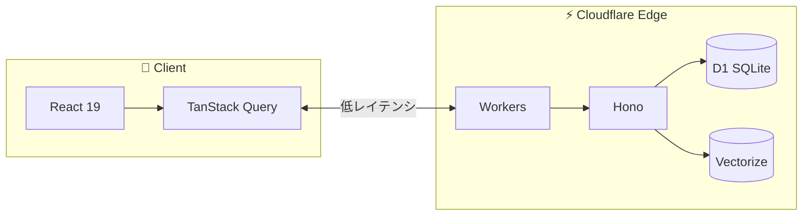

## はじめに

「あとで読む」に保存した記事、読んでますか？

僕は正直、**読めていませんでした**。Pocketに100件以上の記事が溜まっていて、「いつか読む」と思いながら放置。気づけば1年以上前の記事が未読のまま眠っている状態でした。保存する行為自体が目的化してしまっていたんです。

**ないなら作ろう**ということで、自分用のRead-it-laterアプリを5日間で作りました。

---

## 作ったもの

**Tuck** - 保存した記事をAIが要約し、読書習慣をサポートするRead-it-laterアプリです。

https://gettuck.app

https://www.youtube.com/watch?v=2s5hIytVr4o

### 主な機能

- **AI要約**: 保存した記事を自動で要約（無料）
- **週間ダイジェスト**: 1週間の読書をAIがレポート
- **スマート通知**: 読書パターンに基づく最適タイミング通知
- **セマンティック検索**: 「あのReactの記事」で検索できる
- **読書インサイト**: カテゴリ別の読書傾向を可視化
- **日本語ネイティブ**: UIもAI要約も自然な日本語

「読まなくても、要点だけ把握できればいい」——この発想がTuckの原点です。

---

## なぜ作ったか

### 課題1: Pocketが終了する

長年愛用していた**Pocketがサービス終了**することになりました。移行先を探す中で見つけたのが**CuraQ**というサービス。AIで記事を要約し、セマンティック検索ができるというコンセプトに「これだ」と思いました。

ただ、実際に使ってみると**パフォーマンスやUIが自分の好みではありませんでした**。「コンセプトは最高なのに、惜しい...」そう感じた瞬間、エンジニアなら誰もが思うあの言葉が浮かびました。**「これなら自分でも作れるのでは？」**

### 課題2: Claude Codeに課金しているのに使い道がない

正直に言うと、最近はClaude Codeに課金して生成AIで遊んでいました。完全に赤字です。「どうせ課金するなら、自分が使いたいアプリに使おう」——これがTuck開発の直接的なきっかけでした。

### 課題3: 既存サービスの日本語対応が微妙

Pocket、Raindrop、Instapaper...どれも英語圏向け。日本語の記事を保存すると、微妙に挙動がおかしかったり、UIが不自然だったりします。**日本語ネイティブ対応**は、自分で作るなら絶対に外せないポイントでした。

---

## 5日間で作り上げた｜個人開発の開発スピード

着手から今の状態まで、**約5日間**でした。「5日でRead-it-laterアプリ？」と思うかもしれませんが、これまでの個人開発で培った**Cloudflare + Hono + React**の構成をそのまま流用できたのが大きいです。

| 日数  | 内容                           |
| :---- | :----------------------------- |
| 1日目 | プロジェクト構築、DB設計、認証 |
| 2日目 | 記事保存・表示、AI要約         |
| 3日目 | セマンティック検索、ハイライト |
| 4日目 | スマート通知、週間ダイジェスト |
| 5日目 | UI/UXブラッシュアップ          |

**使い慣れた技術スタックがあれば、アイデアを形にするスピードは格段に上がります。**

---

## 技術スタック｜Cloudflare Workers + Hono + React 19

「エッジで動く」「低コスト」「型安全性」を重視した構成です。

### 全体構成

| レイヤー  | 技術                        |
| :-------- | :-------------------------- |
| Monorepo  | pnpm workspaces             |
| Backend   | Cloudflare Workers + Hono   |
| Database  | Cloudflare D1 + Drizzle ORM |
| Vector DB | Cloudflare Vectorize        |
| Frontend  | React 19 + TanStack Router  |
| UI        | shadcn/ui + Tailwind CSS v4 |
| i18n      | Lingui（日英対応）          |
| AI        | OpenAI API (gpt-4o-mini)    |

### なぜCloudflare？

個人開発で一番気になるのはコストです。

| サービス  | 無料枠             |
| :-------- | :----------------- |
| Workers   | 10万リクエスト/日  |
| D1        | 読み取り500万行/日 |
| D1        | 書き込み10万行/日  |
| Vectorize | 500万次元/月       |

個人開発レベルであれば**維持費ほぼ0円**で運用できます。

---

## AI機能の実装｜要約とセマンティック検索

Tuckの核となる機能は、**AI要約**と**セマンティック検索**です。

### 記事の自動要約

記事を保存すると、バックグラウンドでAIが要約を生成します。

- **gpt-4o-mini**採用（低コストで高性能）
- 日本語記事は日本語で、英語記事は英語で要約
- 要約は3段階（一行サマリー、概要、詳細）
- 生成結果はD1にキャッシュ

### セマンティック検索

「あのReactの記事どこだっけ...」

タイトルを正確に覚えていないと見つからない。これが従来のRead-it-laterアプリの限界でした。Tuckでは**Cloudflare Vectorize**を活用しています。

1. 記事保存時にEmbedding APIで埋め込みベクトルを生成
2. Vectorizeに保存
3. 検索時はクエリをベクトル化し、コサイン類似度で関連記事を取得

「最近保存したAIに関する長めの記事」——こんな曖昧な検索でも、目的の記事にたどり着けます。

---

## 競合との比較｜Pocket・Raindrop・CuraQとの違い

正直に書くと、機能だけで見ればPocketやRaindropも優秀です。ただ、**AI機能**と**日本語対応**では差別化できていると思います。

| 機能               | Tuck          | Pocket | Raindrop | CuraQ |
| :----------------- | :------------ | :----- | :------- | :---- |
| AI要約             | ✅ 無料       | ❌     | ❌       | ✅    |
| 週間ダイジェスト   | ✅            | ❌     | ❌       | ✅    |
| セマンティック検索 | ✅            | ❌     | ❌       | ✅    |
| スマート通知       | ✅            | ❌     | ❌       | ❌    |
| 日本語対応         | ✅ ネイティブ | △      | △        | ✅    |

CuraQは同じコンセプトのサービスで、機能的に似ている部分も多いです。Tuckは**スマート通知**や**ハイライト共有**など、読書を「習慣化」するための機能に力を入れています。

---

## 学んだこと｜Cloudflare D1とVectorizeの実運用Tips

### Cloudflare D1の実運用Tips

D1は個人開発レベルでは十分実用的でした。

- **Drizzle ORM**との相性が良い
- マイグレーションは`wrangler d1 migrations apply`で管理
- ローカル開発時は`--local`フラグを忘れずに

### Vectorizeの導入は意外と簡単

セマンティック検索の実装は思ったより簡単でした。OpenAIのEmbedding APIで埋め込みを生成し、Vectorizeに保存するだけ。検索のUXが劇的に向上しました。

### Claude Code + hookifyで開発効率アップ

Claude Codeでの開発には[hookify](https://github.com/anthropics/claude-code/tree/HEAD/plugins/hookify)プラグインを活用しました。特定のパターンを検出してルールを強制できるので、コーディング規約の統一やミス防止に役立ちます。

- **lint/formatの自動実行**: コード変更時に自動でチェック
- **コミットメッセージの規約強制**: Conventional Commitsに準拠
- **禁止パターンの検出**: `console.log`の消し忘れなど

AIにコードを書かせるとき、hookifyでガードレールを設けておくと品質が安定します。

---

## 開発コスト｜初期投資$120で維持費ほぼ0円

個人開発でかかった費用を正直に公開します。

| 項目            |   費用 | 備考                                  |
| :-------------- | -----: | :------------------------------------ |
| OpenAI API      |     $5 | 要約・Embedding用（まだほぼ残ってる） |
| ドメイン        | $14/年 | gettuck.app                           |
| Apple Developer | $99/年 | Safari拡張機能の配布用                |
| Cloudflare      |     $0 | 無料枠で十分                          |

**初期投資:** 約$120（ドメイン + Apple Developer + OpenAI）

Cloudflareの無料枠が優秀なので、ランニングコストは**ほぼ0円**。スケールしても安心です。

---

## 現状の数字｜Product Huntローンチ前のリアル

### 2026/01/14時点

| 指標         | 数値             |
| :----------- | :--------------- |
| 総ユーザー   | 5人              |
| 有料ユーザー | 0人              |
| Product Hunt | 明日ローンチ予定 |

正直、まだほぼ自分用のアプリです。でも、だからこそ**自分が本当に欲しい機能だけ**を実装できました。

### Product Huntローンチ後にやりたいこと

- モバイルアプリ（React Native）の開発
- ブラウザ拡張機能の改善
- ユーザーフィードバックを元にした機能改善

---

## まとめ

Tuckは「あとで読む」を「あとで読めた」に変えるためのアプリです。

**個人開発のポイント:**

- **自分の課題を解決する** - 既存サービスへの不満から始める
- **Cloudflareで低コスト運用** - 無料枠を活かして維持費ほぼ0円
- **AI活用で差別化** - 要約とセマンティック検索でUX向上
- **使い慣れた技術スタック** - 5日間で形にできた

「あとで読む」に記事が溜まりすぎて困っている方は、ぜひ試してみてください。

https://gettuck.app

https://www.producthunt.com/products/tuck

使ってみて良いと思ったら、Product Huntでのサポートもいただけると嬉しいです！

質問があれば [X (@paveg\_)](https://x.com/paveg_) までお気軽にどうぞ。

---

## 関連記事

- [Cloudflare D1 + Hono + Reactでサプリ管理PWAを個人開発した話【維持費ほぼ0円】](/blog/2025/dailydose-pwa-development)
- [個人開発アプリをEdge構成で構築した技術スタック - Cloudflare/Hono/Expo](/blog/2025/modern-edge-tech-stack)
