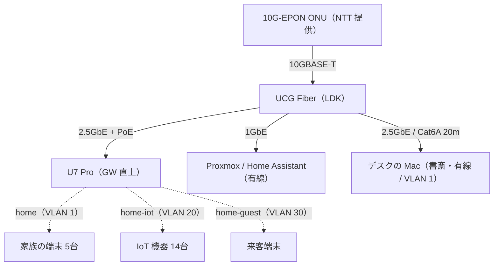

import AffiliateCard from '@/components/AffiliateCard.astro';

※ 本記事にはアフィリエイトリンク（広告）を含みます。

[前回](/blog/2026/isp-migration-nuro-to-enhikari/)は回線の話でした。
今回は予告どおりネットワーク編、UCG Fiber + U7 Pro での UniFi ネットワーク構築です。

結論から書くと、**ゲートウェイ1台と AP 1台（スイッチレス）、SSID 3本で、家族・IoT・来客を3つの VLAN に分離し、22クライアントが安定稼働しています**。
実測は AP 至近の 6GHz で下り 1.29Gbps。
IoT 14台を 2.4GHz に隔離した結果、2.4GHz のチャネル使用率が 57% まで埋まる一方で、人間が使う 5GHz / 6GHz は 5〜6% とガラガラ——「IoT の混雑が人間の体感に波及しない」設計意図どおりの数字が取れました。

## 想定読者

- IoT 機器が増えてきて、VLAN でネットワークを分離したい人
- UniFi を最小構成（ゲートウェイ + AP 各1台）で始めたい人
- Wi-Fi 7 / 6GHz が実効でどのくらい出るのか、生活環境の数字を見たい人

## 機材は2台だけ——スイッチレス構成

機材は Ubiquiti の UniFi シリーズで統一しています。
Ubiquiti は米国のネットワーク機器メーカーで、VLAN・コントローラ管理・PoE 給電といった業務用の機能を、家庭に手が届く価格で出しているのが特徴です（データセンターと家庭の間、いわゆるプロシューマー帯の定番メーカーです）。
日本の家電量販店で見かけることは少ない印象ですが、公式の日本ストアと Amazon で普通に買えます。
UniFi を選んだ経緯は[第1回](/blog/2026/smarthome-design-overview/)に書いたので、ここでは構成だけ。

機材構成はこれだけです。

| 役割         | 機材                                   | 価格                          |
| ------------ | -------------------------------------- | ----------------------------- |
| ゲートウェイ | UniFi Cloud Gateway Fiber（UCG Fiber） | ¥54,221（公式ストア、送料込） |
| AP           | UniFi U7 Pro（Wi-Fi 7、2.4/5/6GHz）    | ¥34,735                       |

UCG Fiber は 10G SFP+ ×2、10G RJ45 ×1、2.5GbE RJ45 ×4（うち1つ PoE+）を内蔵したルーターです。
有線クライアントが少ない家なら、このポートだけで足りるのでスイッチが要りません。
うちの有線は Proxmox ホスト（Home Assistant が載っている Tiny PC）、AP、それにデスクのモニタの3本で、2.5GbE ×4 ポートに収まっています。
モニタ（[Dell U4025QW](/blog/2024/review-monitors-u4025qw-dell/)）は内蔵の 2.5GbE を書斎までの Cat6A で引き込んであり、USB-C ドックの KVM 経由でデスクのどのマシンにも同じ有線が渡ります。
PC ごとに USB Ethernet ドングルを挿さず、スイッチも足さずに複数マシンを有線化できているのが、この2台構成のちょっとした裏技です。
UCG Fiber は Amazon にも出品がありますが、執筆時点では公式日本ストアよりかなり割高でした。
価格はどちらも変動するので、買う前に両方を見比べることをおすすめします。

https://jp.store.ui.com/jp/ja/products/ucg-fiber

<AffiliateCard
  title="Ubiquiti UCG-Fiber Cloud Gateway"
  description="10G SFP+ ×2 / 10G RJ45 / 2.5GbE ×4（PoE+ ×1）内蔵のゲートウェイ。Amazon は割高なことが多いので公式ストアと比較を"
  amazon={{ asin: 'B0DZSB9HYY' }}
/>

U7 Pro は UCG Fiber の PoE+ ポートから給電しています（実測 10W 前後）。
AP 側に電源が要らないので、設置場所の自由度が高い。
賃貸なので壁に穴は開けられず、**壁美人（ホッチキス固定の棚）を LDK と廊下の境界に付けて、その上に AP を置いています**。
ケーブル1本だけモール処理すれば済むので、原状回復の負担も最小です。

<AffiliateCard
  title="Ubiquiti UniFi U7 Pro（Wi-Fi 7 アクセスポイント）"
  description="2.4/5/6GHz トライバンド、6GHz は 160MHz 幅対応。PoE+ 給電で AP 側の電源が不要"
  amazon={{ asin: 'B0CSR63FMH' }}
/>

論理構成はこうなっています。

## VLAN 設計——家庭は3つで足りる

UniFi を選んだ主な目的の一つが VLAN 分離です。
設計はシンプルに3つに絞りました。

| VLAN | ネットワーク | サブネット      | 用途                          |
| ---- | ------------ | --------------- | ----------------------------- |
| 1    | Default      | 192.168.1.0/24  | 家族の端末 + UniFi 機器の管理 |
| 20   | IoT          | 192.168.20.0/24 | スマートホーム機器全部        |
| 30   | Guest        | 192.168.30.0/24 | 来客用（隔離有効）            |

設計判断を2つ補足します。

**企業では定番の「管理専用（Mgmt）VLAN」は、今回あえて設けませんでした。**
ネットワーク機器の設定画面へ触れる面を別 VLAN に隔離するのが定石ですが、家庭で管理者は自分ひとりです。
分離のメリットより、トラブル時に自分が管理画面に届かなくなるリスクの方が大きいと判断して、Default に同居させています。
必要になってから切れば十分です。

**VLAN 1（Default）に 192.168.1.0/24 を割り当てたのは、実は妥協です。**
ここは家族の端末と母艦（メイン PC）が居る信頼できる面で、以降は Trusted とも呼びます。
ありふれたアドレス帯なので、外出先のネットワークと衝突しやすい。
将来 Tailscale のサブネットルーターを入れたときに経路が曖昧になる懸念は自覚していて、顕在化したら 192.168.10.0/24 あたりへ引っ越す余地を残しています。

Guest は UniFi の隔離オプション（Client Device Isolation）を有効にするだけで、他 VLAN にも Guest 内の他端末にも届かない「インターネットだけ」のネットワークになります。
ここは自作ファイアウォールルール不要で、チェックボックス一つでした。

## SSID 設計——home 3本に集約

SSID は VLAN と 1:1 対応の3本です。

| SSID       | 帯域           | セキュリティ                   | 紐づけ VLAN  |
| ---------- | -------------- | ------------------------------ | ------------ |
| home       | 2.4 + 5 + 6GHz | WPA2/WPA3 移行（PMF optional） | 1（Default） |
| home-iot   | 2.4GHz のみ    | WPA2 固定                      | 20（IoT）    |
| home-guest | 2.4 + 5 + 6GHz | WPA2/WPA3 移行                 | 30（Guest）  |

ポイントは**セキュリティモードと帯域の対応関係**です。
6GHz は規格上 WPA3-SAE + PMF（管理フレーム保護）が必須なので[^wpa3]、WPA2 専用の SSID からは 6GHz を出せません。
home を WPA2/WPA3 移行モードにすることで、1本の SSID で古い端末（WPA2）から 6GHz 対応端末（WPA3）までカバーしています。

逆に home-iot は **WPA2 固定・2.4GHz のみ**に振り切りました。
IoT 機器には WPA3 や PMF が有効だと接続に失敗する個体が珍しくなく、5GHz 非対応の機器も多い。
どうせ 2.4GHz にしか居られない機器たちなら、最初から 2.4GHz 専用にして帯域の期待値を固定した方が運用が楽です。

実は当初、WPA3 専用の別 SSID を立てて2本立てにする設計でした。
移行モードの存在に気づいて「1本で全部賄えるじゃないか」となり、2本立て案は廃止。
SSID は 1 本ごとにビーコンを常時発信するので、増やすほどエアタイムを消費します。
本数は少ないほど良く、帯域ごとに4本が上限の目安です（現状 2.4GHz に3本、5/6GHz に2本）。

## VLAN 間のポリシー——遮断は一方向

分離して終わりではなく、「どちらからどちらへ通すか」が本題です。

- **IoT → Trusted は遮断、Trusted → IoT は許可**。
  母艦や Home Assistant から IoT 機器へはアクセスできますが、IoT 側から母艦や PC へは接続できません。この一方通行が狙いです。
  実装は UniFi のトラフィックルールで一方向 Block（Source to Destination）を1本置くだけ。
  戻りの通信はステートフルに通るので、Trusted 側の使い勝手は何も変わりません
- **mDNS は Default と IoT の両方で有効**。
  Chromecast や Matter 機器の発見だけは VLAN 越しに通す必要があるためです
- **IPv6 のグローバルアドレスは Default にのみ配布**。
  IoT / Guest には配りません

Home Assistant だけは特殊で、VLAN 1 と VLAN 20 の両方に足を持つデュアル NIC 構成にしています。
これは「HA を IoT 側に置くか、Trusted 側に置くか」という置き場所問題の答えなのですが、長くなるので次回の Home Assistant 編で書きます。

## 実測——ボトルネックがどこへ移るか

### クライアント分布

執筆時点の接続クライアントは 22台です。

| ネットワーク          | 台数       | 内訳                                                                                             |
| --------------------- | ---------- | ------------------------------------------------------------------------------------------------ |
| home（VLAN 1）        | 5 + 有線2  | Mac ×2、iPhone ×2、iPad（6GHz に3台、5GHz に2台）                                                |
| home-iot（VLAN 20）   | 14 + 有線1 | ハブ類、スマートプラグ、家電、3D プリンタなど全部 2.4GHz（有線1は Home Assistant の IoT 側の足） |
| home-guest（VLAN 30） | 0          | 来客時のみ                                                                                       |

### チャネル使用率——隔離の答え合わせ

この分布が帯域の混雑にどう出るかが面白いところで、U7 Pro の帯域別統計はこうなっています。

| 帯域   | チャネル     | 接続台数 | チャネル使用率 |
| ------ | ------------ | -------- | -------------- |
| 2.4GHz | 6（20MHz）   | 14       | **57%**        |
| 5GHz   | 48（80MHz）  | 1        | 6%             |
| 6GHz   | 37（160MHz） | 3        | 5%             |

2.4GHz はマンションの近隣 AP と IoT 14台で半分以上埋まっています。
それでも困らないのは、**人間の端末がそこに1台もいない**からです。
IoT のセンサー値やスマートプラグの通信は数十 kbps の世界なので、混んだ 2.4GHz でも実害がない。
「遅くていいものを遅い帯域に集め、速くあってほしいものを空いた帯域に置く」という分離設計の答え合わせになりました。

### スループット4点測定

経路上のどこがボトルネックかを見るため、4点で測りました（2026-07-10〜11、macOS の networkQuality と UniFi ゲートウェイの内蔵スピードテスト）。

| 測定点                | 経路                          | 下り / 上り               |
| --------------------- | ----------------------------- | ------------------------- |
| ゲートウェイ直（WAN） | 回線のみ                      | 3,627 / 2,900 Mbps（8ms） |
| 書斎・有線            | Cat6A 20m → モニタ内蔵 2.5GbE | 1,681 / 2,100 Mbps        |
| LDK・AP 至近（6GHz）  | Wi-Fi + AP アップリンク 2.5G  | 1,288 / 1,135 Mbps        |
| 書斎（6GHz、-79dBm）  | 無線がボトルネック            | 524 / 291 Mbps            |

回線の 3.6Gbps が、有線 2.5GbE で 1.7〜2.1Gbps、AP 経由の Wi-Fi で 1.3Gbps、書斎の無線で 0.5Gbps。
経路の先へ進むほど、きれいに段が下がります。
**ボトルネックが WAN → 有線リンク → 無線区間へと移っていく**のがよく見えます。
有線の下りが 2.5G の線速（約 2.35Gbps）まで伸びていないのは、networkQuality の下り測定が相手側 CDN の速度で頭打ちになりやすいためです。
上りが 2.1Gbps 出ているので、リンク自体は健全です。
AP のすぐ近くで 1Gbps を超えるのは Wi-Fi 7（6GHz 160MHz）の実力で、無線でこの数字なら実用十分です。

面白いのは書斎の2行です。
同じ部屋なのに、Wi-Fi（6GHz、-79dBm）だと 524/291Mbps、Cat6A の有線だと 1,681/2,100Mbps と3倍以上ひらきます。
書斎の -79dBm は縦長 2LDK の対角をまたぐ減衰そのもので、設計時からわかっていた弱点でした。
だからデスクの常設マシンは先行敷設した Cat6A に有線でつなぎ、ここは無線の弱さを最初から回避しています。
残るのは書斎で使うモバイル機器の 6GHz で、体感で不満が出たら小型 AP（U7 Lite あたり）を増設する計画です。

## ハマりどころ——AP のアップリンクが 1G に落ちていた

この記事のために実測を取っていて気づいたのですが、**UCG Fiber と U7 Pro の間のリンクが、2.5G で想定していたのに実際は 1Gbps でつながっていました**。
両方とも 2.5GbE 対応ポートで、設定にも速度固定は入っていない。
それでも 1G のまま変わりません。
通信エラーは1件も記録されていないので、パッと見ではまったく正常に見えます。

原因はケーブルでした。
僕が使っていたのは「Cat7 対応」を名乗るフラットケーブル。
そもそも RJ45 コネクタの Cat7 ケーブルは規格として存在しない自称品で[^cat7]、抜き差ししたら 2.5G でつながり直りました。
その状態で AP 至近の実測が 1.29Gbps——1G リンクの実効上限（約 940Mbps）を超えたので、復旧が本物だと確認できました。

教訓は2つあります。

- **リンク速度はエラーと違って警告が出ない**。
  1G に落ちていても UniFi は「正常」として扱うので、機器一覧のリンク速度表示を自分の目で見る習慣が要ります
- **フラットケーブルの「Cat7」表記は当てにしない**。
  接触が甘いと静かに 1G へフォールバックします。
  該当区間はまともな Cat6A に交換予定です

ちなみに書斎まで引いた 20m のケーブルも、実はフラットの Cat6A を選んでいます。
配線モールに収める余裕を優先した結果ですが、丸線でもよかったかと少し後悔しています。
ただこちらは自称 Cat7 と違って規格どおりの Cat6A なので、20m でも 2.5G を掴んで安定しています。
フラットの形状そのものが悪いわけではありません。原因は規格を詐称したケーブルで、それだけの話でした。

## まとめ——誰に向く構成か

**向いている人**:

- IoT 機器が10台を超えてきて、そろそろ隔離したい人。
  3つの VLAN + SSID 3本のパターンはそのまま流用できるはずです
- 機材点数を増やしたくない人。
  ゲートウェイと AP の2台・約 ¥89K で、VLAN・IDS・PoE 給電・Wi-Fi 7 まで揃います

**注意が要る人**:

- 有線クライアントが多い人はスイッチが必要になります（その時点で UCG Fiber の 2.5GbE ×4 では足りない）
- UniFi の管理画面は高機能なぶん、市販ルーターの感覚で買うと設定項目の多さに面食らうかもしれません

次回は Home Assistant 編です。
Tiny PC（Lenovo M920q）+ Proxmox に Home Assistant OS を載せ、今回触りだけ書いたデュアル NIC の置き場所問題（VLAN をまたぐ HA をどこに住まわせるか）を掘り下げます。

それでは、またね。

[^wpa3]: Wi-Fi 6E 以降の 6GHz 帯は、Wi-Fi Alliance の認定要件として WPA3-SAE と PMF（Protected Management Frames）が必須。WPA2 との移行モードの電波を 6GHz では吹けないため、SSID のセキュリティ設定がそのまま「6GHz を出せるか」を決める。

[^cat7]: Cat7 は本来 S/FTP（全対シールド）+ GG45/TERA コネクタで規定された規格で、RJ45 コネクタの時点で Cat7 ではない。市販の「Cat7 フラットケーブル」はほぼすべてこの自称品にあたる。
