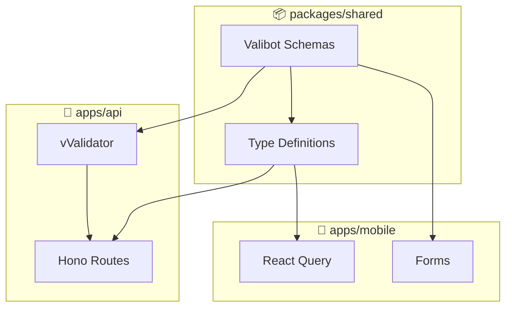

「APIのレスポンス型が変わったのに、フロントエンドで気づかず本番でクラッシュ」

フルスタック開発者なら一度は経験したことがあるはずです。

この記事では、**Valibot**を使ってバックエンド（Hono）とフロントエンド（React Native）間で**APIスキーマ共有による型安全性**を保証しながら、**バンドルサイズを最小化**する設計パターンを解説します。Zodの14KB程度の負荷から解放される、開発体験を実装例で紹介します。

## TL;DR

- **Valibot**: Zodより**90%軽量**なバリデーションライブラリ
- **モノレポで型共有**: `packages/shared`にスキーマを集約し、API・Mobile両方で利用
- **Honoとの統合**: `@hono/valibot-validator`でリクエストバリデーションを型安全に
- **型の自動生成**: `v.InferOutput`でスキーマから型を抽出、手動の型定義は不要

> この設計を実装した筋トレ記録アプリ **Attain** を公開中。
> 👉 [アプリを見る](https://attain-app.com/lp)

---

## Zodとの比較 - なぜValibotなのか

### バンドルサイズの決定的な差

フルスタックTypeScriptの定番は**Zod**ですが、モバイルアプリでは**バンドルサイズ**が致命的です。

| ライブラリ  | min+gzip | 特徴                          |
| ----------- | -------- | ----------------------------- |
| **Zod**     | ~14.5 KB | 豊富なエコシステム            |
| **Valibot** | ~1.5 KB  | Tree-shakable、モジュラー設計 |

Valibotは**使った機能だけ**がバンドルに含まれます。
React Nativeアプリでは、この差がユーザーの初回起動速度に直結します。

### API設計の工夫 - パイプ構文がTree-shakingを実現

```typescript
import * as v from 'valibot';

// Zodスタイル（メソッドチェーン）ではなく、パイプで構成
const EmailSchema = v.pipe(v.string(), v.email(), v.maxLength(255));
```

最初は違和感がありますが、**Tree-shaking効率**のための設計です。
使わないバリデーション（`v.url()`など）は、バンドルに含まれません。

---

## アーキテクチャ: 共有パッケージ

モノレポ構成で、スキーマを一元管理します。



```text
attain/
├── apps/
│   ├── api/          # Hono + Cloudflare Workers
│   └── mobile/       # Expo + React Native
└── packages/
    └── shared/       # Valibot schemas + types
```

**ポイント**: スキーマを変更すれば、API・Mobileの両方で**型エラーが即座に検出**されます。

---

## 実装: 共有スキーマ

### 基本的なスキーマ定義

```typescript
// packages/shared/src/schema.ts
import * as v from 'valibot';

// Enum（picklist）
export const FitnessLevel = v.picklist([
  'beginner',
  'intermediate',
  'advanced',
]);

// User Schema
export const UserSchema = v.object({
  id: v.pipe(v.string(), v.uuid()),
  email: v.pipe(v.string(), v.email()),
  name: v.nullable(v.string()),
  heightCm: v.nullable(v.pipe(v.number(), v.minValue(0))),
  weightKg: v.nullable(v.pipe(v.number(), v.minValue(0))),
  fitnessLevel: FitnessLevel,
  createdAt: v.string(),
  updatedAt: v.string(),
});

// 型を自動生成（手動定義不要）
export type User = v.InferOutput<typeof UserSchema>;
```

### Create/Updateスキーマの分離

API設計のベストプラクティスとして、**Create/Update用のスキーマを分離**します。

```typescript
// Create: 必須フィールドとデフォルト値
export const CreateUserSchema = v.object({
  email: v.pipe(v.string(), v.email()),
  name: v.optional(v.string()),
  fitnessLevel: v.optional(FitnessLevel, 'beginner'), // デフォルト値
  targetWorkoutsPerWeek: v.optional(
    v.pipe(v.number(), v.integer(), v.minValue(1), v.maxValue(7)),
    3, // デフォルト: 週3回
  ),
});

// Update: 全フィールドをオプショナルに
export const UpdateUserSchema = v.partial(CreateUserSchema);

// 型を自動生成
export type CreateUser = v.InferOutput<typeof CreateUserSchema>;
export type UpdateUser = v.InferOutput<typeof UpdateUserSchema>;
```

`v.partial()`で**既存スキーマをラップ**するだけで、Update用スキーマが完成します。

### 複合型（ネストしたオブジェクト）

```typescript
// Workout Set Schema
export const WorkoutSetSchema = v.object({
  id: v.pipe(v.string(), v.uuid()),
  sessionId: v.pipe(v.string(), v.uuid()),
  exerciseId: v.pipe(v.string(), v.uuid()),
  setNumber: v.pipe(v.number(), v.integer(), v.minValue(1)),
  weightKg: v.pipe(v.number(), v.minValue(0)),
  reps: v.pipe(v.number(), v.integer(), v.minValue(1)),
  // RIR: Reps in Reserve (0=限界, 3=余裕あり)
  rir: v.nullable(
    v.pipe(v.number(), v.integer(), v.minValue(0), v.maxValue(3)),
  ),
  isWarmup: v.boolean(),
  isFailed: v.boolean(),
  isPr: v.boolean(),
  completedAt: v.string(),
});

// JOINした結果用の拡張型
export type WorkoutSetWithExercise = WorkoutSet & {
  exerciseNameKey: string;
  exerciseEquipment: string;
  exerciseCategory: string;
};
```

---

## 実装: API側（Hono）

### @hono/valibot-validatorの導入

```bash
pnpm add @hono/valibot-validator
```

### ルートでのバリデーション

```typescript
// apps/api/src/routes/workouts.ts
import { CreateWorkoutSetSchema } from '@attain/shared';
import { vValidator } from '@hono/valibot-validator';
import { Hono } from 'hono';

const workouts = new Hono();

// POST /workouts/:parent/sets
workouts.post(
  '/:parent/sets',
  vValidator('json', CreateWorkoutSetSchema), // ← バリデーション
  async (c) => {
    const body = c.req.valid('json'); // ← 型が自動推論される
    // body.exerciseId, body.weightKg, body.reps... すべて型安全

    const setId = generateId();
    await c.env.DB.prepare(`INSERT INTO workout_sets (...) VALUES (...)`)
      .bind(
        setId,
        body.exerciseId,
        body.weightKg,
        body.reps,
        // ...
      )
      .run();

    return c.json({ workoutSet: { id: setId, ...body } }, 201);
  },
);
```

`vValidator`を使うことで：

1. リクエストボディを**自動バリデーション**
2. バリデーション失敗時は**400エラーを自動返却**
3. `c.req.valid("json")`で**型安全なアクセス**

### エラーレスポンスのカスタマイズ

デフォルトのエラーメッセージをカスタマイズしたい場合：

```typescript
import { vValidator } from '@hono/valibot-validator';

const customValidator = vValidator('json', CreateUserSchema, (result, c) => {
  if (!result.success) {
    return c.json(
      {
        error: {
          code: 'INVALID_ARGUMENT',
          message: 'Validation failed',
          details: result.issues.map((issue) => ({
            field: issue.path?.map((p) => p.key).join('.'),
            message: issue.message,
          })),
        },
      },
      400,
    );
  }
});
```

---

## 実装: フロントエンド側

### React Queryとの統合

```typescript
// apps/mobile/src/hooks/useUser.ts
import { useQuery, useMutation } from '@tanstack/react-query';
import type { User, UpdateUser } from '@attain/shared';

type UserResponse = {
  user: User; // ← 共有型を使用
};

export const useUser = () => {
  return useQuery<UserResponse>({
    queryKey: ['user', 'me'],
    queryFn: async () => {
      const res = await apiFetch('/api/users/me');
      if (!res.ok) throw new Error('Failed to fetch user');
      return res.json() as Promise<UserResponse>;
    },
  });
};

export const useUpdateUser = () => {
  return useMutation<UserResponse, Error, UpdateUser>({
    mutationFn: async (data: UpdateUser) => {
      // ← 共有型を使用
      const res = await apiFetch('/api/users/me', {
        method: 'PATCH',
        body: JSON.stringify(data),
      });
      if (!res.ok) throw new Error('Failed to update user');
      return res.json() as Promise<UserResponse>;
    },
  });
};
```

**メリット**:

- `UpdateUser`型の変更が、フロントエンドで**即座に型エラー**として検出される
- APIレスポンスの構造変更も同様に検出可能

### フォームバリデーション

フロントエンドでも同じスキーマでバリデーション可能：

```typescript
import * as v from 'valibot';
import { CreateBodyMeasurementSchema } from '@attain/shared';

const handleSubmit = (formData: unknown) => {
  const result = v.safeParse(CreateBodyMeasurementSchema, formData);

  if (!result.success) {
    // バリデーションエラー
    const errors = result.issues.map((issue) => ({
      field: issue.path?.map((p) => p.key).join('.'),
      message: issue.message,
    }));
    setErrors(errors);
    return;
  }

  // result.output は型安全
  mutation.mutate(result.output);
};
```

> **この設計の実装例をすぐに確認したい方へ**: Valibotを使った実践的なフルスタック型共有は、公開中の筋トレ記録アプリ **Attain** で体験できます。
>
> 👉 **[Attainをブラウザで試す](https://attain-app.com/lp)**

---

## 実践パターン: 型の拡張

### JOINした結果の型

SQLのJOIN結果は、基本スキーマに追加フィールドが含まれます。

```typescript
// 基本型
export type SessionExercise = v.InferOutput<typeof SessionExerciseSchema>;

// JOINした結果用の拡張型（型の交差で表現）
export type SessionExerciseWithDetails = SessionExercise & {
  exerciseNameKey: string;
  exerciseEquipment: string;
  exerciseCategory: string;
  exerciseSubcategory: string | null;
};
```

### APIレスポンス型

Google AIP準拠のレスポンス形式：

```typescript
// List response (AIP-132)
type WorkoutsResponse = {
  workoutSessions: WorkoutSession[];
  nextPageToken?: string;
};

// Get response (AIP-131)
type WorkoutResponse = {
  workoutSession: WorkoutSession;
  sessionExercises: SessionExerciseWithDetails[];
  workoutSets: WorkoutSetWithExercise[];
};
```

---

## トレードオフと注意点

### 1. Zodエコシステムとの互換性

Zodには豊富なエコシステム（zod-to-json-schema, react-hook-form連携など）がありますが、Valibotはまだ発展途上です。

**対策**: 必要な機能は自前で実装するか、[valibot-json-schema](https://github.com/gcornut/valibot-to-json-schema)などの代替を使用

### 2. 学習コスト

Zodのメソッドチェーンに慣れていると、Valibotのパイプ構文は違和感があります。

```typescript
// Zod
const schema = z.string().email().max(255);

// Valibot
const schema = v.pipe(v.string(), v.email(), v.maxLength(255));
```

ただし、**コードベースを読む分**には十分に読みやすいです。

### 3. 実行時バリデーションの配置

- **API側**: 必須。外部からの入力は常にバリデーション
- **フロントエンド側**: 任意。UXのためのプレバリデーションとして活用

フロントエンドでの過剰なバリデーションは、**バンドルサイズ増加**につながるため注意。

---

## まとめ: 「型で守る」開発体験

Valibotを使ったフルスタック型共有は、以下のメリットをもたらします：

| Before                | After                     |
| --------------------- | ------------------------- |
| API仕様書を手動で同期 | スキーマが唯一の真実の源  |
| 型定義を二重管理      | `v.InferOutput`で自動生成 |
| 本番でクラッシュ発見  | ビルド時に型エラーで検出  |
| 巨大なバンドル        | Tree-shakingで最小化      |

「型で守られた開発体験」を、ぜひ試してみてください。

---

## この設計パターンを実装したアプリで検証

Valibotによる型安全なフルスタック開発を実践した筋トレ記録アプリ **Attain** では、この記事で解説したアーキテクチャをそのまま実装しています。

### 実装のメリットを実感できる機能

| 機能             | 体験できること                               |
| ---------------- | -------------------------------------------- |
| ワークアウト記録 | リアルタイムでセット追加・更新・削除できるUI |
| Smart Pre-fill   | 前回のセット情報を自動入力（スキーマ型安全） |
| オフライン対応   | ネットワーク遮断時も同じ操作感               |
| 複数デバイス同期 | 型不整合エラーなしで自動同期                 |

👉 **[Attainを試す（PWA対応）](https://attain-app.com/lp)**

---

質問・フィードバックは [X (@paveg\_)](https://x.com/paveg_) まで！
